# **一**、计算机网络


## 1.[长连接和短链接](https://www.zhihu.com/question/22677800/answer/63806275)

**首先介绍下短链接和长连接的区别：**
**短连接**
连接->传输数据->关闭连接 
比如HTTP是无状态的的短链接，浏览器和服务器每进行一次HTTP操作，就建立一次连接，但任务结束就中断连接。 

也可以这样说：短连接是指SOCKET连接后，发送接收完数据后马上断开连接。 
 因为连接后接收了数据就断开了，所以每次数据接受处理不会有联系。 这也是HTTP协议无状态的原因之一。

**长连接**
连接->传输数据->保持连接 -> 传输数据-> ...........->直到一方关闭连接，多是客户端关闭连接。 
长连接指建立SOCKET连接后不管是否使用都保持连接，但安全性较差。 

**HTTP在短链接和长连接上的选择：**

HTTP是无状态的 ，也就是说，浏览器和服务器每进行一次HTTP操作，就建立一次连接，但任务结束就中断连接。如果客户端浏览器访问的某个HTML或其他类型的 Web页中包含有其他的Web资源，如JavaScript文件、图像文件、CSS文件等；当浏览器每遇到这样一个Web资源，就会建立一个HTTP会话 

HTTP1.1和HTTP1.0相比较而言，最大的区别就是增加了持久连接支持(貌似最新的HTTP1.1 可以显示的指定 keep-alive),但还是无状态的，或者说是不可以信任的。 
如果浏览器或者服务器在其头信息加入了这行代码 Connection:keep-alive 
TCP连接在发送后将仍然保持打开状态，于是，浏览器可以继续通过相同的连接发送请求。保持连接节省了为每个请求建立新连接所需的时间，还节约了带宽。 
实现长连接要客户端和服务端都支持长连接。

**什么时候用长连接，短连接？**
 长连接多用于操作频繁，点对点的通讯，而且连接数不能太多情况，。每个TCP连接都需要三步握手，这需要时间，如果每个操作都是先连接，再操作的话那么处理速度会降低很多，所以每个操作完后都不断开，次处理时直接发送数据包就OK了，不用建立TCP连接。例如：数据库的连接用长连接， 如果用短连接频繁的通信会造成socket错误，而且频繁的socket 创建也是对资源的浪费。 

而像WEB网站的http服务一般都用短链接，因为长连接对于服务端来说会耗费一定的资源，而像WEB网站这么频繁的成千上万甚至上亿客户端的连接用短连接会更省一些资源，如果用长连接，而且同时有成千上万的用户，如果每个用户都占用一个连接的话，那可想而知吧。所以并发量大，但每个用户无需频繁操作情况下需用短连好。 

总之，长连接和短连接的选择要视情况而定。 


## 2.URI 和 URL

统一资源**标志符**URI就是在某一规则下能把一个资源独一无二地标识出来。 统一资源**定位符**URL又是URI，因为它可以标识一个资源，所以URL又是URI的子集。综上所述,URI 就是由某个协议方案表示的资源的定位标识符.

假设所有的Html文档都有唯一的编号，记作html:xxxxx，xxxxx是一串数字，即Html文档的身份证号码，这个能唯一标识一个Html文档，那么这个号码就是一个URI。
而URL则通过描述是哪个主机上哪个路径上的文件来唯一确定一个资源，也就是定位的方式来实现的URI。
对于现在网址我更倾向于叫它URL，毕竟它提供了资源的位置信息，如果有一天网址通过号码来标识变成了[http://741236985.html](https://link.zhihu.com/?target=http%3A//741236985.html)，那感觉叫成URI更为合适，不过这样子的话还得想办法找到这个资源咯

## 3.ARP攻击

ARP攻击主要是通过伪造IP地址和MAC地址进行欺骗。使[以太网数据包](https://baike.baidu.com/item/以太网数据包/22036240)的源地址、目标地址和ARP通信数量剧增导致网络中断或[中间人攻击](https://baike.baidu.com/item/中间人攻击/1739730)。ARP攻击主要存在于局域网中。若其中一台计算机感染ARP病毒。就会试图通过ARP欺骗截获局域网内其他计算机的信息，造成局域网内的计算机通信故障

假设有台主机A，B，C位于同一个交换式局域网中，监听者主机为A，而主机B、c正在进行通信，A希望能嗅探到B与c之间的通信数据，于是A就可以伪装成c对B做ARP欺骗，向B发送伪造的ARP应答包，在这个伪造的应答包中，IP地址为c的IP地址，而MAC地址为A的MAC地址：B在接收到这个应答包后，会刷新它的ARP缓存，这样在B的ARP缓存表中就出现了c的IP地址对应的是A的MAC地址，说详细点，就是让B认为c的IP地址映射到的MAC地址为主机A的MAC地址，这样，B想要发送给C的数据实际上却发送给了A，这样就达到了嗅探的目的。

## 4.OSI分层

- 物理层：通过媒介传输比特，确定机械及电气规范（比特bit）。 网卡、集线器工作在这一层。 

- 数据链路层：将比特组装层帧和点到点的传递（帧frame）。 这一层在物理层提供的比特流的基础上，通过差错控制、流量控制方法，使有差错的物理线路变为无差错的数据链路。提供物理地址寻址功能。交换机工作在这一层。 

- 网络层：负责数据包从源到宿的传递和网际互联（包packet）。 将网络地址翻译成对应的物理地址，并决定如何将数据从发送方路由到接收方，通过路由选择算法为分组通过通信子网选择最佳路径。路由器工作在这一层。 

- 传输层：提供端到端的可靠报文传递和错误恢复（段segment） 。传输层提供了进程间的逻辑通信，传输层向高层用户屏蔽了下面网络层的核心细节，使应用程序看起来像是在两个传输层实体之间有一条端到端的逻辑通信信道。 

- 会话层：建立、管理和终止会话 

-  表示层：对数据进行翻译、加密和压缩 

- 应用层：允许访问OSI环境的手段 


## 5.域名结构

域名结构：主机名•结构名•网络名•顶级域名


## 6. [TCP 快速重传为什么是三次冗余 ACK](https://www.zhihu.com/question/21789252)

其实这个设计是一种权衡。发送端收到了3个关于包n的冗余ACK，说明n没收到，但3个在n之后的包收到了，作者认为这种情况下快速重传是一种最佳的权衡（其实我也不清楚具体原因）。如果快速重传机制设置为收到2个冗余ack就重传的话，有可能会发生这种情况：发送n,n+1,n+2但是由于网络原因n+1，n+2先到了，这时候会产生2个n的冗余ack，然后发送端就会重新发送n。


## 7.TCP三次握手过程 

1. 第一次握手:[客户端]()将标志位SYN置为1，随机产生一个值序列号seq=x，并将该数据包发送给服务端，[客户端]() 进入syn_sent状态，等待服务端确认。 

2. 第二次握手:服务端收到数据包后由标志位SYN=1知道[客户端]()请求建立连接，服务端将标志位SYN和 ACK都置为1，ack=x+1,随机产生一个值seq=y，并将该数据包发送给[客户端]()以确认连接请求，服务端进入syn_rcvd状态。 

3. 第三次握手:[客户端]()收到确认后检查,如果正确则将标志位ACK为1，ack=y+1，并将该数据包发送给服务端，服务端进行检查如果正确则连接建立成功，[客户端]()和服务端进入established状态，完成三次握手，随后[客户端]()和服务端之间可以开始传输 数据了 

   ​										[](https://camo.githubusercontent.com/1a8423d689b0c5bd9bcebb68114349f50a0ba5fa4a3584db580b749515b99c50/68747470733a2f2f63732d6e6f7465732d313235363130393739362e636f732e61702d6775616e677a686f752e6d7971636c6f75642e636f6d2f65393264306562632d376434362d343133622d616563312d3334613339363032663738372e706e67)


## 8.为什么TCP握手需要三次，两次行不行？ 

 不行。TCP进行可靠传输的关键就在于维护一个序列号，三次握手的过程即是通信双方相互告知序列号起始值， 并确认对方已经收到了序列号起始值。 

 如果只是两次握手， 至多只有[客户端]()的起始序列号能被确认， 服务器端的序列号则得不到确认。 


## 9.TCP四次挥手过程 

1. 第一次挥手：[客户端]()发送一个FIN，用来关闭[客户端]()到服务端的数据传送，[客户端]()进入fin_wait_1状态。 

2. 第二次挥手：服务端收到FIN后，发送一个ACK给[客户端]()，确认序号为收到序号+1，服务端进入Close_wait状态。此时TCP连接处于半关闭状态，即[客户端]()已经没有要发送的数据了，但服务端若发送数据，则[客户端]()仍要接收。 

3. 第三次挥手：服务端发送一个FIN，用来关闭服务端到[客户端]()的数据传送，服务端进入Last_ack状态。 

4. 第四次挥手：[客户端]()收到FIN后，[客户端]()进入Time_wait状态，接着发送一个ACK给服务端，确认后，服务端进入Closed状态，完成四次挥手。 

   
   
   

## 10.为什么TCP挥手需要4次 

 主要原因是当服务端收到[客户端]()的 FIN 数据包后，服务端可能还有数据没发完，不会立即close。 

 所以服务端会先将 ACK 发过去告诉[客户端]()我收到你的断开请求了，但请再给我一点时间，这段时间用来发送剩下的数据报文，发完之后再将 FIN 包发给[客户端]()表示现在可以断了。之后[客户端]()需要收到 FIN 包后发送 ACK 确认断开信息给服务端。 


## 11.简述TCP协议的拥塞控制 

 拥塞是指一个或者多个交换点的数据报超载，TCP又会有重传机制，导致过载。 为了防止拥塞窗口cwnd增长过大引起网络拥塞，还需要设置一个慢开始门限ssthresh状态变量. 

如果网络出现拥塞，分组将会丢失，此时发送方会继续重传，从而导致网络拥塞程度更高。因此当出现拥塞时，应当控制发送方的速率。这一点和流量控制很像，但是出发点不同。流量控制是为了让接收方能来得及接收，而拥塞控制是为了降低整个网络的拥塞程度。

### 1. 慢开始与拥塞避免

发送的最初执行慢开始，令 cwnd = 1，发送方只能发送 1 个报文段；当收到确认后，将 cwnd 加倍，因此之后发送方能够发送的报文段数量为：2、4、8 ...

注意到慢开始每个轮次都将 cwnd 加倍，这样会让 cwnd  增长速度非常快，从而使得发送方发送的速度增长速度过快，网络拥塞的可能性也就更高。设置一个慢开始门限 ssthresh，当 cwnd >=  ssthresh 时，进入拥塞避免，每个轮次只将 cwnd 加 1。

如果出现了超时，则令 ssthresh = cwnd / 2，然后重新执行慢开始。

### 2. 快重传与快恢复

在接收方，要求每次接收到报文段都应该对最后一个已收到的有序报文段进行确认。例如已经接收到 M1 和 M2，此时收到 M4，应当发送对 M2 的确认。

在发送方，如果收到三个重复确认，那么可以知道下一个报文段丢失，此时执行快重传，立即重传下一个报文段。例如收到三个 M2，则 M3 丢失，立即重传 M3。

在这种情况下，只是丢失个别报文段，而不是网络拥塞。因此执行快恢复，令 ssthresh = cwnd / 2 ，cwnd = ssthresh，注意到此时直接进入拥塞避免。

**慢开始和快恢复的快慢指的是 cwnd 的设定值，而不是 cwnd 的增长速率。慢开始 cwnd 设定为 1，而快恢复 cwnd 设定为 ssthresh。**


##  12.为什么四次挥手释放连接时需要等待2MSL 

>保证A发送的最后一个ACK报文段能够到达B。这个ACK报文段有可能丢失，B收不到这个确认报文，就会超时重传连接释放报文段，然后A可以在2MSL时间内收到这个重传的连接释放报文段，接着A重传一次确认，重新启动2MSL计时器，最后A和B都进入到CLOSED状态，若A在TIME-WAIT状态不等待一段时间，而是发送完ACK报文段后立即释放连接，则无法收到B重传的连接释放报文段，所以不会再发送一次确认报文段，B就无法正常进入到CLOSED状态。

> MSL即报文最大生存时间。设置2MSL可以保证上一次连接的报文已经在网络中消失，不会出现与新TCP连接报文冲突的情况。 


## 13.浏览器中输入一个网址后，具体发生了什么 
1.  进行DNS解析操作，根据DNS解析的结果查到服务器IP地址 
2.  通过ip寻址和arp，找到服务器，并利用三次握手建立TCP连接 
3.  浏览器生成HTTP报文，发送HTTP请求，等待服务器响应 
4.  服务器处理请求，并返回给浏览器 
5.  根据HTTP是否开启长连接，进行TCP的挥手过程 
6.  浏览器根据收到的静态资源进行页面渲染 


## 14.GET 和 POST 比较

> GET 用于获取资源，而 POST 用于传输实体主体。

> GET 和 POST 的请求都能使用额外的参数，但是 GET 的参数是以查询字符串出现在 URL 中，而 POST 的参数存储在实体主体中。不能因为 POST 参数存储在实体主体中就认为它的安全性更高，因为照样可以通过一些抓包工具（Fiddler）查看。

因为 URL 只支持 ASCII 码，因此 GET 的参数中如果存在中文等字符就需要先进行编码。例如 `中文` 会转换为 `%E4%B8%AD%E6%96%87`，而空格会转换为 `%20`。POST 参数支持标准字符集。


## 15.HTTPS

HTTP 有以下安全性问题：

- 使用明文进行通信，内容可能会被窃听；
- 不验证通信方的身份，通信方的身份有可能遭遇伪装；
- 无法证明报文的完整性，报文有可能遭篡改。

HTTPS 并不是新协议，而是让 HTTP 先和 SSL（Secure Sockets Layer）通信，再由 SSL 和 TCP 通信，也就是说 HTTPS 使用了隧道进行通信。

通过使用 SSL，HTTPS 具有了加密（防窃听）、认证（防伪装）和完整性保护（防篡改）。

**HTTPS握手流程：**

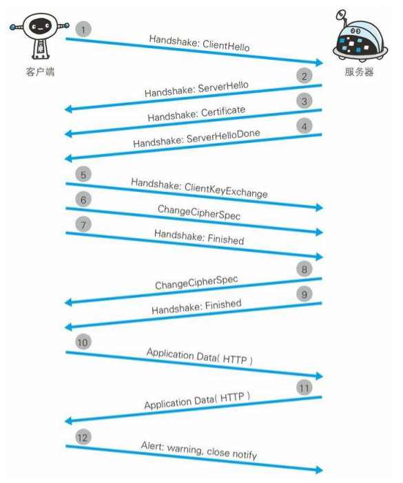

1. 客户端通过发送 Client Hello 报文开始 SSL 通信。报文中包含客户端支持的 SSL 的指定版本、加密组件(Cipher Suite)列表(所使用的加密算法及密钥长度等)。

2. 服务器可进行 SSL 通信时,会以 Server Hello 报文作为应答。和客户端一样,在报文中包含 SSL 版本以及加密组件。服务器的加密组件内容是从接收到的客户端加密组件内筛选出来的。

3. 之后服务器发送 Certificate 报文。报文中包含公开密钥证书。

4. 最后服务器发送 Server Hello Done 报文通知客户端,最初阶段的 SSL 握手协商部分结束。

5. SSL 第一次握手结束之后,客户端以 Client Key Exchange 报文作为回应。报文中包含通信加密中使用的一种被称为 Pre-mastersecret 的随机密码串。该报文已用步骤 3 中的公开密钥进行加密。

6. 接着客户端继续发送 Change Cipher Spec 报文。该报文会提示服务器,在此报文之后的通信会采用 Pre-master secret 密钥加密。

7. 客户端发送 Finished 报文。该报文包含连接至今全部报文的整体校验值。这次握手协商是否能够成功,要以服务器是否能够正确解密该报文作为判定标准。

8. 服务器同样发送 Change Cipher Spec 报文。
9. 服务器同样发送 Finished 报文。
10. 服务器和客户端的 Finished 报文交换完毕之后,SSL 连接就算建立完成。当然,通信会受到 SSL 的保护。从此处开始进行应用层协议的通信,即发送 HTTP 请求。
11. 应用层协议通信,即发送 HTTP 响应。
12. 最后由客户端断开连接。断开连接时,发送 close_notify 报文。上图做了一些省略,这步之后再发送 TCP FIN 报文来关闭与 TCP的通信。

在以上流程中,应用层发送数据时会附加一种叫做 MAC(MessageAuthentication Code)的报文摘要。MAC 能够查知报文是否遭到篡改,从而保护报文的完整性。


## 16.HTTP缓存

浏览器第一次向一个web服务器发起`http`请求后，服务器会返回请求的资源，并且在响应头中添加一些有关缓存的字段如：`Cache-Control`、`Expires`、`Last-Modified`、`ETag`、`Date`等等。之后浏览器再向该服务器请求该资源就可以视情况使用**强缓存**和**协商缓存**。

- 强缓存：浏览器直接从本地缓存中获取数据，不与服务器进行交互。
- 协商缓存：浏览器发送请求到服务器，服务器判定是否可使用本地缓存。
- 联系与区别：两种缓存方式最终使用的都是本地缓存；前者无需与服务器交互，后者需要。

> **强缓存**：若缓存未过期，返回状态码为`200`，则直接从本地读取缓存，这就完成了整个强缓存过程；如果缓存过期，则进入协商缓存或服务器返回新资源过程。

> **协商缓存**：当浏览器发现缓存过期后，缓存并不一定不能使用了，因为服务器端的资源可能仍然没有改变，所以需要与服务器协商，让服务器判断本地缓存是否还能使用。


## 17.[TCP Keepalive](https://blog.csdn.net/weixin_40332490/article/details/105590486?utm_medium=distribute.pc_relevant.none-task-blog-2~default~baidujs_title~default-0.control&spm=1001.2101.3001.4242)

长连接的环境下，进行一次数据交互后，很长一段时间内无数据交互时，**客户端可能意外断电、死机、崩溃**、重启，还是中间路由网络无故断开，这些TCP连接并未来得及正常释放，那么，连接的另一方并不知道对端的情况，它会一直维护这个连接，**长时间的积累会导致非常多的半打开连接**，造成端系统资源的消耗和浪费，且有可能导致在一个无效的数据链路层面发送业务数据，结果就是发送失败。**所以服务器端要做到快速感知失败，减少无效链接操作，这就有了TCP的Keepalive（保活探测）机制。**

**原理：**

当一个 TCP 连接建立之后，启用 TCP Keepalive 的一端便会启动一个**计时器**，当这个计时器数值到达 0 之后（也就是经过tcp_keep-alive_time时间后（2h）），**一个 TCP 探测包便会被发出**。这个 TCP 探测包是一个纯 ACK 包（规范建议，不应该包含任何数据，但也可以包含1个无意义的字节，比如0x0。），其 Seq号 与上一个包是重复的，所以其实探测包报文不在窗口控制范围内。

如果**一个给定的连接在两小时内（默认时长）没有任何的动作**，则服务器就向客户发一个探测报文段，客户主机必须处于以下4个状态之一：

> 客户主机依然正常运行，并从服务器可达。客户的TCP响应正常，而服务器也知道对方是正常的，服务器在两小时后将保活定时器复位。

> 客户主机已经崩溃，并且关闭或者正在重新启动。在任何一种情况下，客户的TCP都没有响应。服务端将不能收到对探测的响应，并在75秒后超时。服务器总共发送10个这样的探测 ，每个间隔75秒。如果服务器没有收到一个响应，它就认为客户主机已经关闭并终止连接。

> 客户主机崩溃并已经重新启动。服务器将收到一个对其保活探测的响应，这个响应是一个复位，使得服务器终止这个连接。

> 客户机正常运行，但是服务器不可达，这种情况与2类似，TCP能发现的就是没有收到探测的响应。


## 18.http跨域访问

跨域是浏览器安全机制, 其实就是说你请求访问的域名与ajax请求地址不一致，浏览器会直接无法返回请求结果。

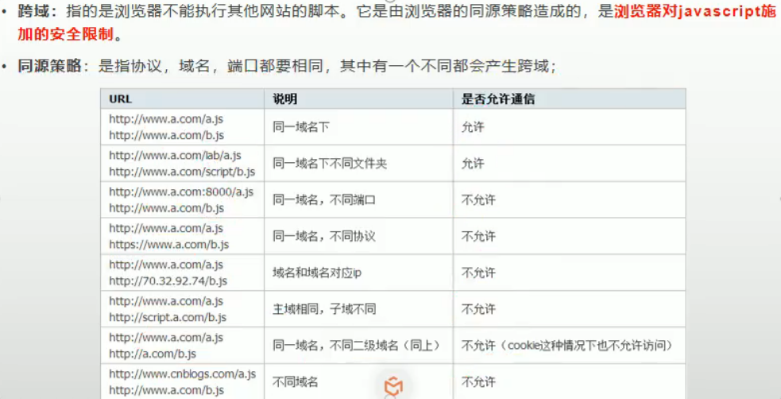

跨源资源共享标准（[Cross-Origin Resource Sharing](http://www.w3.org/TR/cors/) (CORS)）通过新增一系列 HTTP  头，让服务器能声明哪些来源可以通过浏览器访问该服务器上的资源。另外，对那些会对服务器数据造成破坏性影响的 HTTP 请求方法（特别是 GET  以外的 HTTP 方法，或者搭配某些MIME类型的POST请求），标准强烈要求浏览器必须先以**` OPTIONS` 请求方式发送一个预请求**(preflight request)，从而获知服务器端对跨源请求所支持 HTTP 方法。

### 简单请求

 所谓的简单，是指：

- 只使用 **GET, HEAD 或者 POST** 请求方法。如果使用 POST 向服务器端传送数据，则**数据类型**(Content-Type)只能是 `application/x-www-form-urlencoded`, `multipart/form-data 或 text/plain`中的一种。

- 不会使用自定义请求头（类似于 X-Modified 这种）。

  ```http
  GET /resources/public-data/ HTTP/1.1
  Host: bar.other
  User-Agent: Mozilla/5.0 (Macintosh; U; Intel Mac OS X 10.5; en-US; rv:1.9.1b3pre) Gecko/20081130 Minefield/3.1b3pre
  Accept: text/html,application/xhtml+xml,application/xml;q=0.9,*/*;q=0.8
  Accept-Language: en-us,en;q=0.5
  Accept-Encoding: gzip,deflate
  Accept-Charset: ISO-8859-1,utf-8;q=0.7,*;q=0.7
  Connection: keep-alive
  Referer: http://foo.example/examples/access-control/simpleXSInvocation.html
  Origin: http://foo.example
   
   
  HTTP/1.1 200 OK
  Date: Mon, 01 Dec 2008 00:23:53 GMT
  Server: Apache/2.0.61 
  Access-Control-Allow-Origin: *
  Keep-Alive: timeout=2, max=100
  Connection: Keep-Alive
  Transfer-Encoding: chunked
  Content-Type: application/xml
   
  [XML Data]
  ```

  Origin，它表明了该请求来自于 http://foo.exmaple

  服务器返回了响应头 Access-Control-Allow-Origin: *，这表明服务器接受来自任何站点的跨站请求。如果服务器端仅允许来自 http://foo.example 的跨站请求，它可以返回：

   Access-Control-Allow-Origin: http://foo.example

### 预请求

 不同于上面讨论的简单请求，“预请求”要求必须先发送一个 OPTIONS 请求给目的站点，来查明这个跨站请求对于目的站点是不是安全可接受的。这样做，是因为跨站请求可能会对目的站点的数据造成破坏。 当请求具备以下条件，就会被当成预请求处理：

- 请求以 GET, HEAD 或者 POST 以外的方法发起请求。或者，使用 POST，但请求数据为 `application/x-www-form-urlencoded, multipart/form-data 或者 text/plain` 以外的数据类型。**比如说，用 POST 发送数据类型为 `application/xml 或者 text/xml 的 XML 数据的请求。`**
- 使用自定义请求头（比如添加诸如 X-PINGOTHER）

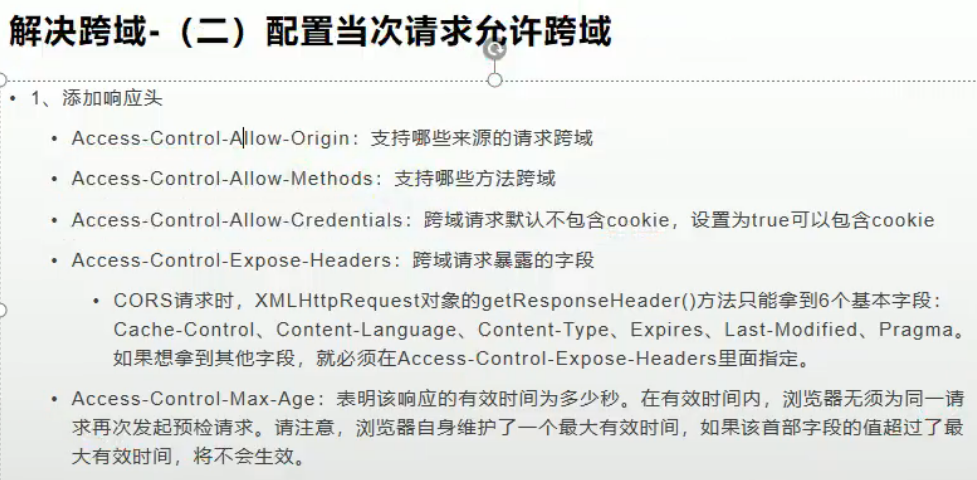


- 跨域：协议、ip、端口中只要有一个不同就是跨域请求。
- 同源策略：浏览器默认只允许ajax访问同源(协议、ip、端口都相同)内容。
- 解决同源策略：在控制器接口上添加@CrossOrigin。表示允许跨域。本质在响应头中添加Access-Control-Allow-Origin: *

```java
@RequestMapping("/demo5")
@ResponseBody
@CrossOrigin
public List<People> demo5(@RequestBody List<People> list) {
    System.out.println(list);
    return list;
}
```


## 19. [HTTPS中间人攻击](https://www.jianshu.com/p/6ed1ec6e729b)

首先我们假设不存在认证机构，任何人都可以制作证书，这带来的安全风险便是经典的“中间人攻击”问题。


1.本地请求被劫持（如DNS劫持等），所有请求均发送到中间人的服务器

2.中间人服务器返回中间人自己的证书

3.客户端创建随机数，通过中间人证书的公钥对随机数加密后传送给中间人，然后凭随机数构造对称加密对传输内容进行加密传输

4.中间人因为拥有客户端的随机数，可以通过对称加密算法进行内容解密

5.中间人以客户端的请求内容再向正规网站发起请求

6.因为中间人与服务器的通信过程是合法的，正规网站通过建立的安全通道返回加密后的数据

7.中间人凭借与正规网站建立的对称加密算法对内容进行解密

8.中间人通过与客户端建立的对称加密算法对正规内容返回的数据进行加密传输

9.客户端通过与中间人建立的对称加密算法对返回结果数据进行解密

由于缺少对证书的验证，所以客户端虽然发起的是 HTTPS 请求，但客户端完全不知道自己的网络已被拦截，传输内容被中间人全部窃取。


## 20.**四次挥手，close_wait和time_wait是什么，如果出现大量time_wait会是什么原因** 
  1）四次挥手 blabla 

  2）close_wait 服务端还有消息没法送完时候 

  3) time_wait [客户端]() 最后的ACK发送完等待2MSL时间，如果丢失重发时间2MSL,上一次链接的消息完全消失 

  4) 出现大量time_wait： 在 **高并发短连接** 的TCP服务器上，当服务器处理完请求后立刻主动正常关闭连接。这个场景下会出现大量socket处于TIME_WAIT状态。如果[客户端]()的并发量持续很高，此时部分[客户端]()就会显示连接不上。 

  具体一点，**短连接表示“业务处理+传输数据的时间 远远小于 TIMEWAIT超时的时间”的连接**。比如取一个web页面，1秒钟的http短连接处理完业务，在关闭连接之后，这个业务用过的端口会停留在TIMEWAIT状态几分钟，而这几分钟，其他HTTP请求来临的时候是无法占用此端口的。这样大量端口占用造成严重的资源浪费


## 21.从输入网址到获得页面的过程

　　(1). 浏览器查询 DNS，获取域名对应的IP地址:具体过程包括浏览器搜索自身的DNS缓存、搜索操作系统的DNS缓存、读取本地的Host文件和向本地DNS服务器进行查询等。对于向本地DNS服务器进行查询，如果要查询的域名包含在本地配置区域资源中，则返回解析结果给客户机，完成域名解析(此解析具有权威性)；如果要查询的域名不由本地DNS服务器区域解析，但该服务器已缓存了此网址映射关系，则调用这个IP地址映射，完成域名解析（此解析不具有权威性）。如果本地域名服务器并未缓存该网址映射关系，那么将根据其设置发起递归查询或者迭代查询；

　　(2). 浏览器获得域名对应的IP地址以后，浏览器向服务器请求建立链接，发起三次握手；

　　(3). TCP/IP链接建立起来后，浏览器向服务器发送HTTP请求；

　　(4). 服务器接收到这个请求，并根据路径参数映射到特定的请求处理器进行处理，并将处理结果及相应的视图返回给浏览器；

　　(5). 浏览器解析并渲染视图，若遇到对js文件、css文件及图片等静态资源的引用，则重复上述步骤并向服务器请求这些资源；

　　(6). 浏览器根据其请求到的资源、数据渲染页面，最终向用户呈现一个完整的页面。


## 22.XSS攻击

> XSS是一种经常出现在web应用中的计算机安全漏洞，与SQL注入一起成为web中最主流的攻击方式。XSS是指恶意攻击者利用网站没有对用户提交数据进行转义处理或者过滤不足的缺点，进而添加一些脚本代码嵌入到web页面中去，使别的用户访问都会执行相应的嵌入代码，从而盗取用户资料、利用用户身份进行某种动作或者对访问者进行病毒侵害的一种攻击方式。

漏洞产生的根本原因是 太相信用户提交的数据，对用户所提交的数据过滤不足所导致的，因此解决方案也应该从这个方面入手，具体方案包括：

```tex
1.将重要的cookie标记为http only, 这样的话Javascript 中的document.cookie语句就不能获取到cookie了（如果在cookie中设置了HttpOnly属性，那么通过js脚本将无法读取到cookie信息，这样能有效的防止XSS攻击）；

2.表单数据规定值的类型，例如：年龄应为只能为int、name只能为字母数字组合。。。。

3.对数据进行Html Encode 处理

4.过滤或移除特殊的Html标签，例如: <script>, <iframe> , < for <, > for>, &quot for

5.过滤JavaScript 事件的标签，例如 “οnclick=”, “onfocus” 等等。
```


## 23.**HTTP1.0, 1.1, 2.0的一些区别**

HTTP1.0最早在网页中使用是在1996年，那个时候只是使用一些较为简单的网页上和网络请求上，而HTTP1.1则在1999年才开始广泛应用于现在的各大浏览器网络请求中，同时HTTP1.1也是当前使用最为广泛的HTTP协议。 主要区别主要体现在：

1. **缓存处理**，在HTTP1.0中主要使用header里的If-Modified-Since,Expires来做为缓存判断的标准，HTTP1.1则引入了更多的缓存控制策略例如Entity tag，If-Unmodified-Since, If-Match, If-None-Match等更多可供选择的缓存头来控制缓存策略。

2. **带宽优化及网络连接的使用**，HTTP1.0中，存在一些浪费带宽的现象，例如客户端只是需要某个对象的一部分，而服务器却将整个对象送过来了，并且不支持断点续传功能，HTTP1.1则在请求头引入了range头域，它允许只请求资源的某个部分，即返回码是206（Partial Content），这样就方便了开发者自由的选择以便于充分利用带宽和连接。

3. **错误通知的管理**，在HTTP1.1中新增了24个错误状态响应码，如409（Conflict）表示请求的资源与资源的当前状态发生冲突；410（Gone）表示服务器上的某个资源被永久性的删除。

4. **Host头处理**，在HTTP1.0中认为每台服务器都绑定一个唯一的IP地址，因此，请求消息中的URL并没有传递主机名（hostname）。但随着虚拟主机技术的发展，在一台物理服务器上可以存在多个虚拟主机（Multi-homed Web  Servers），并且它们共享一个IP地址。HTTP1.1的请求消息和响应消息都应支持Host头域，且请求消息中如果没有Host头域会报告一个错误（400 Bad Request）。

5. **长连接**，HTTP  1.1支持长连接（PersistentConnection）和请求的流水线（Pipelining）处理，在一个TCP连接上可以传送多个HTTP请求和响应，减少了建立和关闭连接的消耗和延迟，在HTTP1.1中默认开启Connection： keep-alive，一定程度上弥补了HTTP1.0每次请求都要创建连接的缺点。

   

**HTTP2.0和HTTP1.X相比的新特性**

- **新的二进制格式**（Binary  Format），HTTP1.x的解析是基于文本。基于文本协议的格式解析存在天然缺陷，文本的表现形式有多样性，要做到健壮性考虑的场景必然很多，二进制则不同，只认0和1的组合。基于这种考虑HTTP2.0的协议解析决定采用二进制格式，实现方便且健壮。
- **多路复用**（MultiPlexing），即连接共享，即每一个request都是是用作连接共享机制的。一个request对应一个id，这样一个连接上可以有多个request，1个连接的request可以随机的混杂在一起，接收方可以根据request的 id将request再归属到各自不同的服务端请求里面。
- **header压缩**，如上文中所言，对前面提到过HTTP1.x的header带有大量信息，而且每次都要重复发送，HTTP2.0使用encoder来减少需要传输的header大小，通讯双方各自cache一份header fields表，既避免了重复header的传输，又减小了需要传输的大小。
- **服务端推送**（server push），同SPDY一样，HTTP2.0也具有server push功能。服务器除了对最初请求的响应外，服务器还可以额外的向[客户端](https://www.nowcoder.com/jump/super-jump/word?word=客户端)推送资源，无需[客户端](https://www.nowcoder.com/jump/super-jump/word?word=客户端)请求。


## 24.GET 和 POST 比较
1. GET 用于获取资源,刷新无害,POST 用于传输实体主体。
2. POST请求稍微安全一点,但照样可以通过一些抓包工具(Fiddler)查看。
3. GET请求只能进行url编码，而POST支持多种编码方式。例如空格会转换为 %20 。POST 参数支持标准字符集。
4. Get请求HTTP协议并不限制参数大小,但是浏览器会限制
5. GET请求参数通过URL传递，POST的参数放在请求体中。
6. GET产生一个TCP数据包；POST产生两个TCP数据包。对于GET方式的请求，浏览器会把请求头和请求体一并发送出去；而对于POST，浏览器先发送请求头，服务器响应100 continue，浏览器再发送请求体。 


## 25.[HTTP请求/响应报文结构](https://blog.csdn.net/shouwang666666/article/details/70232053/)

**HTTP请求报文**

一个HTTP请求报文由四个部分组成：**请求行、请求头部、空行、请求数据。**

请求头部

HTTP客户程序(例如浏览器)，向服务器发送请求的时候必须指明请求类型(一般是GET或者 POST)。如有必要，客户程序还可以选择发送其他的请求头。大多数请求头并不是必需的，但Content-Length除外。对于POST请求来说 Content-Length必须出现。

**常见的请求头字段含义：**

> **Accept**： 浏览器可接受的MIME类型。

> **Accept-Charset**：浏览器可接受的字符集。

> Accept-Encoding：浏览器能够进行解码的数据编码方式，比如gzip。Servlet能够向支持gzip的浏览器返回经gzip编码的HTML页面。许多情形下这可以减少5到10倍的下载时间。

> **Accept-Language**：浏览器所希望的语言种类，当服务器能够提供一种以上的语言版本时要用到。

> **Authorization**：授权信息，通常出现在对服务器发送的WWW-Authenticate头的应答中。

> **Content-Length**：表示请求消息正文的长度。

> **Host**： 客户机通过这个头告诉服务器，想访问的主机名。Host头域指定请求资源的Intenet主机和端口号，必须表示请求url的原始服务器或网关的位置。HTTP/1.1请求必须包含主机头域，否则系统会以400状态码返回。

> **If-Modified-Since**：客户机通过这个头告诉服务器，资源的缓存时间。只有当所请求的内容在指定的时间后又经过修改才返回它，否则返回304“Not Modified”应答。

> **Referer**：客户机通过这个头告诉服务器，它是从哪个资源来访问服务器的(防盗链)。包含一个URL，用户从该URL代表的页面出发访问当前请求的页面。

> **User-Agent**：User-Agent头域的内容包含发出请求的用户信息。浏览器类型，如果Servlet返回的内容与浏览器类型有关则该值非常有用。

> **Cookie**：客户机通过这个头可以向服务器带数据，这是最重要的请求头信息之一。

> **Pragma**：指定“no-cache”值表示服务器必须返回一个刷新后的文档，即使它是代理服务器而且已经有了页面的本地拷贝。

> **From：**请求发送者的email地址，由一些特殊的Web客户程序使用，浏览器不会用到它。

> **Connection**：处理完这次请求后是否断开连接还是继续保持连接。如果Servlet看到这里的值为“Keep- Alive”，或者看到请求使用的是HTTP 1.1(HTTP 1.1默认进行持久连接)，它就可以利用持久连接的优点，当页面包含多个元素时(例如Applet，图片)，显著地减少下载所需要的时间。要实现这一点，Servlet需要在应答中发送一个Content-Length头，最简单的实现方法是：先把内容写入 ByteArrayOutputStream，然后在正式写出内容之前计算它的大小。

> **Range**：Range头域可以请求实体的一个或者多个子范围。例如，


## 26.TCP和UDP的区别？

1. TCP面向连接；UDP是无连接的，即发送数据之前不需要建立连接 

2. TCP提供可靠的服务；UDP不保证可靠交付 

3. TCP面向字节流，把数据看成一连串无结构的字节流;UDP是面向报文的 

4. TCP有拥塞控制；UDP没有拥塞控制，因此网络出现拥塞不会使源主机的发送速率降低（对实时应用很有用，如IP电话，实时视频会议等） 

5. 每一条TCP连接只能是点到点的；UDP支持一对一，一对多，多对一和多对多的交互通信 

6. TCP首部开销20字节；UDP的首部开销小，只有8个字节 

---------------------------------------------------------------------------------------------------------------------------------------

TCP 是面向连接，能保证数据的可靠性交付，因此经常用于：

- FTP文件传输 
- HTTP / HTTPS 

UDP 面向无连接，它可以随时发送数据，再加上UDP本身的处理既简单又高效，因此经常用于：

- 包总量较少的通信，如 DNS 、SNMP等 
- 视频、音频等多媒体通信 
- 广播通信 


# 二、操作系统

## 1.[孤儿进程与僵尸进程](https://www.cnblogs.com/Anker/p/3271773.html)

**孤儿进程：**

**一个父进程退出，而它的一个或多个子进程还在运行，那么那些子进程将成为孤儿进程。孤儿进程将被init进程(进程号为1)所收养，并由init进程对它们完成状态收集工作。**

**孤儿进程是没有父进程的进程，孤儿进程这个重任就落到了init进程身上**，init进程就好像是一个民政局，专门负责处理孤儿进程的善后工作。每当出现一个孤儿进程的时候，内核就把孤  儿进程的父进程设置为init，而init进程会循环地wait()它的已经退出的子进程。这样，当一个孤儿进程凄凉地结束了其生命周期的时候，init进程就会代表党和政府出面处理它的一切善后工作。**因此孤儿进程并不会有什么危害。**

**僵尸进程：**

**一个进程使用fork创建子进程，如果子进程退出，而父进程并没有调用wait或waitpid获取子进程的状态信息，那么子进程的进程描述符仍然保存在系统中。这种进程称之为僵死进程。**

**如果进程不调用wait / waitpid的话，** **那么保留的那段信息就不会释放，其进程号就会一直被占用，但是系统所能使用的进程号是有限的，如果大量的产生僵死进程，将因为没有可用的进程号而导致系统不能产生新的进程. 此即为僵尸进程的危害，应当避免。**

> 子进程的结束和父进程的运行是一个异步过程，即父进程永远无法预测子进程到底什么时候结束。那么会不会因为父进程太忙来不及 wait  子进程，或者说不知道子进程什么时候结束，而丢失子进程结束时的状态信息呢？不会。因为UNIX提供了一种机制可以保证，只要父进程想知道子进程结束时的  状态信息，就可以得到。这种机制就是：当子进程走完了自己的生命周期后，它会执行exit（）系统调用，内核释放该进程所有的资源，包括打开的文件，占用 的内存等。但是仍然为其保留一定的信息（包括进程号the process ID，退出码exit code，退出状态the  terminationstatus of the process，运行时间the amount of CPU time taken by the process等），**这些数据会一直保留到系统将它传递给它的父进程为止**，直到父进程通过wait / waitpid来取时才释放。

解决方法：

  （1） 父进程通过wait和waitpid等函数等待子进程结束，这会导致父进程挂起。

  执行wait（）或waitpid（）系统调用，则子进程在终止后会立即把它在进程表中的数据返回给父进程，此时系统会立即删除该进入点。在这种情形下就不会产生defunct进程。

  （2） 如果父进程很忙，那么可以用signal函数为SIGCHLD安装handler。在子进程结束后，父进程会收到该信号，可以在handler中调用wait回收。

  （3） 如果父进程不关心子进程什么时候结束，那么可以用signal（SIGCLD, SIG_IGN）或signal（SIGCHLD, SIG_IGN）通知内核，自己对子进程的结束不感兴趣，那么子进程结束后，内核会回收，并不再给父进程发送信号

  （4）fork两次，父进程fork一个子进程，然后继续工作，子进程fork一个孙进程后退出，那么孙进程被init接管，孙进程结束后，init会回收。不过子进程的回收还要自己做。


## 2.查看进程中的线程

```
ps -T -p <pid>
```

要让top输出某个特定进程<pid>并检查该进程内运行的线程状况：

```
 top -H -p <pid>
```

```
pstree PID
```


## 3.linux查找目录下的所有文件中是否含有某个字符串

**从根目录开始查找所有扩展名为.log的文本文件，并找出包含”ERROR”的行** 

> find / -type f -name "\*.log" | xargs grep "ERROR


## 4.虚拟地址

问题1：进程地址空间不隔离。

问题2：内存使用效率低。

问题3：程序运行的地址不确定。

虚拟地址：虚拟地址并不真实存在于计算机中。每个进程都分配有自己的虚拟空间，而且只能访问自己被分配使用的空间。理论上，虚拟空间受物理内存大小的限制，如给有4GB内存，那么虚拟地址空间的地址范围就应该是0x00000000~0xFFFFFFFF。每个进程都有自己独立的虚拟地址空间。这样每个进程都能访问自己的地址空间，这样做到了有效的隔离。

> 每个进程都有自己独立的4G内存空间，各个进程的内存空间具有类似的结构。


# 三、Java基础


## 1.@Qualifier,@Autowired,@Resource

使用 `@Autowired` 注解是 **Spring** 依赖注入的绝好方法。但是有些场景下仅仅靠这个注解不足以让Spring知道到底要注入哪个 **bean**。默认情况下，`@Autowired` 按类型装配 **Spring Bean**。如果容器中有多个相同类型的 **bean**，则框架将抛出 `NoUniqueBeanDefinitionException`， 以提示有多个满足条件的 **bean** 进行自动装配。程序无法正确做出判断使用哪一个

通过使用 `@Qualifier` 注解，我们可以消除需要注入哪个 **bean** 的问题。让我们重新回顾一下前面的例子，看看我们如何通过包含 `@Qualifier` 注释来指出我们想要使用哪个 **bean** 来解决问题：

```java
    @Component
    public class FooService {
        @Autowired
        @Qualifier("fooFormatter")
        private Formatter formatter;
        
        //todo 
    }
```

还有另一个名为 `@Primary` 的注解，我们也可以用来发生依赖注入的歧义时决定要注入哪个 **bean**。当存在多个相同类型的 **bean** 时，此注解定义了首选项。如果 `@Qualifier` 和 `@Primary` 注释都存在，那么 `@Qualifier` 注释将具有优先权。

```java
    @Bean
    public Employee tomEmployee() {
        return new Employee("Tom");
    }

    @Bean
    @Primary
    public Employee johnEmployee() {
        return new Employee("john");
    }
```

@Resource（`@Autowired`和`@Qualifier`是spring注释，`@Resource`而是标准java注释（来自JSR-250），默认安照名称进行装配，名称可以通过name属性进行指定， 
如果没有指定name属性，当注解写在字段上时，默认取字段名进行按照名称查找，如果注解写在setter方法上默认取属性名进行装配。 当找不到与名称匹配的bean时才按照类型进行装配。但是需要注意的是，如果name属性一旦指定，就只会按照名称进行装配。


## 2. [ArrayList扩容机制](https://blog.csdn.net/qq_32963927/article/details/89313082)

默认初始容量大小（默认能添加10条数据）,当我们要add进第一个元素到ArrayList时，elementData.length为0（因为还是一个空的list，里面还没有数据，所以没有进行扩容，默认扩容10）, 每次扩容1.5倍


## 3. [调用System.gc()会发生什么?](https://blog.csdn.net/qq_32534441/article/details/94989683)

告诉垃圾收集器打算进行垃圾收集，而垃圾收集器进不进行收集是不确定的


## 4.简述java的多态 

Java多态可以分为编译时多态和运行时多态。 

 编译时多态主要指方法的重载，即通过参数列表的不同来区分不同的方法。 

 运行时多态主要指继承父类和实现接口时，可使用父类引用指向子类对象。 

 运行时多态的实现：主要依靠方法表，方法表中最先存放的是Object类的方法，接下来是该类的父类的方法，最后是该类本身的方法。如果子类改写了父类的方法，那么子类和父类的那些同名方法共享一个方法表项，都被认作是父类的方法。因此可以实现运行时多态。 


## 5.为何HashMap线程不安全

在JDK1.7中，HashMap采用头插法插入元素，因此并发情况下会导致环形[链表]()，产生死循环。 

 虽然JDK1.8采用了尾插法解决了这个问题，但是并发下的put操作也会使前一个key被后一个key覆盖。 

 由于HashMap有扩容机制存在，也存在A线程进行扩容后，B线程执行get方法出现失误的情况。 


## 6.**为什么HashMap的长度一定是2的次幂呢？**

我们首先可能会想到采用%取余的操作来实现。但是，重点来了：**“取余(%)操作中如果除数是 2 的幂次则等价于与其除数减一的与(&)操作（也就是说 hash%length==hash&(length-1)的前提是 length 是 2 的 n 次方；）。”** 并且 **采用二进制位操作 &，相对于%能够提高运算效率，这就解释了 HashMap 的长度为什么是 2 的幂次方。**

因为哈希表掩码sizemask为size-1，当size满足2的n次方时，计算每个key的索引值时只需要用key的hash值与掩码sizemask进行位与操作，替代求余操作，计算更快。

当数组长度不为2的n次幂 的时候，hashCode 值与数组长度减一做与运算 的时候，会出现重复的数据。这带来的问题就是HashMap上的数组元素分布不均匀，而数组上的某些位置，永远也用不到。


## 7.抽象类和接口的使用侧重点

当子类和父类之间存在逻辑上的层次结构，推荐使用抽象类，有利于功能的累积。当功能不需要，希望支持差别较大的两个或更多对象间的特定交互行为，推荐使用接口。使用接口能降低软件系统的耦合度，便于日后维护或添加删除方法。

继承是一个 "是不是"的关系，而 接口 实现则是 "有没有"的关系。对于抽象类，如果需要添加新的方法，可以直接在抽象类中添加具体的实现，子类可以不进行变更；而对于接口则不行，如果接口进行了变更，则所有实现这个接口的类都必须进行相应的改动。

**1.抽象类的使用场景**

既想约束子类具有共同的行为（但不再乎其如何实现），又想拥有缺省的方法，又能拥有实例变量

如：模板方法设计模式，模板方法使得子类可以在不改变算法结构的情况下，重新定义算法中某些步骤的具体实现。

**2.接口的应用场景**

① 约束多个实现类具有统一的行为，但是不在乎每个实现类如何具体实现

② 作为能够实现特定功能的标识存在，也可以是什么接口方法都没有的纯粹标识。

③ 实现类需要具备很多不同的功能，但各个功能之间可能没有任何联系。

④ 使用接口的引用调用具体实现类中实现的方法（多态）

**语法层面上**
1）抽象类可以有方法实现，而接口的方法中只能是抽象方法；
2）抽象类中的成员变量可以是各种类型的，接口中的成员变量只能是public static final类型；
3）接口中不能含有静态代码块以及静态方法，而抽象类可以有静态代码块和静态方法；
4）一个类只能继承一个抽象类，而一个类却可以实现多个接口。


## 8.红黑树和avl树的区别

**avl树:** 一般用平衡因子判断是否平衡并通过旋转来实现平衡，左右子树树高不超过1，和红黑树相比，AVL树是高度平衡的二叉树，平衡条件必须满足（所有节点的左右子树高度差不超过1）。不管我们是执行插入还是删除操作，只要不满足上面的条件，就要通过旋转来保持平衡，而的由于旋转比较耗时，由此我们可以知道AVL树适合用于插入与删除次数比较少，但查找多的情况

**红黑树:** 也是一种平衡二叉树，但每个节点有一个存储位表示节点的颜色，可以是红或黑。通过对任何一条从根到叶子的路径上各个节点着色的方式的限制，红黑树确保没有一条路径会比其它路径长出两倍，因此，红黑树是一种弱平衡二叉树（由于是弱平衡，可以看到，在相同的节点情况下，AVL树的高度<=红黑树），相对于要求严格的AVL树来说，它的旋转次数少，所以对于搜索，插入，删除操作较多的情况下，用红黑树。

| 平衡二叉树类型 | 平衡度 | 调整频率 | 适用场景        |
| -------------- | ------ | -------- | --------------- |
| AVL树          | 高     | 高       | 查询多，增/删少 |
| 红黑树         | 低     | 低       | 增/删频繁       |


## 9. NIO

NIO（JDK1.4）模型是一种同步非阻塞IO，主要有三大核心部分：Channel(通道)，Buffer(缓冲区), Selector（多路复用器）。

- IO是面向流的，NIO是面向缓冲区的。 
- NIO的非阻塞模式，使一个线程从某通道发送请求读取数据，但是它仅能得到目前可用的数据，如果目前没有数据可用时，就什么都不会获取。一个线程请求写入一些数据到某通道，但不需要等待它完全写入，这个线程同时可以去做别的事情。 线程通常将非阻塞IO的空闲时间用于在其它通道上执行IO操作，所以一个单独的线程现在可以管理多个输入和输出通道

#### NIO优点：

1. 通过Channel注册到Selector上的状态来实现一种客户端与服务端的通信。
2. Channel中数据的读取是通过Buffer , 一种非阻塞的读取方式。
3. Selector 多路复用器单线程模型，  线程的资源开销相对比较小。


## 10.[Java中的对象一定在堆上分配吗？](https://baijiahao.baidu.com/s?id=1678511797907822583&wfr=spider&for=pc)

不一定

这是因为Java JIT（just-in-time）编译器进行的两项优化，分别称作**逃逸分析**（escape analysis）和**标量替换**（scalar replacement）。

逃逸分析就是：一种确定指针动态范围的静态分析，它可以分析在程序的哪些地方可以访问到指针。

当JVM通过逃逸分析，确定要将对象分配到栈上时，即时编译可以将对象打散，将对象替换为一个个很小的局部变量，我们将这个打散的过程叫做标量替换。将对象替换为一个个局部变量后，就可以非常方便的在栈上进行分配了。

JVM在Server模式下的逃逸分析可以分析出某个对象是否永远只在某个方法、线程的范围内，并没有“逃逸”出这个范围，逃逸分析的一个结果就是对于某些未逃逸对象可以直接在栈上分配，由于该对象一定是局部的，所以栈上分配不会有问题。在实际的应用程序，尤其是大型程序中反而发现实施逃逸分析可能出现效果不稳定的情况，或因分析过程耗时但却无法有效判别出非逃逸对象而导致性能（即时编译的收益）有所下降，所以在很长的一段时间里，即使是Server Compiler，也默认不开启逃逸分析，甚至在某些版本（如JDK 1.6 Update18）中还曾经短暂地完全禁止了这项优化。


## 11.**TLAB**

> TLAB的全称是Thread Local Allocation Buffer，即线程本地分配缓存区，这是一个线程专用的内存分配区域。 

由于对象一般会分配在堆上，而堆是全局共享的。因此**在同一时间，可能会有多个线程在堆上申请空间。因此，每次对象分配都必须要进行同步**（虚拟机采用CAS配上失败重试的方式保证更新操作的原子性），而在竞争激烈的场合分配的效率又会进一步下降。JVM使用TLAB来避免多线程冲突，在给对象分配内存时，每个线程使用自己的TLAB，这样可以避免线程同步，提高了对象分配的效率。 

TLAB本身占用eEden区空间，在开启TLAB的情况下，虚拟机会为**每个Java线程分配一块TLAB空间**。参数-XX:+UseTLAB开启TLAB，默认是开启的。TLAB空间的内存非常小，缺省情况下仅占有整个Eden空间的1%，当然可以通过选项-XX:TLABWasteTargetPercent设置TLAB空间所占用Eden空间的百分比大小。 

对象分配的流程


## 12.CMS收集器及其缺点

- **初始标记：** 暂停所有的其他线程，并记录下直接与 root 相连的对象，速度很快 ；
- **并发标记：** 同时开启 GC 和用户线程，用一个闭包结构去记录可达对象。但在这个阶段结束，这个闭包结构并不能保证包含当前所有的可达对象。因为用户线程可能会不断的更新引用域，所以 GC 线程无法保证可达性分析的实时性。所以这个算法里会跟踪记录这些发生引用更新的地方。
- **重新标记：** 重新标记阶段就是为了修正并发标记期间因为用户程序继续运行而导致标记产生变动的那一部分对象的标记记录，这个阶段的停顿时间一般会比初始标记阶段的时间稍长，远远比并发标记阶段时间短
- **并发清除：** 开启用户线程，同时 GC 线程开始对未标记的区域做清扫。

**缺点：**

1. CMS收集器对处理器资源非常敏感。在并发阶段,它虽然不会导致用户线程停顿,但却会因为占用了一部分线程(或者说处理器的计算能力)而导致应用程序变慢,降低总吞吐量。

2. 无法处理“浮动垃圾”，有可能出现“Con-current Mode Failure”失败进而导致另一次完全“Stop The World”的Full GC的产生。    用户线程是还在继续运行，就还会有新的垃圾对象不断产生,但这一部分垃圾对象是出现在标记过程结束以后,CMS无法在当次收集中处理掉它们,只好留待下一次垃圾收集时再清理掉。这一部分垃圾就称为“浮动垃圾”。要是CM S运行期间预留的内存无法满足程序分配新对象的需要,就会出现一次“并发失败”(Concurrent M ode Failure),这时候虚拟机将不得不启动后备预案:冻结用户线程的执行,临时启用Serial Old收集器来重新进行老年代的垃圾收集。
3. CMS是一款基于“标记-清除”算法实现的收集器,收集结束时会有大量空间碎片产生。


## 13.G1收集器

- **初始标记(Initial M arking):**仅仅只是标记一下GC Roots能直接关联到的对象,并且修改TAM S
  指针的值,让下一阶段用户线程并发运行时,能正确地在可用的Region中分配新对象。这个阶段需要
  停顿线程,但耗时很短,而且是借用进行M inor GC的时候同步完成的,所以G1收集器在这个阶段实际
  并没有额外的停顿。
- **并发标记(Concurrent M arking):**从GC Root开始对堆中对象进行可达性分析,递归扫描整个堆
  里的对象图,找出要回收的对象,这阶段耗时较长,但可与用户程序并发执行。当对象图扫描完成以
  后,还要重新处理SATB记录下的在并发时有引用变动的对象。
- **最终标记(Final M arking):**对用户线程做另一个短暂的暂停,用于处理并发阶段结束后仍遗留
  下来的最后那少量的SATB记录。
- **筛选回收(Live Data Counting and Evacuation):**负责更新Region的统计数据,对各个Region的回
  收价值和成本进行排序,根据用户所期望的停顿时间来制定回收计划,可以自由选择任意多个Region
  构成回收集,然后把决定回收的那一部分Region的存活对象复制到空的Region中,再清理掉整个旧
  Region的全部空间。这里的操作涉及存活对象的移动,是必须暂停用户线程,由多条收集器线程并行
  完成的。

**特点：**

- **并行与并发**：G1 能充分利用 CPU、多核环境下的硬件优势，使用多个 CPU（CPU 或者  CPU 核心）来缩短 Stop-The-World 停顿时间。部分其他收集器原本需要停顿 Java 线程执行的 GC 动作，G1  收集器仍然可以通过并发的方式让 java 程序继续执行。
- **分代收集**：虽然 G1 可以不需要其他收集器配合就能独立管理整个 GC 堆，但是还是保留了分代的概念。
- **空间整合**：与 CMS 的“标记-清理”算法不同，G1 从整体来看是基于“标记-整理”算法实现的收集器；从局部上来看是基于“标记-复制”算法实现的。
- **可预测的停顿**：这是 G1 相对于 CMS 的另一个大优势，降低停顿时间是 G1 和 CMS 共同的关注点，但 G1 除了追求低停顿外，还能建立可预测的停顿时间模型，能让使用者明确指定在一个长度为 M 毫秒的时间片段内。


## 14.Fail-Fast

fast-fail是Java集合的一种错误机制。当多个线程对同一个集合进行操作时，就有可能会产生fast-fail事件。
例如：当线程a正通过iterator遍历集合时，另一个线程b修改了集合的内容，此时**modCount**（记录集合操作过程的修改次数）会加1，不等于**expectedModCount**，那么线程a访问集合的时候，就会抛出ConcurrentModificationException，产生fast-fail事件。边遍历边修改集合也会产生fast-fail事件。

解决方法：

- 使用Colletions.synchronizedList方法或在修改集合内容的地方加上synchronized。这样的话，增删集合内容的同步锁会阻塞遍历操作，影响性能。 

- 使用CopyOnWriteArrayList来替换ArrayList。在对CopyOnWriteArrayList进行修改操作的时候，会拷贝一个新的数组，对新的数组进行操作，操作完成后再把引用移到新的数组。


## 15. HashMap扩容机制


因此，我们在扩充HashMap的时候，不需要像JDK1.7的实现那样重新计算hash，只需要看看原来的hash值新增的那个bit是1还是0就好了，是0的话索引没变，是1的话索引变成“原索引+oldCap”，可以看看下图为16扩充为32的resize示意图：


## 16.代码中减少GC的开销

- **不要显式调用System.gc()**
  　　此函数建议JVM进行主GC,虽然只是建议而非一定,但很多情况下它会触发主GC,从而增加主GC的频率,也即增加了间歇性停顿的次数。
-  **尽量减少临时对象的使用**
    　　临时对象在跳出函数调用后,会成为垃圾,少用临时变量就相当于减少了垃圾的产生,从而延长了出现上述第二个触发条件出现的时间,减少了主GC的机会。
- **对象不用时最好显式置为Null**
- **尽量使用StringBuffer,而不用String来累加字符串**
  　　由于String是固定长的字符串对象,累加String对象时,并非在一个String对象中扩增,而是重新创建新的String对象,如Str5=Str1+Str2+Str3+Str4,这条语句执行过程中会产生多个垃圾对象,因为对次作“+”操作时都必须创建新的String对象,但这些过渡对象对系统来说是没有实际意义的,只会增加更多的垃圾。避免这种情况可以改用StringBuffer来累加字符串,因StringBuffer是可变长的,它在原有基础上进行扩增,不会产生中间对象。
- **能用基本类型如Int,Long,就不用Integer,Long对象**
- **尽量少用静态对象变量**
  　　静态变量属于全局变量,不会被GC回收,它们会一直占用内存。
- **分散对象创建或删除的时间**
  　　集中在短时间内大量创建新对象,特别是大对象,会导致突然需要大量内存,JVM在面临这种情况时,只能进行主GC,以回收内存或整合内存碎片,从而增加主GC的频率。集中删除对象,道理也是一样的。它使得突然出现了大量的垃圾对象,空闲空间必然减少,从而大大增加了下一次创建新对象时强制主GC的机会。

- **尽可能的给List或者Map分配一个初始容量**

  ​	一旦内部数组溢出，它就会被一个新的、并且足够大的数组代替，这就使之前分配的数组成为了垃圾。


## 17.反射的理解

反射机制（Reflection）是指动态获取类信息、动态调用类方法的功能
一般来说，程序是在编译期被加载，**但反射在编译期并不确定哪个类被加载**，而是在程序运行时才被加载、探知、自审

Java反射机制主要提供的功能：

    在运行时判断任意一个对象所属的类
    在运行时构造任意一个类的对象
    在运行时判断任意一个类所具有的成员变量和方法
    在运行时调用任意一个对象的方法
    生成动态代理
 反射机制是构建框架技术的基础所在
 反射技术大量用于Java设计模式和框架技术
 框架：Spring、MyBatis等
 设计模式：单例模式、工厂模式、代理模式等


## 18.为什么局部内部类和匿名内部类只能访问final的局部变量?

```java
class OutClass {
	private int age = 12;
    
    public void outPrint(final int x) { /////
        class InClass {
            public void InPrint() {
                System.out.println(x);
                System.out.println(age);
            }
        }
        new InClass().InPrint();
	}
}
```
根本原因就是作用域中变量的**生命周期**导致的;  内部类和外部类是处于同一个级别的,**内部类不会因为定义在方法中就会随着方法的执行完毕就被销毁.**

局部变量实际上确实会复制为内部类的成员变量使用。

>若变量是final时：

- 若是基本类型，其值是不能改变的，就保证了copy与原始的局部变量的值是一样的；

- 若是引用类型，其引用是不能改变的，保证了copy与原始的变量引用的是同一个对象。

**这就使得局部变量与内部类内建立的拷贝保持一致。**

> 外部类访问内部类：必须建立内部类的对象
>
> 内部类访问外部类：内部类可以直接访问外部类的成员包括私有成员，因为外部类持有内部类的引用


## 19.安全点

**为什么要有安全点(Safepoint)？**

> 如果HotSpot虚拟机需要实现垃圾收集，首先需要判断对象存活，使用可达性分析，那么需要从GC Roots开始找引用链。

> 但是在实际情况中引用关系不断改变，我们需要确定一个安全点(Safepoint)，所有线程中断(Stop The World)。

**安全点怎么选择呢？**

> 我们选择方法调用，循环跳转，异常跳转之类的位置，因为他们标志着开始了一整段程序运行

**为什么要有安全区(Safe Region)？**

> 程序可能因为blocked或者sleep，无法到达安全点。可以设置一个安全区域，这个安全区域对应的代码段，引用关系不会变。JVM检测到程序在安全区域时，可以进行GC。程序运行出安全区域时，检测GC没有结束的话，自我中断。


## 20.堆和栈

栈的优势：存取速度比堆要快。

栈的缺点：存在栈的数据大小和生存期必须是确定的，缺乏灵活性。

堆的优势：可以动态地分配内存大小，生存期也不必事先告诉编译器，Java的垃圾收集器会自动收走这些不在实用的数据。

堆的缺点：由于运行时要动态分配内存，存取速度慢。

    1.栈内存存储的是局部变量而堆内存存储的是实体；
    
    2.栈内存的更新速度要快于堆内存，因为局部变量的生命周期很短；
    
    3.栈内存存放的变量生命周期一旦结束就会被释放，而堆内存存放的实体会被垃圾回收机制不定时的回收。


## 21. [JVM内存大小](https://blog.csdn.net/dingxie1963/article/details/101259674)             

**堆内存分配**

> JVM初始分配的内存由-Xms指定，默认是物理内存的**1/64**；
>
> JVM最大分配的内存由-Xmx指定，默认是物理内存的**1/4**。

**New Generation（新生代）内存大小设置**

> -Xmn256m

> 设置JVM的新生代内存大小（－Xmn 是将NewSize与MaxNewSize设为一致。256m）,同下面两个参数
> -XX:NewSize=256m
> -XX:MaxNewSize=256m

> 还可以通过新生代和老年代内存的比值来设置新生代大小
> -XX:NewRatio=3

> 设置新生代（包括Eden和两个Survivor区）与老年代的比值（除去持久代）。设置为3，则新生代与老年代所占比值为1：3，新生代占整个堆栈的1/4

**Survivor内存大小设置**

> -XX:SurvivorRatio=8

> 设置为8,则两个Survivor区与一个Eden区的比值为2:8,一个Survivor区占整个新生代的1/10

**Stack(栈)内存大小设置**

> -Xss1m
> 每个线程都会产生一个栈。在相同物理内存下，减小这个值能生成更多的线程。如果这个值太小会影响方法调用的深度。

**Metaspace（元空间）内存大小设置**

> 元空间（Metaspace）(JDK8)
> **-XX:MetaspaceSize=128m -XX:MaxMetaspaceSize=512m（JDK8）**，JDK8的持久代几乎可用完机器的所有内存，同样设一个128M的初始值，512M的最大值保护一下。

> 默认情况下，类元数据分配受到可用的本机内存容量的限制（容量依然取决于你使用32位JVM还是64位操作系统的虚拟内存的可用性）。

> 一个新的参数 (MaxMetaspaceSize)可以使用。允许你来限制用于类元数据的本地内存。如果没有特别指定，元空间将会根据应用程序在运行时的需求动态设置大小。

**设置新生代代对象进入老年代的年龄**

> -XX:MaxTenuringThreshold=15


## 22.CMS和G1

**CMS收集器**：

1. 初始标记 (Stop the World事件 CPU停顿， 很短) 初始标记仅标记一下GC Roots能直接关联到的对象，速度很快；
2. 并发标记 (收集垃圾跟用户线程一起执行) 初始标记和重新标记需要“stop the world”，并发标记过程就是进行GC Roots Tracing的过程；
3. 重新标记 (Stop the World事件 CPU停顿，比初始标记稍微长，远比并发标记短)修正并发标记期间因用户程序继续运作而导致标记产生变动的那一部分对象的标记记录，这个阶段的停顿时间一般会比初始标记阶段稍长一些，但远比并发标记时间短
4. 并发清理 -清除算法

> 优点：并发收集，低停顿。由于在整个过程和中最耗时的并发标记和 并发清除过程收集器程序都可以和用户线程一起工作，所以总体来说，Cms收集器的内存回收过程是与用户线程一起并发执行的
>
> 缺点：CMS收集器对CPU资源非常敏感，CMS处理器无法处理浮动垃圾，大量的空间碎片

**G1收集器：**

1. 初始标记(stop the world事件 CPU停顿只处理垃圾)；
2. 并发标记(与用户线程并发执行)；
3. 最终标记(stop the world事件 ,CPU停顿处理垃圾)；
4. 筛选回收(stop the world事件 根据用户期望的GC停顿时间回收)

优点：

- **并行于并发**：G1能充分利用CPU、多核环境下的硬件优势，使用多个CPU（CPU或者CPU核心）来缩短stop-The-World停顿时间。部分其他收集器原本需要停顿线程执行的GC动作，G1收集器仍然可以通过并发的方式让java程序继续执行。
- **分代收集**：虽然G1可以不需要其他收集器配合就能独立管理整个GC堆，但是还是保留了分代的概念。它能够采用不同的方式去处理新创建的对象和已经存活了一段时间，熬过多次GC的旧对象以获取更好的收集效果。
- **空间整合**：与CMS的“标记--清理”算法不同**，G1从整体来看是基于“标记整理”算法实现的收集器；从局部上来看是基于“复制”算法实现的**。
- **可预测的停顿**：这是G1相对于CMS的另一个大优势，降低停顿时间是G1和ＣＭＳ共同的关注点，但Ｇ１除了追求低停顿外，还能建立可预测的停顿时间模型，能让使用者明确指定在一个长度为M毫秒的时间片段内。
- 在G1中，**还有一种特殊的区域Humongous**。  如果一个对象占用的空间超过了分区容量50%以上，G1收集器就认为这是一个巨型对象。这些巨型对象，默认直接会被分配在年老代，但是如果它是一个短期存在的巨型对象，就会对垃圾收集器造成负面影响。为了解决这个问题，G1划分了一个Humongous区，它用来专门存放巨型对象。如果一个H区装不下一个巨型对象，那么G1会寻找连续的H分区来存储。为了能找到连续的H区，有时候不得不启动Full GC。
- **G1回收是选择一些内存块，而不是整代内存来回收**。其它GC每次回收都会回收整个Generation的内存(Eden,  Old),  而回收内存所需的时间就取决于内存的大小，以及实际垃圾的多少，所以垃圾回收时间是不可控的；而G1每次并不会回收整代内存，到底回收多少内存就看用户配置的暂停时间，配置的时间短就少回收点，配置的时间长就多回收点，伸缩自如。

缺点：

  如果应用的内存非常吃紧，对内存进行部分回收根本不够，始终要进行整个Heap的回收，那么G1要做的工作量就一点也不会比其它垃圾回收器少，而且因为本身算法复杂了一点，可能比其它回收器还要差。因此**G1比较适合内存稍大一点的应用**(一般来说至少4G以上)，小内存的应用还是用传统的垃圾回收器比如CMS比较合适。


# 四、Java多线程高并发


## 1. synchronized和Lock有什么区别

1）synchronized属于JVM层面，属于java的关键字

- monitorenter（底层是通过monitor对象来完成，其实wait/notify等方法也依赖于monitor对象 只能在同步块或者方法中才能调用 wait/ notify等方法）
- Lock是具体类（java.util.concurrent.locks.Lock）是api层面的锁

2）使用方法：

- synchronized：不需要用户去手动释放锁，当synchronized代码执行后，系统会自动让线程释放对锁的占用

- ReentrantLock：则需要用户去手动释放锁，若没有主动释放锁，就有可能出现死锁的现象，需要lock() 和 unlock() 配置try catch语句来完成

3）等待是否中断

- synchronized：不可中断，除非抛出异常或者正常运行完成
- ReentrantLock：可中断，可以设置超时方法
  - 设置超时方法，trylock(long timeout, TimeUnit unit)
  - lockInterrupible() 放代码块中，调用interrupt() 方法可以中断

4）加锁是否公平

- synchronized：非公平锁
- ReentrantLock：默认非公平锁，构造函数可以传递boolean值，true为公平锁，false为非公平锁

5）锁绑定多个条件Condition

- synchronized：没有，要么随机，要么全部唤醒

- ReentrantLock：用来实现分组唤醒需要唤醒的线程，可以精确唤醒，而不是像synchronized那样，要么随机，要么全部唤醒

  

## 2. ThreadLocal 

ThreadLocal 是线程共享变量。ThreadLoacl 有一个静态内部类 ThreadLocalMap，其 Key 是 ThreadLocal 对象，值是 Entry 对象，ThreadLocalMap是每个线程私有的。 

-  set 给ThreadLocalMap设置值。 
-  get 获取ThreadLocalMap。 
-  remove 删除ThreadLocalMap类型的对象。 

 存在的问题 

1.  对于线程池，由于线程池会重用 Thread 对象，因此与 Thread 绑定的 ThreadLocal 也会被重用，造成一系列问题。 

2.  内存泄漏。由于 ThreadLocal 是弱引用，但 Entry 的 value 是强引用，因此当 ThreadLocal 被垃圾回收后，value 依旧不会被释放，产生内存泄漏。 

   

## 3. **Synchronized 原理**

每个对象有一个监视器锁（monitor）。当monitor被占用时就会处于锁定状态，线程执行monitorenter指令时尝试获取monitor的所有权，过程如下：

1、如果monitor的进入数为0，则该线程进入monitor，然后将进入数设置为1，该线程即为monitor的所有者。

2、如果线程已经占有该monitor，只是重新进入，则进入monitor的进入数加1.

3.如果其他线程已经占用了monitor，则该线程进入阻塞状态，直到monitor的进入数为0，再重新尝试获取monitor的所有权。

Synchronized的语义底层是通过一个monitor的对象来完成，其实wait/notify等方法也依赖于monitor对象，这就是为什么只有在同步的块或者方法中才能调用wait/notify等方法，否则会抛出java.lang.IllegalMonitorStateException的异常的原因。但是监视器锁本质又是依赖于底层的操作系统的Mutex Lock来实现的。而操作系统实现线程之间的切换这就需要从用户态转换到核心态，这个成本非常高，状态之间的转换需要相对比较长的时间，这就是为什么Synchronized效率低的原因


## 4.[ **ConcurrentHashMap**](https://blog.csdn.net/hao_yunfeng/article/details/82535009)

### **1.7中的原理和实现**

- **数据结构**

  由Segment数组结构和HashEntry数组结构组成。Segment实际继承自可重入锁（ReentrantLock），在ConcurrentHashMap里扮演锁的角色；HashEntry则用于存储键值对数据。一个ConcurrentHashMap里包含一个Segment数组，每个Segment里包含一个HashEntry数组，我们称之为table，每个HashEntry是一个链表结构的元素。

- **ConcurrentHashMap实现原理是怎么样的或者问ConcurrentHashMap如何在保证高并发下线程安全的同时实现了性能提升?**

  答：ConcurrentHashMap允许多个修改操作并发进行，其关键在于使用了**锁分离**技术。它使用了多个锁来控制对hash表的不同部分进行的修改。内部使用段(Segment)来表示这些不同的部分，每个段其实就是一个小的hash table，只要多个修改操作发生在不同的段上，它们就可以并发进行。

- **在高并发下的情况下如何保证取得的元素是最新的？**

  答：用于存储键值对数据的HashEntry，在设计上它的成员变量value等都是volatile类型的，这样就保证别的线程对value值的修改，get方法可以马上看到。get() 定位segment和定位table后，依次扫描这个table元素下的的链表，要么找到元素，要么返回null。

- **put()方法**

  首先定位segment，当这个segment在map初始化后，还为null，由ensureSegment方法负责填充这个segment。

  首先对Segment 加锁， 再定位所在的table元素，并扫描table下的链表

- **扩容操作**

  Segment 不扩容，扩容下面的table数组，每次都是将数组翻倍

- **size方法**

  size的时候进行两次不加锁的统计，两次一致直接返回结果，不一致，重新加锁再次统计

- **弱一致性**

  get方法和containsKey方法都是通过对链表遍历判断是否存在key相同的节点以及获得该节点的value。但由于遍历过程中其他线程可能对链表结构做了调整，因此get和containsKey返回的可能是过时的数据，这一点是ConcurrentHashMap在弱一致性上的体现。

### **1.8中的原理和实现**

- **数据结构**

  JDK1.8的实现已经摒弃了Segment的概念，而是直接用Node数组+链表+红黑树的数据结构来实现，并发控制使用Synchronized和CAS来操作，整个看起来就像是优化过且线程安全的HashMap，虽然在JDK1.8中还能看到Segment的数据结构，但是已经简化了属性，只是为了兼容旧版本

- **put()方法**

```
  1. 如果没有初始化就先调用initTable（）方法来进行初始化过程
  2. 如果没有hash冲突就直接CAS插入
  3. 如果还在进行扩容操作就先帮助其他线程进行扩容
  4. 如果存在hash冲突，就对node加锁来保证线程安全，这里有两种情况，一种是链表形式就直接遍历到尾端插入，		一种是红黑树就按照红黑树结构插入，
  5. 最后一个如果该链表的数量大于阈值8，就要先转换成黑红树的结构，break再一次进入循环
  6. 如果添加成功就调用addCount（）方法统计size，并且检查是否需要扩容
```

- **size()** 

  在JDK1.8版本中，对于size的计算，在扩容和addCount()方法就已经有处理了，JDK1.7是在调用size()方法才去计算，其实在并发集合中去计算size是没有多大的意义的，因为size是实时在变的，只能计算某一刻的大小，但是某一刻太快了，人的感知是一个时间段，所以并不是很精确。

### **ConcurrentHashMap总结**

1. JDK1.8取消了segment数组，直接用table保存数据，锁的粒度更小，减少并发冲突的概率。

2. JDK1.8存储数据时采用了链表+红黑树的形式，纯链表的形式时间复杂度为O(n)，红黑树则为O（logn），性能提升很大。什么时候链表转红黑树？当key值相等的元素形成的链表中元素个数超过8个的时候。

3. JDK1.8的实现降低锁的粒度，JDK1.7版本锁的粒度是基于Segment的，包含多个HashEntry，而JDK1.8锁的粒度就是HashEntry（首节点）

4. JDK1.8版本的数据结构变得更加简单，使得操作也更加清晰流畅，因为已经使用synchronized来进行同步，所以不需要分段锁的概念，也就不需要Segment这种数据结构了，由于粒度的降低，实现的复杂度也增加了

5. JDK1.8使用红黑树来优化链表，基于长度很长的链表的遍历是一个很漫长的过程，而红黑树的遍历效率是很快的，代替一定阈值的链表，这样形成一个最佳拍档

6. JDK1.8为什么使用内置锁synchronized来代替重入锁ReentrantLock，我觉得有以下几点   

   1. 因为粒度降低了，在相对而言的低粒度加锁方式，synchronized并不比ReentrantLock差，在粗粒度加锁中ReentrantLock可能通过Condition来控制各个低粒度的边界，更加的灵活，而在低粒度中，Condition的优势就没有了
   2. JVM的开发团队从来都没有放弃synchronized，而且基于JVM的synchronized优化空间更大，使用内嵌的关键字比使用API更加自然
   3. 在大量的数据操作下，对于JVM的内存压力，基于API的ReentrantLock会开销更多的内存，虽然不是瓶颈，但是也是一个选择依据

**通过什么保证线程安全**?

```
通过使用Synchroized关键字来同步代码块，而且只是在put方法中加锁，在get方法中没有加锁.在加锁时是使用头结点作为同步锁对象。，并且定义了三个原子操作方法
```

**为什么要用synchronized，cas不是已经可以保证操作的线程安全吗？**

       CAS也是适用一些场合的，比如资源竞争小时，是非常适用的，不用进行内核态和用户态之间的线程上下文切换，同时自旋概率也会大大减少，提升性能，但资源竞争激烈时（比如大量线程对同一资源进行写和读操作）并不适用，自旋概率会大大增加，从而浪费CPU资源，降低性能

其他内部类结构
 Node：
  ConcurrentHashMap存储结构的基本单元，实现了Map.Entry接口，用于存储数据。它对value和next属性设置了volatile同步锁(与JDK7的Segment相同)，它不允许调用setValue方法直接改变Node的value域，它增加了find方法辅助map.get()方法。
 TreeNode：
 继承于Node，但是数据结构换成了二叉树结构，它是红黑树的数据的存储结构，用于红黑树中存储数据，当链表的节点数大于8时会转换成红黑树的结构，他就是通过TreeNode作为存储结构代替Node来转换成黑红树。
 TreeBin：
 从字面含义中可以理解为存储树形结构的容器，而树形结构就是指TreeNode，所以TreeBin就是封装TreeNode的容器，它提供转换黑红树的一些条件和锁的控制。
 ForwardingNode：
 一个用于连接两个table的节点类。它包含一个nextTable指针，用于指向下一张表。而且这个节点的key value  next指针全部为null，它的hash值为-1.  这里面定义的find的方法是从nextTable里进行查询节点，而不是以自身为头节点进行查找。
 Unsafe和CAS：


## 5.简述AQS 

 AQS（AbstractQuenedSynchronizer）抽象的队列式同步器。
 AQS是将每一条请求共享资源的**线程封装成一个锁队列的一个结点**（Node），来实现锁的分配。
 AQS是用来构建锁或其他同步组件的基础框架，它使用一个 volatile int state 变量作为共享资源，如果线程获取资源失败，则进入同步队列等待；如果获取成功就执行临界区代码，释放资源时会通知同步队列中的等待线程。 

 子类通过继承同步器并实现它的抽象方法getState、setState 和 compareAndSetState对同步状态进行更改。 


## 6.[轻量级锁和偏向锁](https://www.cnblogs.com/deltadeblog/p/9559035.html)

 JVM 对 synchronized 的优化，JDK 1.6 引入了偏向锁和轻量级锁，从而让锁拥有了四个状态：无锁状态（unlocked）、偏向锁状态（biasble）、轻量级锁状态（lightweight locked）和重量级锁状态（inflated）。

对象头包含两部分：Mark Word 和 Class Metadata Address


其中Mark Word在默认情况下存储着对象的HashCode、分代年龄、锁标记位等以下是32位JVM的Mark Word默认存储结构


### 轻量级锁

如果完全没有实际的锁竞争，那么申请重量级锁都是浪费的。轻量级锁是相对于传统的重量级锁而言，它使用 CAS 操作来避免重量级锁使用互斥量的开销。如果有两条以上的线程争用同一个锁，那轻量级锁就不再有效，要膨胀为重量级锁。

- 在代码进入同步块的时候，如果同步对象锁状态为**无锁状态**（锁标志位为“01”状态，是否为偏向锁为“0”），虚拟机首先将在当前线程的栈帧中建立一个名为**锁记录（Lock Record）**的空间，用于存储**锁对象目前的Mark Word的拷贝**，官方称之为 Displaced Mark Word。这时候线程堆栈与对象头的状态如图：


- 拷贝对象头中的Mark Word复制到锁记录（Lock Record）中；

- 拷贝成功后，虚拟机将使用**CAS**操作尝试将锁对象的Mark Word更新为指向Lock Record的指针，并将线程栈帧中的Lock Record里的owner指针指向Object的 Mark Word。

- 如果这个更新动作成功了，那么这个线程就拥有了该对象的锁，并且对象**Mark Word的锁标志位设置为“00”**，即表示此对象处于**轻量级锁定状态**，这时候线程堆栈与对象头的状态如图所示。

  

  

  - 如果这个更新操作失败了，虚拟机首先会检查对象的**Mark  Word是否指向当前线程的栈帧**，如果是就说明当前线程已经拥有了这个对象的锁，那就可以直接进入同步块继续执行。否则说明多个线程竞争锁，**轻量级锁就要膨胀为重量级锁，锁标志的状态值变为“10”，Mark Word中存储的就是指向重量级锁（互斥量）的指针**，后面等待锁的线程也要进入阻塞状态。

  

### 偏向锁

**偏向锁的目标是，减少无竞争且只有一个线程使用锁的情况下，使用轻量级锁产生的性能消耗。**偏向锁的思想是偏向于让第一个获取锁对象的线程，这个线程在之后获取该锁就不再需要进行同步操作，甚至连 CAS 操作也不再需要。当有另外一个线程去尝试获取这个锁对象时，偏向状态就宣告结束，此时撤销偏向（Revoke Bias）后恢复到未锁定状态或者轻量级锁状态。

> 当锁对象第一次被线程获取的时候，线程使用CAS操作把这个**线程的ID记录在对象Mark  Word之中**，同时置偏向**标志位1**。以后该线程在进入和退出同步块时不需要进行CAS操作来加锁和解锁，只需要简单地测试一下对象头的Mark  Word里是否存储着指向当前线程的ID。如果测试成功，表示线程已经获得了锁。

> 当有另外一个线程去尝试获取这个锁时，偏向模式就宣告结束。根据锁对象目前是否处于被锁定的状态，撤销偏向后恢复到未锁定或轻量级锁定状态。


## 7. [几种线程池比较](https://www.cnblogs.com/aaron911/p/6213808.html)

**为什么要用线程池**

1. 降低资源消耗。通过重复利用已创建的线程降低线程创建、销毁线程造成的消耗。
2. 提高响应速度。当任务到达时，任务可以不需要等到线程创建就能立即执行。
3. 提高线程的可管理性。线程是稀缺资源，如果无限制的创建，不仅会消耗系统资源，还会降低系统的稳定性，使用线程池可以进行统一的分配、调优和监控

**添加执行任务**

- submit()  该方法返回一个Future对象，可执行带返回值的线程；或者执行想随时可以取消的线程。Future对象的get()方法获取返回值。Future对象的cancel(true/false)取消任务，未开始或已完成返回false，参数表示是否中断执行中的线程
- execute() 没有返回值。

**线程池关闭**

1. shutdown() 不接收新任务,会处理已添加任务
2. shutdownNow() 不接受新任务,不处理已添加任务,中断正在处理的任务

**常用队列介绍**

1. ArrayBlockingQueue： 这是一个由数组实现的容量固定的有界阻塞队列.
2. SynchronousQueue： 没有容量，不能缓存数据；每个put必须等待一个take; offer()的时候如果没有另一个线程在poll()或者take()的话返回false。
3. LinkedBlockingQueue： 这是一个由单链表实现的默认无界的阻塞队列。LinkedBlockingQueue提供了一个可选有界的构造函数，而在未指明容量时，容量默认为Integer.MAX_VALUE。

　　队列操作:

| 方法    | 说明                                                   |
| ------- | ------------------------------------------------------ |
| add     | 增加一个元索; 如果队列已满，则抛出一个异常             |
| remove  | 移除并返回队列头部的元素; 如果队列为空，则抛出一个异常 |
| offer   | 添加一个元素并返回true; 如果队列已满，则返回false      |
| poll    | 移除并返回队列头部的元素; 如果队列为空，则返回null     |
| put     | 添加一个元素; 如果队列满，则阻塞                       |
| take    | 移除并返回队列头部的元素; 如果队列为空，则阻塞         |
| element | 返回队列头部的元素; 如果队列为空，则抛出一个异常       |
| peek    | 返回队列头部的元素; 如果队列为空，则返回null           |

**Executors线程工厂类**

1. Executors.newCachedThreadPool();
   说明: 创建一个可缓存线程池，如果线程池长度超过处理需要，可灵活回收空闲线程，若无可回收，则新建线程.

   ```java 
   new ThreadPoolExecutor(0,Integer.MAX_VALUE,60L,TimeUnit.SECONDS,new SynchronousQueue());
   ```

2. Executors.newFixedThreadPool(int);
   说明: 创建一个定长线程池，可控制线程最大并发数，超出的线程会在队列中等待。

   ```java
   new ThreadPoolExecutor(nThreads, nThreads,0L,TimeUnit.MILLISECONDS,new LinkedBlockingQueue());
   ```

3. Executors.newSingleThreadExecutor();
   说明:创建一个单线程化的线程池，它只会用唯一的工作线程来执行任务，保证所有任务按照顺序执行。

   ```java
   new ThreadPoolExecutor(1,1,0L,TimeUnit.MILLISECONDS,new LinkedBlockingQueue())
   ```

4. Executors.newScheduledThreadPool(int);
   说明:创建一个定长线程池，支持定时及周期性任务执行。

   使用的任务队列 `DelayQueue` 封装了一个 `PriorityQueue`，`PriorityQueue` 会对队列中的任务进行[排序]()，时间早的任务先被执行(即`ScheduledFutureTask` 的 `time` 变量小的先执行)，如果time相同则先提交的任务会被先执行(`ScheduledFutureTask` 的 `squenceNumber` 变量小的先执行)。

   执行周期任务步骤：

   1. 线程从 `DelayQueue` 中获取已到期的 `ScheduledFutureTask（DelayQueue.take()）`。到期任务是指 `ScheduledFutureTask`的 time 大于等于当前系统的时间； 
   2. 执行这个 `ScheduledFutureTask`； 
   3. 修改 `ScheduledFutureTask` 的 time 变量为下次将要被执行的时间； 
   4. 把这个修改 time 之后的 `ScheduledFutureTask` 放回 `DelayQueue` 中（`DelayQueue.add()`)。 

   

   适用场景：周期性执行任务的场景，需要限制线程数量的场景。

**参数说明**

> - corePoolSize ：线程池的核心线程数。
> - maximumPoolSize ：线程池所能容纳的最大线程数。
> - keepAliveTime ：非核心线程闲置时的超时时长。超过该时长，非核心线程就会被回收。
> - unit ：keepAliveTime的时间单位。
> - workQueue ：线程池中的任务队列。
> - threadFactory：线程工厂，默认值DefaultThreadFactory。
> - handler ： 饱和策略，当线程池中的数量大于maximumPoolSize，对拒绝任务的处理策略，默认值ThreadPoolExecutor.AbortPolicy()。

**拒绝策略**

> 线程池中的线程已经用完了，无法继续为新任务服务，同时，等待队列也已经排满了，再也塞不下新任务了。这时候我们就需要拒绝策略机制合理的处理这个问题。
> JDK 内置的拒绝策略如下：
>
> - AbortPolicy ： 直接抛出异常，阻止系统正常运行。
>
> - CallerRunsPolicy ： 只要线程池未关闭，该策略直接在调用者线程中，运行当前被丢弃的任务。显然这样做不会真的丢弃任务，但是，任务提交线程的性能极有可能会急剧下降。
>
> - DiscardOldestPolicy ： 丢弃最老的一个请求，也就是即将被执行的一个任务，并尝试再次提交当前任务。
>
> - DiscardPolicy ： 该策略默默地丢弃无法处理的任务，不予任何处理。如果允许任务丢失，这是最好的一种方案。
>
>   以上内置拒绝策略均实现了 RejectedExecutionHandler 接口，若以上策略仍无法满足实际需要，完全可以自己扩展 RejectedExecutionHandler 接口。


## 8. [ThreadLocal的内存泄露](https://zhuanlan.zhihu.com/p/102571059)

threadLocalMap使用ThreadLocal的弱引用作为key，如果一个ThreadLocal不存在外部**强引用**时，Key(ThreadLocal)势必会被GC回收，这样就会导致ThreadLocalMap中key为null， 而value还存在着强引用，只有thead线程退出以后,value的强引用链条才会断掉。


**key 使用强引用**

当threadLocalMap的key为强引用回收ThreadLocal时，因为ThreadLocalMap还持有ThreadLocal的强引用，如果没有手动删除，ThreadLocal不会被回收，导致Entry内存泄漏。

**key 使用弱引用**

当ThreadLocalMap的key为弱引用回收ThreadLocal时，由于ThreadLocalMap持有ThreadLocal的弱引用，即使没有手动删除，ThreadLocal也会被回收。当key为null，在下一次ThreadLocalMap调用set(),get()，remove()方法的时候会被清除value值。


## 9.一个线程调用2次start()方法吗？

Java的线程是不允许启动两次的，第二次调用必然会抛出IllegalThreadStateException，这是一种运行时异常。

关于线程生命周期的不同状态，在Java 5以后，线程状态被明确定义在其公共内部枚举类型java.lang.Thread.State中，分别是：

- 新建（NEW），表示线程被创建出来还没真正启动的状态，可以认为它是个Java内部状态。

- **就绪（RUNNABLE），**表示该线程已经在JVM中执行，当然由于执行需要计算资源，它可能是正在运行，也可能还在等待系统分配给它CPU片段，在就绪队列里面排队。****

- 在其他一些分析中，会额外区分一种状态RUNNING，但是从Java API的角度，并不能表示出来。

- **阻塞（BLOCKED**），这个状态和我们前面两讲介绍的同步非常相关，阻塞表示线程在等待Monitor lock。比如，线程试图通过synchronized去获取某个锁，但是其他线程已经独占了，那么当前线程就会处于阻塞状态。

- **等待（WAITING**），表示正在等待其他线程采取某些操作。一个常见的场景是类似生产者消费者模式，发现任务条件尚未满足，就让当前消费者线程等待（wait），另外的生产者线程去准备任务数据，然后通过类似notify等动作，通知消费线程可以继续工作了。Thread.join()也会令线程进入等待状态。

- **计时等待（TIMED_WAIT）**，其进入条件和等待状态类似，但是调用的是存在超时条件的方法，比如wait或join等方法的指定超时版本，如下面示例：

- **终止（TERMINATED）**，不管是意外退出还是正常执行结束，线程已经完成使命，终止运行，也有人把这个状态叫作死亡。


## 10.AQS源码

**ReentrantLock为例**

Sync内部类继承自AQS， 并重写**tryAcquire**和**tryRelease**方法

```java
abstract static class Sync extends AbstractQueuedSynchronizer {
    private static final long serialVersionUID = -5179523762034025860L;
    //非公平锁的获取方式
    final boolean nonfairTryAcquire(int acquires) {
        Thread current = Thread.currentThread();
        int c = this.getState();
        if (c == 0) {
            if (this.compareAndSetState(0, acquires)) { //主要区别，不管队列中有没有线程在等待， 直接cas尝试获取锁
                this.setExclusiveOwnerThread(current);
                return true;
            }
        } else if (current == this.getExclusiveOwnerThread()) { //占有的是当前线程， 可重入锁
            int nextc = c + acquires;  //每次进入+1， 解锁和加锁次数要相同
            if (nextc < 0) {
                throw new Error("Maximum lock count exceeded");
            }

            this.setState(nextc);
            return true;
        }

        return false;
    }
   	//公平锁的获取方式
    protected final boolean tryAcquire(int acquires) {
        Thread current = Thread.currentThread();
        int c = this.getState();
        if (c == 0) {
            if (!this.hasQueuedPredecessors() && this.compareAndSetState(0, acquires)) { //主要区别,队列空了再尝试
                this.setExclusiveOwnerThread(current);
                return true;
            }
        } else if (current == this.getExclusiveOwnerThread()) {
            int nextc = c + acquires;
            if (nextc < 0) {
                throw new Error("Maximum lock count exceeded");
            }

            this.setState(nextc);
            return true;
        }

        return false;
    }
    //解锁
    protected final boolean tryRelease(int releases) {
        int c = this.getState() - releases;
        if (Thread.currentThread() != this.getExclusiveOwnerThread()) {
            throw new IllegalMonitorStateException();
        } else {
            boolean free = false;
            if (c == 0) {
                free = true;
                this.setExclusiveOwnerThread((Thread)null); //占有线程设为null
            }

            this.setState(c); //标志state设为0
            return free;
        }
    }
```

解锁和加锁都是基于Sync继承的AQS模板方法**acquire**和**release**

```java
public void lock() {
    this.sync.acquire(1);
}
public void unlock() {
	this.sync.release(1);
}
```

AQS中定义的两个模板方法：

```java
public final void acquire(int arg) {
    //tryAcquire尝试CAS获取获取锁 检查是否可重入
    if (!this.tryAcquire(arg) && this.acquireQueued(this.addWaiter(AbstractQueuedSynchronizer.Node.EXCLUSIVE), arg)) {
        selfInterrupt();
    }
}
public final boolean release(int arg) {
    if (this.tryRelease(arg)) { //解锁state-1
        AbstractQueuedSynchronizer.Node h = this.head;
        if (h != null && h.waitStatus != 0) {
            this.unparkSuccessor(h); //unpack哨兵节点的下一个节点
        }
        return true;
    } else {
        return false;
    }
}
```

**addWaiter**方法：将线程加入等待队列中

Node为AQS内部类，用来封装Thread

```java
private AbstractQueuedSynchronizer.Node addWaiter(AbstractQueuedSynchronizer.Node mode) {
    AbstractQueuedSynchronizer.Node node = new AbstractQueuedSynchronizer.Node(mode);

    AbstractQueuedSynchronizer.Node oldTail;
    do {
        while(true) {
            oldTail = this.tail; //尾节点
            if (oldTail != null) { 
                node.setPrevRelaxed(oldTail); 
                break; 
            }

            this.initializeSyncQueue(); // 第一次进来，增加一个哨兵节点
        }
    } while(!this.compareAndSetTail(oldTail, node)); //CAS插入到哨兵后面

    oldTail.next = node;
    return node;
}
```
**acquireQueued** 再次尝试获取锁，然后阻塞线程

```java
final boolean acquireQueued(AbstractQueuedSynchronizer.Node node, int arg) {
    boolean interrupted = false;
    try {
        while(true) {
            AbstractQueuedSynchronizer.Node p = node.predecessor();
            //如果阻塞线程被唤醒， 检查前一个节点是哨兵，再次尝试获取锁
            if (p == this.head && this.tryAcquire(arg)) {
                this.setHead(node); //将获取成功的线程从Node中删除， 该Node变成新的哨兵节点
                p.next = null; // help gc 原来的哨兵节点被回收
                return interrupted;
            }
			//阻塞线程
            if (shouldParkAfterFailedAcquire(p, node)) {
                interrupted |= this.parkAndCheckInterrupt();
            }
        }
    } catch (Throwable var5) {
        this.cancelAcquire(node);
        if (interrupted) {
            selfInterrupt();
        }

        throw var5;
    }
}
```


## 11.LockSupport 面试题

为什么可以先唤醒线程后阻塞线程?

> 因为unpark获得了一个凭证，之后再调用park方法，就可以名正言顺的凭证消费，故不会阻塞。

为什么唤醒两次后阻塞两次，但最终结果还会阻塞线程?

> 因为凭证的数量最多为1，连续调用两次unpark和调用一次unpark效果一样，只会增加一个凭证；而调用两次park却需要消费两个凭证，证不够，不能放行。

```java
public class LockSupportTest {

    public static void main(String[] args) {
        Thread parkThread = new Thread(new ParkThread());
        parkThread.start();
        System.out.println("开始线程唤醒");
        LockSupport.unpark(parkThread);
        System.out.println("结束线程唤醒");

    }
    static class ParkThread implements Runnable{
        @Override
        public void run() {
            try {
                TimeUnit.SECONDS.sleep(1);
            } catch (InterruptedException e) {
                e.printStackTrace();
            }
            System.out.println("开始线程阻塞");
            LockSupport.park();
            System.out.println("结束线程阻塞");
        }
    }
}
```


## 12.为什么ConcurrentHashMap的读操作不需要加锁？

是由于 Node 的元素 val 和指针 next 是用 volatile 修饰的，在多线程环境下线程 A 修改结点的 val 或者新增节点的时候是对线程 B 可见的。


## 13.[volatile的应用场景](https://www.jianshu.com/p/5584600d2569)

只能在有限的一些情形下使用volatile变量代替锁。（也就是保证原子性）**要使volatile变量提供理想的线程安全，必须同时满足下面两个条件**

>  1.对变量的写操作不依赖于当前值。
>  2.该变量没有包含在具有其他变量的不变式中。

**模式 #1：状态标志**
 也许实现 volatile 变量的规范使用仅仅是使用一个布尔状态标志，用于指示发生了一个重要的一次性事件，例如完成初始化或请求停机。

**#模式 2：一次性安全发布（one-time safe publication）**

​	单例模式中使用，防止指令重排序。

**模式 #3：独立观察（independent observation）**

安全使用 volatile 的另一种简单模式是：定期 “发布” 观察结果供程序内部使用。【例如】假设有一种环境传感器能够感觉环境温度。一个后台线程可能会每隔几秒读取一次该传感器，并更新包含当前文档的 volatile 变量。然后，其他线程可以读取这个变量，从而随时能够看到最新的温度值。

**模式 #4：开销较低的“读－写锁”策略**

如果读操作远远超过写操作，您可以结合使用**内部锁**和 **volatile 变量**来减少公共代码路径的开销。

如下显示的线程安全的计数器，使用 `synchronized` 确保增量操作是原子的，并使用 `volatile` 保证当前结果的可见性。如果更新不频繁的话，该方法可实现更好的性能，因为读路径的开销仅仅涉及 volatile 读操作，这通常要优于一个无竞争的锁获取的开销。


## 14.线程的状态


```java
    public enum State {
        /**
         * Thread state for a thread which has not yet started.
         */
        NEW,

        /**
         * Thread state for a runnable thread.  A thread in the runnable
         * state is executing in the Java virtual machine but it may
         * be waiting for other resources from the operating system
         * such as processor.
         */
        RUNNABLE,

        /**
         * Thread state for a thread blocked waiting for a monitor lock.
         * A thread in the blocked state is waiting for a monitor lock
         * to enter a synchronized block/method or
         * reenter a synchronized block/method after calling
         * {@link Object#wait() Object.wait}.
         */
        BLOCKED,

        /**
         * Thread state for a waiting thread.
         * A thread is in the waiting state due to calling one of the
         * following methods:
         * <ul>
         *   <li>{@link Object#wait() Object.wait} with no timeout</li>
         *   <li>{@link #join() Thread.join} with no timeout</li>
         *   <li>{@link LockSupport#park() LockSupport.park}</li>
         * </ul>
         *
         * <p>A thread in the waiting state is waiting for another thread to
         * perform a particular action.
         *
         * For example, a thread that has called <tt>Object.wait()</tt>
         * on an object is waiting for another thread to call
         * <tt>Object.notify()</tt> or <tt>Object.notifyAll()</tt> on
         * that object. A thread that has called <tt>Thread.join()</tt>
         * is waiting for a specified thread to terminate.
         */
        WAITING,

        /**
         * Thread state for a waiting thread with a specified waiting time.
         * A thread is in the timed waiting state due to calling one of
         * the following methods with a specified positive waiting time:
         * <ul>
         *   <li>{@link #sleep Thread.sleep}</li>
         *   <li>{@link Object#wait(long) Object.wait} with timeout</li>
         *   <li>{@link #join(long) Thread.join} with timeout</li>
         *   <li>{@link LockSupport#parkNanos LockSupport.parkNanos}</li>
         *   <li>{@link LockSupport#parkUntil LockSupport.parkUntil}</li>
         * </ul>
         */
        TIMED_WAITING,

        /**
         * Thread state for a terminated thread.
         * The thread has completed execution.
         */
        TERMINATED;
    }
```


## 15.**interrupt**

interrupt方法是用于中断线程的，调用该方法的线程的状态将被置为"中断"状态。

注意：调用interrupt（）方法仅仅是在当前线程中打了一个停止的标记，并不是真的停止线程，需要用户自己去监视线程的状态为并做处理。这一方法实际上完成的是，在线程受到阻塞时抛出一个中断信号，这样线程就得以退出阻塞的状态。更确切的说，如果线程被Object.wait, Thread.join和Thread.sleep三种方法之一阻塞，那么，它将接收到一个中断异常（InterruptedException），从而提早地终结被阻塞状态。 


- interrupted()：测试**当前线程**（当前线程是指运行interrupted()方法的线程）是否已经中断，且清除中断状态。

- isInterrupted()：测试线程（**调用该方法的线程**）是否已经中断，不清除中断状态。


# 五、Redis


## 1.[为什么Redis集群有16384个槽](https://www.cnblogs.com/rjzheng/p/11430592.html)

因为每秒钟，redis节点需要发送一定数量的ping消息作为心跳包，如果槽位为65536，这个ping消息的消息头太大了，浪费带宽。

(1)如果槽位为65536，发送心跳信息的消息头达8k，发送的心跳包过于庞大。 

如上所述，在消息头中，最占空间的是`myslots[CLUSTER_SLOTS/8]`。 当槽位为65536时，这块的大小是: `65536÷8÷1024=8kb` 因为每秒钟，redis节点需要发送一定数量的ping消息作为心跳包，如果槽位为65536，这个ping消息的消息头太大了，浪费带宽。

 (2)redis的集群主节点数量基本不可能超过1000个。

 如上所述，集群节点越多，心跳包的消息体内携带的数据越多。如果节点过1000个，也会导致网络拥堵。因此redis作者，不建议redis  cluster节点数量超过1000个。 那么，对于节点数在1000以内的redis  cluster集群，16384个槽位够用了。没有必要拓展到65536个。

 (3)槽位越小，节点少的情况下，压缩比高  

Redis主节点的配置信息中，它所负责的哈希槽是通过一张bitmap的形式来保存的，在传输过程中，会对bitmap进行压缩，但是如果bitmap的填充率slots / N很高的话(N表示节点数)，bitmap的压缩率就很低。 如果节点数很少，而哈希槽数量很多的话，bitmap的压缩率就很低。


## 2.Redis缓存穿透、雪崩、击穿

1.缓存穿透：查询不存在的数据，都要过一遍数据库。——空结果缓存解决；接口层加校验；布隆过滤器

2.缓存雪崩：大量key同一时间过期。——设置随机过期时间解决；缓存预热；互斥锁

3.缓存击穿：热点数据过期,大量请求同时查数据库。——加锁，只让一个线程去查然后放入缓存。热点数据永不过期


## 3.Redis分布式锁

使用redis插入数据实现分布式锁：

```java
    /**
     * 使用分布式锁
     * @return
     */
    public Map<String, List<Catelog2Vo>> getCatalogJsonFromDBResdisLock() {
        //使用redis占坑
        //设置UUID是防止lock过期后删了别人的锁，删锁之前要判断是自己的锁
        String uuid = UUID.randomUUID().toString();
        //加死亡时间，防止机器断电后锁一直被占用，产生死锁； 【set与设置时间要为原子操作】
        Boolean lock = redisTemplate.opsForValue().setIfAbsent("lock", uuid, 300, TimeUnit.SECONDS);
        if(lock){
            System.out.println("获取分布式锁成功...");
            Map<String, List<Catelog2Vo>> catalogJsonFromDB;
            try {
                //如果在在死亡时间后业务还没有执行完， 就要增加lock的时间， 这里简单地将时间设为很大的300s
                catalogJsonFromDB = getCatalogJsonFromDB();//双重检验+查库+加入缓存
            } finally {
                // lua 脚本解锁,保证原子性: 将lock中的值与uuid比较，然后删除
                String script = "if redis.call('get', KEYS[1]) == ARGV[1] then return redis.call('del', KEYS[1]) else return 0 end";
                //删除锁
                redisTemplate.execute(new DefaultRedisScript<>(script, Long.class),Arrays.asList("lock"), uuid);
            }
            return catalogJsonFromDB;
        }
        else{
            System.out.println("获取分布式锁失败...等待重试...");
            //休眠100ms
            try {
                TimeUnit.MILLISECONDS.sleep(100);
            } catch (InterruptedException e) {
                e.printStackTrace();
            }
            return getCatalogJsonFromDBResdisLock(); //自旋

        }
    }
```

使用Redisson实现的分布式锁:

```java
    @ResponseBody
    @GetMapping(value = "/hello")
    public String hello() {
        //1、获取一把锁，只要锁的名字一样，就是同一把锁
        RLock myLock = redisson.getLock("my-lock");
        //2、加锁
        myLock.lock();      //阻塞式等待。默认加的锁都是30s
        //1）、锁的自动续期，如果业务超长，运行期间自动锁上新的30s。不用担心业务时间长，锁自动过期被删掉
        //2）、加锁的业务只要运行完成，就不会给当前锁续期，即使不手动解锁，锁默认会在30s内自动过期，不会产生死锁问题
        // myLock.lock(10,TimeUnit.SECONDS);   //10秒钟自动解锁,自动解锁时间一定要大于业务执行时间
        //问题：在锁时间到了以后，不会自动续期
        //1、如果我们传递了锁的超时时间，就发送给redis执行脚本，进行占锁，默认超时就是 我们制定的时间
        //2、如果我们指定锁的超时时间，就使用 lockWatchdogTimeout = 30 * 1000 【看门狗默认时间】
        //只要占锁成功，就会启动一个定时任务【重新给锁设置过期时间，新的过期时间就是看门狗的默认时间】,每隔10秒都会自动的再次续期，续成30秒
        // internalLockLeaseTime 【看门狗时间】 / 3， 10s
        try {
            System.out.println("加锁成功，执行业务..." + Thread.currentThread().getId());
            try { TimeUnit.SECONDS.sleep(20); } catch (InterruptedException e) { e.printStackTrace(); }
        } catch (Exception ex) {
            ex.printStackTrace();
        } finally {
            //3、解锁  假设解锁代码没有运行，Redisson会不会出现死锁
            System.out.println("释放锁..." + Thread.currentThread().getId());
            myLock.unlock();
        }
        return "hello";
    }
```


## 4.[redis的过期策略和内存淘汰机制](https://blog.csdn.net/yuanlong122716/article/details/104420880)

    过期策略：即redis针对过期的key使用的清除策略，策略为，定期删除+惰性删除
    内存淘汰机制：即内存占用达到内存限制设定值时触发的redis的淘汰策略来删除键

**过期策略**

定期删除：redis默认每隔100ms检查，是否有过期的key,有过期key则删除。需要说明的是，redis不是每隔100ms将所有的key检查一次，而是随机抽取进行检查(如果每隔100ms,全部key进行检查，redis岂不是卡死)。因此，如果只采用定期删除策略，会导致很多key到时间没有删除。

惰性删除：也就是说在你获取某个key的时候，redis会检查一下，这个key如果设置了过期时间那么是否过期了？如果过期了此时就会删除。

过期策略存在的问题，由于redis定期删除是随机抽取检查，不可能扫描清除掉所有过期的key并删除，然后一些key由于未被请求，惰性删除也未触发。这样redis的内存占用会越来越高。此时就需要内存淘汰机制

**内存淘汰机制**
redis配置文件中可以使用maxmemory <bytes>将内存使用限制设置为指定的字节数。当达到内存限制时，Redis会根据选择的淘汰策略来删除键。（ps：没搞明白为什么不是百分比）
策略有如下几种（LRU的意思是：Least Recently Used最近最少使用的，LFU的意思是：Least Frequently Used最不常用的）

volatile-lru -> Evict using approximated LRU among the keys with an expire set.
                    在带有过期时间的键中选择最近最少使用的。（推荐）
allkeys-lru -> Evict any key using approximated LRU.
                    在所有的键中选择最近最少使用的。（不区分是否携带过期时间）（一般推荐）
volatile-lfu -> Evict using approximated LFU among the keys with an expire set.
                    在带有过期时间的键中选择最不常用的。
allkeys-lfu -> Evict any key using approximated LFU.
                    在所有的键中选择最不常用的。（不区分是否携带过期时间）
volatile-random -> Remove a random key among the ones with an expire set.
                    在带有过期时间的键中随机选择。
allkeys-random -> Remove a random key, any key.
                    在所有的键中随机选择。
volatile-ttl -> Remove the key with the nearest expire time (minor TTL)
                    在带有过期时间的键中选择过期时间最小的。
noeviction -> Don't evict anything, just return an error on write operations.
                    不要删除任何东西，只是在写操作上返回一个错误。默认。


## 5.[Redis 单线程模型详解](https://snailclimb.gitee.io/javaguide/#/docs/database/Redis/redis-all?id=_7-redis-单线程模型详解)

Redis 通过**IO 多路复用程序** 来监听来自客户端的大量连接。**I/O 多路复用技术的使用让 Redis 不需要额外创建多余的线程来监听客户端的大量连接，降低了资源的消耗**


## 6.Redis分布式锁的缺点

就是如果你对某个 redis master 实例，写入了 myLock 这种锁 key 的 value，此时会异步复制给对应的 master slave 实例。但是这个过程中一旦发生 redis m aster 宕机，主备切换，redis slave 变为了 redis master。
接着就会导致，客户端 2 来尝试加锁的时候，在新的 redis master 上完成了加锁，而客户端 1 也以为自己成功加了锁。此时就会导致多个客户端对一个分布式锁完成了加锁。这时系统在业 务语义上一定会出现问题，导致各种脏数据的产生。
所以这个就是 redis cluster，或者是 redis master-slave 架构的主从异步复制导致的 redis 分布 式锁的最大缺陷：在 redis master 实例宕机的时候，可能导致多个客户端同时完成加锁。


## 7.Redis怎样防止异常数据不丢失？

> **RDB 持久化**
> 将某个时间点的所有数据都存放到硬盘上。
> 可以将快照复制到其它服务器从而创建具有相同数据的服务器副本。
> 如果系统发生故障，将会丢失最后一次创建快照之后的数据。
> 如果数据量很大，保存快照的时间会很长。
>
> **bgsave： fork一个子进程保存RDB**
>
> **AOF 持久化**
> 将写命令添加到 AOF 文件（Append Only File）的末尾。
> 使用 AOF 持久化需要设置同步选项，从而确保写命令同步到磁盘文件上的时机。这是因为对文件进行写入并不会马上将内容同步到磁盘上，而是先存储到缓冲区，然后由操作系统决定什么时候同步到磁盘。有以下同步选项：
> 选项同步频率always每个写命令都同步everysec每秒同步一次no让操作系统来决定何时同步
> **always** 选项会严重减低服务器的性能；
> **everysec** 选项比较合适，可以保证系统崩溃时只会丢失一秒左右的数据，并且 Redis 每秒执行一次同步对服务器性能几乎没有任何影响；
> **no** 选项并不能给服务器性能带来多大的提升，而且也会增加系统崩溃时数据丢失的数量
> 随着服务器写请求的增多，AOF 文件会越来越大。Redis 提供了一种将 AOF 重写的特性，能够去除 AOF 文件中的冗余写命令。


## 8.Redis为什么快？

> 1、完全基于内存，绝大部分请求是纯粹的内存操作，非常快速。数据存在内存中，类似于HashMap，HashMap的优势就是查找和操作的时间复杂度都是O(1)；

> 2、数据结构简单，对数据操作也简单，Redis中的数据结构是专门进行设计的；

> 3、采用单线程，避免了不必要的上下文切换和竞争条件，也不存在多进程或者多线程导致的切换而消耗 CPU，不用去考虑各种锁的问题，不存在加锁释放锁操作，没有因为可能出现死锁而导致的性能消耗；

> 4、使用多路I/O复用模型，非阻塞IO；

> 5、使用底层模型不同，它们之间底层实现方式以及与客户端之间通信的应用协议不一样，Redis直接自己构建了VM 机制 ，因为一般的系统调用系统函数的话，会浪费一定的时间去移动和请求；

以上几点都比较好理解，下边我们针对多路 I/O 复用模型进行简单的探讨：

（1）多路 I/O 复用模型

多路I/O复用模型是利用 select、poll、epoll 可以同时监察多个流的 I/O 事件的能力，在空闲的时候，会把当前线程阻塞掉，当有一个或多个流有 I/O  事件时，就从阻塞态中唤醒，于是程序就会轮询一遍所有的流（epoll  是只轮询那些真正发出了事件的流），并且只依次顺序的处理就绪的流，这种做法就避免了大量的无用操作。

这里“多路”指的是多个网络连接，“复用”指的是复用同一个线程。**采用多路 I/O 复用技术可以让单个线程高效的处理多个连接请求（尽量减少网络 IO 的时间消耗）**，且 Redis  在内存中操作数据的速度非常快，也就是说内存内的操作不会成为影响Redis性能的瓶颈，主要由以上几点造就了 Redis 具有很高的吞吐量。


## 9.[渐进式rehash](https://blog.csdn.net/belalds/article/details/93713491)

在redis中，扩展或收缩哈希表需要将 ht[0] 里面的所有键值对 rehash 到 ht[1] 里面， 但是， 这个 rehash  动作并不是一次性、集中式地完成的， 而是分多次、渐进式地完成的。为了避免 rehash 对服务器性能造成影响， 服务器不是一次性将 ht[0]  里面的所有键值对全部 rehash 到 ht[1] ， 而是分多次、渐进式地将 ht[0] 里面的键值对慢慢地 rehash 到 ht[1] 。

以下是哈希表渐进式 rehash 的详细步骤：

（1）为 ht[1] 分配空间， 让字典同时持有 ht[0] 和 ht[1] 两个哈希表。

（2）在字典中维持一个索引计数器变量 rehashidx ， 并将它的值设置为 0 ， 表示 rehash 工作正式开始。

（3）在 rehash 进行期间， 每次对字典执行添加、删除、查找或者更新操作时， 程序除了执行指定的操作以外， 还会顺带将 ht[0]  哈希表在 rehashidx 索引上的所有键值对 rehash 到 ht[1] ， 当 rehash 工作完成之后， 程序将 rehashidx 属性的值增一。

（4）随着字典操作的不断执行， 最终在某个时间点上， ht[0] 的所有键值对都会被 rehash 至 ht[1] ， 这时程序将 rehashidx 属性的值设为 -1 ， 表示 rehash 操作已完成。

渐进式 rehash 的好处在于它采取分而治之的方式， 将 rehash 键值对所需的计算工作均滩到对字典的每个添加、删除、查找和更新操作上， 从而避免了集中式 rehash 而带来的庞大计算量。

**定时辅助rehash**

虽然redis实现了在读写操作时，辅助服务器进行渐进式rehash操作，但是如果服务器比较空闲，redis数据库将很长时间内都一直使用两个哈希表。所以在redis周期函数中，如果发现有字典正在进行渐进式rehash操作，则会花费**1毫秒**的时间，帮助一起进行渐进式rehash操作。

**渐进式 rehash 执行期间的哈希表操作**

因为在进行渐进式 rehash 的过程中， 字典会同时使用 ht[0] 和 ht[1] 两个哈希表， 所以在渐进式 rehash  进行期间， 字典的删除（delete）、查找（find）、更新（update）等操作会在两个哈希表上进行： 比如说，  要在字典里面查找一个键的话， 程序会先在 ht[0] 里面进行查找， 如果没找到的话， 就会继续到 ht[1] 里面进行查找， 诸如此类。

另外， 在渐进式 rehash 执行期间， 新添加到字典的键值对一律会被保存到 ht[1] 里面， 而 ht[0] 则不再进行任何添加操作： 这一措施保证了 ht[0] 包含的键值对数量会只减不增， 并随着 rehash 操作的执行而最终变成空表。

**渐进式rehash带来的问题**

渐进式rehash**避免了redis阻塞**，可以说非常完美，但是由于在rehash时，需要分配一个新的hash表，在rehash期间，同时有两个hash表在使用，会使得redis内存**使用量瞬间突增**，在Redis 满容状态下由于Rehash会导致大量Key驱逐。


## 10.为什么Redis进行RDB持久化数据时，新起一个进程而不是在原进程中起一个线程

> 主要是出于Redis性能的考虑，
>
> (1)Redis RDB持久化机制会阻塞主进程，这样主进程就无法响应客户端请求。
>
> (2)我们知道Redis对客户端响应请求的工作模型是单进程和单线程的，如果在主进程内启动一个线程，这样会造成对数据的竞争条件，为了避免使用锁降低性能。


## 11.redis读写缓存策略

**写** ：

- 先更新 DB
- 然后直接删除 cache 。

**读** :

- 从 cache 中读取数据，读取到就直接返回
- cache中读取不到的话，就从 DB 中读取数据返回
- 再把数据放到 cache 中。

“**在写数据的过程中，可以先删除 cache ，后更新 DB 么？**”

>**答案：** 那肯定是不行的！因为这样可能会造成**数据库（DB）和缓存（Cache）数据不一致**的问题。为什么呢？比如说请求1 先写数据A，请求2随后读数据A的话就很有可能产生数据不一致性的问题。这个过程可以简单描述为：
>
>> 请求1先把cache中的A数据删除 -> 请求2从DB中读取数据->请求1再把DB中的A数据更新。

**“在写数据的过程中，先更新DB，后删除cache就没有问题了么？**”

> **答案：** 理论上来说还是可能会出现数据不一致性的问题，不过概率非常小，因为缓存的写入速度是比数据库的写入速度快很多！
>
> 比如请求1先读数据 A，请求2随后写数据A，并且数据A不在缓存中的话也有可能产生数据不一致性的问题。这个过程可以简单描述为：
>
> > 请求1从DB读数据A->请求2写更新数据 A 到数据库并把删除cache中的A数据->请求1将数据A写入cache。

**1.先更新数据库，再更新缓存。这种做法最大的问题就是两个并发的写操作导致脏数据**。如下图（以Redis和Mysql为例），两个并发更新操作，数据库先更新的反而后更新缓存，数据库后更新的反而先更新缓存。这样就会造成数据库和缓存中的数据不一致，应用程序中读取的都是脏数据。

![[外链图片转存失败,源站可能有防盗链机制,建议将图片保存下来直接上传(img-UD9gpNmX-1575364785050)(imags/mysql_update_cache.png)]](https://img-blog.csdnimg.cn/20191203172148640.png?x-oss-process=image/watermark,type_ZmFuZ3poZW5naGVpdGk,shadow_10,text_aHR0cHM6Ly9ibG9nLmNzZG4ubmV0L3dlaXhpbl80NTQzOTMyNA==,size_16,color_FFFFFF,t_70)

**2.先删除缓存，再更新数据库。这个逻辑是错误的，因为两个并发的读和写操作导致脏数据。**如下图（以Redis和Mysql为例）。假设更新操作先删除了缓存，此时正好有一个并发的读操作，没有命中缓存后从数据库中取出老数据并且更新回缓存，这个时候更新操作也完成了数据库更新。此时，数据库和缓存中的数据不一致，**应用程序中读取的都是原来的数据（脏数据）。**


**3.先更新数据库，再删除缓存。**这种做法其实不能算是坑，在实际的系统中也推荐使用这种方式。但是这种方式理论上还是可能存在问题。如下图（以Redis和Mysql为例），查询操作没有命中缓存，然后查询出数据库的老数据。此时有一个并发的更新操作，更新操作在读操作之后更新了数据库中的数据并且删除了缓存中的数据。然而读操作将从数据库中读取出的老数据更新回了缓存。这样就会造成数据库和缓存中的数据不一致，应用程序中读取的都是原来的数据（脏数据）。 


但是，仔细想一想，这种并发的概率极低。因为这个条件需要发生在读缓存时缓存失效，而且有一个并发的写操作。实际上数据库的写操作会比读操作慢得多，而且还要加锁，而读操作必需在写操作前进入数据库操作，又要晚于写操作更新缓存，所有这些条件都具备的概率并不大。但是为了避免这种极端情况造成脏数据所产生的影响，我们还是要为缓存设置过期时间。

**先更新DB，再删缓存：缓存删除失败怎么办？**

**使用MQ重试，保证原子性**

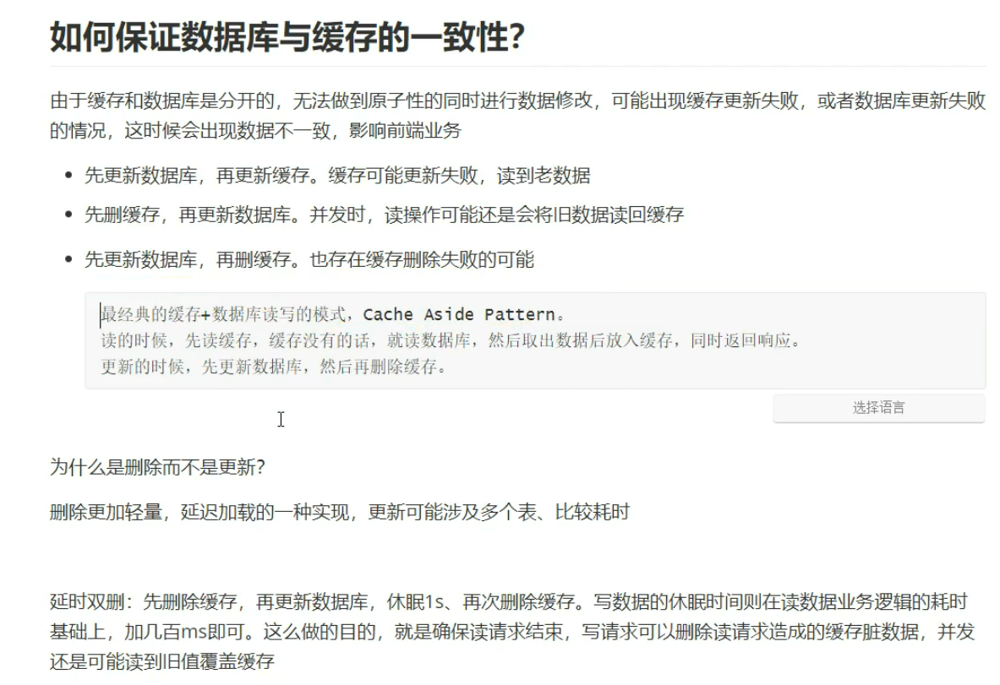

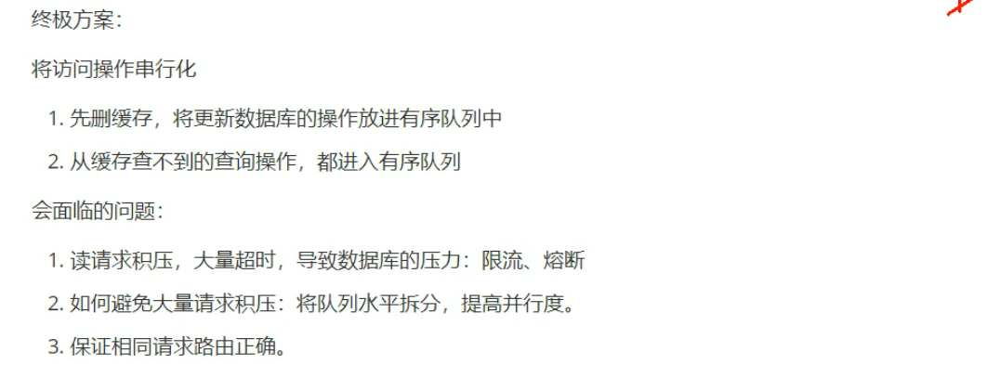


## 12.redis主从复制原理

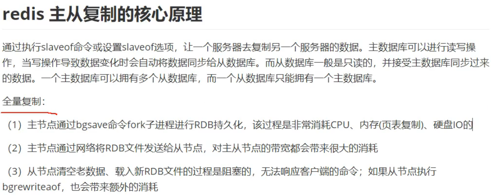

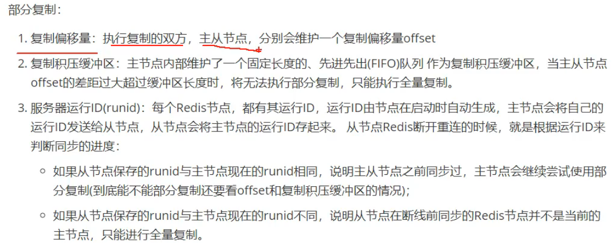


## 13.redis高可用方案

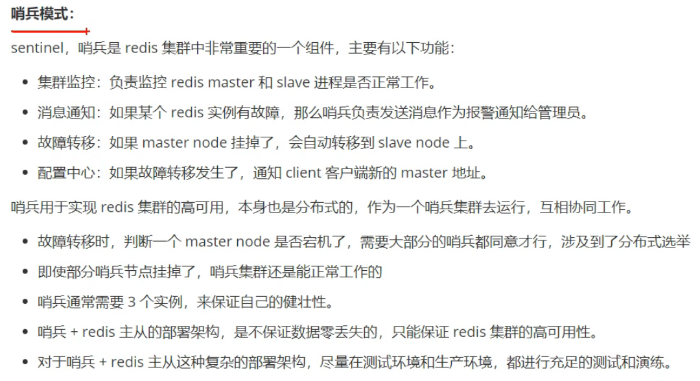

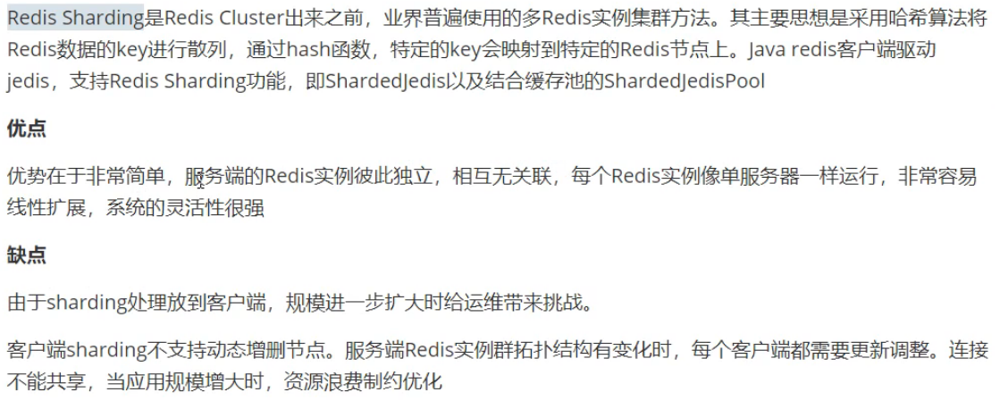


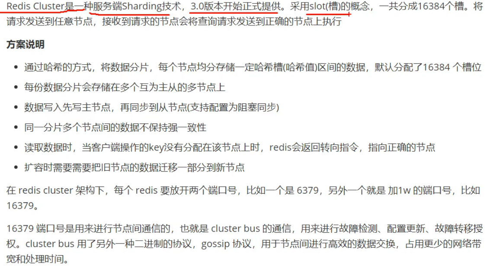

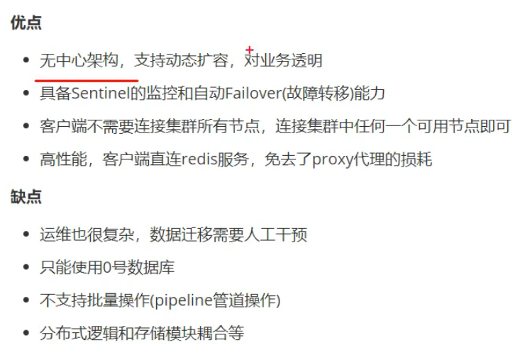


## 14. ZSet排序，分数相同的时候按照时间排序

**设计**

  分数 = 等级 + 时间 （当前系统时间戳）

  分数是 64位的长整型 Long (有符号)

  **\1) 设计方式一**

​     long 分数，二进制用高 32位存 等级，低32位存时间（秒精度），那么数据看起是这样

​     A 玩家， 10 + 1111111111（时间戳）   

​     后来 B 玩家也到 10 级， 10 + 2222222222（时间戳）     

​     这样排序，最终还是 B 玩家 会排到第一名，不能达到目的。

  **\2) 设计方式二**  

​     long 整数长度总共有 19位，923XXX.......，时间戳 毫秒精度 是 13位，所以只需 14 ~ 19 位存 等级，其他13位存时间。接下来看怎么存。

​     等级偏移： Math.power(10, 14) = 10000000000000000（14位）

​     这里有一个最大时间 MAX_TIME = 9999999999999 （13位）

​     A 玩家，（10 * 等级偏移） + MAX_TIME - 11111111111111（ 时间戳），最终分数 10888888888888888

​     B 玩家，（10 * 等级偏移） + MAX_TIME - 22222222222222（ 时间戳），最终分数 10777777777777777

​     最终排序，A 玩家依然是第一。通过分数可以解析出真实 【等级 = 分数 / 等级偏移，取整】

**\3. 劣势**

  \1) 如果有三个，四个排序条件怎么办，这种情况还是推荐使用数据库，就别考虑 Redis了 。Redis 优势在于可以做到实时排行

  \2) 方式二 14 ~ 19位，那么等级最大数据就只能是 919999，超过这个数就会溢出。可以把时间戳降低到秒级别，可以支持更大数字


## 15. 数据结构

​	String、List、Set、zSet、Hash、Bitmap、Hyperloglog、GEO（地理信息）

> 1. String：商品编号、阅读量、点击量用incr命令实现
> 2. set：微信抽奖小程序、微信点赞、共同好友

[list](https://www.cnblogs.com/reecelin/p/13358432.html)：其底层有`linkedList`、`zipList`和`quickList`这三种存储方式。

> 关于压缩链表：`zipList`是由连续的内存组成的，每一个节点不用维护头尾指针，节约内存。zipList遍历时，先根据`zlbytes`和`zltail_offset`定位到最后一个`entry`的位置，然后再根据最后一个`entry`里的`prelen`时确定前一个`entry`的位置。
>
> `qucikList`是由`zipList`和双向链表`linkedList`组成的混合体。它将`linkedList`按段切分，每一段使用`zipList`来紧凑存储，多个`zipList`之间使用双向指针串接起来。

zset：[跳跃表](https://www.bilibili.com/video/BV1QK4y1Y7mS)
[Hash](https://www.cnblogs.com/reecelin/p/13362104.html)：ziplist（压缩列表）和hashtable。


# 六、Mysql


## 1.[Mysql中事务ACID实现原理](https://www.cnblogs.com/rjzheng/p/10841031.html)

**原子性(Atomicity)、一致性(Consistency)、隔离性(Isolation)、持久性(Durability)**


## 2. [gap间隙锁](https://www.cnblogs.com/rjzheng/p/9950951.html)

锁定一个范围但不包括记录本身。其目的是为了防止同一事物的两次当前读出现幻读的情况。 

（1）在索引记录之间，或者在索引之前，或者索引之后的区间上加锁，就是gap锁。比如：

```
SELECT c1 FROM t WHERE c1 BETWEEN 10 and 20 FOR UPDATE;
```

由于在c1=10和c2=20之间已经加上gap锁，所以不管数据表中是否有c1=15这条数据，这个sql都会阻止试图插入c1=15的事务。

（2）一个gap锁可能会锁一个索引、多个索引、或者空索引。

（3）gap锁权衡了性能和并发，并且它只用作于特定的隔离级别。

**什么时候会出现gap间隙锁**

用唯一索引查询唯一的行数据，并不会产生gap锁。比如：

``` 
SELECT * FROM child WHERE id = 100;
```

如果id是唯一索引，就不会产生gap锁；如果id不是索引或者id不是唯一索引，那么会产生gap锁。


## 3. 行锁

锁住某一行，如果表存在索引，那么记录锁是锁在索引上的，如果表没有索引，那么 InnoDB 会创建一个隐藏的聚簇索引加锁。行级锁能大大减少数据库操作的冲突。其加锁粒度最小，并发度高，但加锁的开销也最大，加锁慢，会出现死锁。 

如果一个where语句里面既有聚簇索引，又有二级索引，则会先锁聚簇索引，再锁二级索引。由于是分步加锁的，因此可能会有死锁发生。


## 4. B树和B+树

**b树（balance tree）**和b+树应用在数据库索引，可以认为是m叉的多路平衡查找树，但是从理论上讲，二叉树查找速度和比较次数都是最小的，为什么不用二叉树呢？

因为我们要考虑磁盘IO的影响，它相对于内存来说是很慢的。数据库索引是存储在磁盘上的，当数据量大时，就不能把整个索引全部加载到内存了，只能逐一加载每一个磁盘页（对应索引树的节点）。所以我们要减少IO次数，对于树来说，IO次数就是树的高度，而“矮胖”就是b树的特征之一，它的每个节点最多包含m个孩子，m称为b树的阶，m的大小取决于磁盘页的大小。

**b+树，是b树的一种变体，查询性能更好。m阶的b+树的特征：**

- 有n棵子树的非叶子结点中含有n个关键字（b树是n-1个），这些关键字不保存数据，只用来索引，所有数据都保存在叶子节点（b树是每个关键字都保存数据）。
- 所有的叶子结点中包含了全部关键字的信息，及指向含这些关键字记录的指针，且叶子结点本身依关键字的大小自小而大顺序链接。
- 所有的非叶子结点可以看成是索引部分，结点中仅含其子树中的最大（或最小）关键字。通常在b+树上有两个头指针，一个指向根结点，一个指向关键字最小的叶子结点。
- 同一个数字会在不同节点中重复出现，根节点的最大元素就是b+树的最大元素。

**b+树相比于b树的查询优势：**

- B树不管叶子节点还是非叶子节点，都会保存数据，这样导致在非叶子节点中能保存的指针数量变少(有些资料也称为扇出)，指针少的情况下要保存大量数据，只能增加树的高度，导致IO操作变多，查询性能变低；
- b+树的中间节点不保存数据，所以磁盘页能容纳更多节点元素，更“矮胖”；
- 对于范围查找来说，b+树只需遍历叶子节点链表即可，b树却需要重复地中序遍历
- b+树查询必须查找到叶子节点，b树只要匹配到即可不用管元素位置，因此b+树查找更稳定（并不慢）；


## 5.[MVCC原理](https://blog.csdn.net/SnailMann/article/details/94724197)

MVCC 的英文全称是 Multiversion Concurrency Control  ，中文意思是多版本并发控制技术。原理是，通过数据行的多个版本管理来实现数据库的并发控制，简单来说就是保存数据的历史版本。可以通过比较版本号决定数据是否显示出来。读取数据的时候不需要加锁可以保证事务的隔离效果。

**基本特征：**

- 每行数据都存在一个版本，每次数据更新时都更新该版本。

- 修改时Copy出当前版本随意修改，各个事务之间无干扰。

- 保存时比较版本号，如果成功（commit），则覆盖原记录；失败则放弃copy（rollback）


**InnoDB存储引擎MVCC的实现策略**：

在每一行数据中额外保存两个隐藏的列：当前行创建时的版本号和删除时的版本号， 每个事务又有自己的版本号，这样事务内执行CRUD操作时，就通过版本号的比较来达到数据版本控制的目的。

#### **隐式字段**

每行记录除了我们自定义的字段外，还有数据库隐式定义的DB_TRX_ID,DB_ROLL_PTR,DB_ROW_ID等字段

```java
DB_TRX_ID
6byte，最近修改(修改/插入)事务ID：记录创建这条记录/最后一次修改该记录的事务ID
DB_ROLL_PTR
7byte，回滚指针，指向这条记录的上一个版本（存储于rollback segment里）
DB_ROW_ID
6byte，隐含的自增ID（隐藏主键），如果数据表没有主键，InnoDB会自动以DB_ROW_ID产生一个聚簇索引
实际还有一个删除flag隐藏字段, 既记录被更新或删除并不代表真的删除，而是删除flag变了
```
#### **undo日志**

- insert undo log
  代表事务在insert新记录时产生的undo log, 只在事务回滚时需要，并且在事务提交后可以被立即丢弃
- update undo log
  事务在进行update或delete时产生的undo log; 不仅在事务回滚时需要，在快照读时也需要；所以不能随便删除，只有在快速读或事务回滚不涉及该日志时，对应的日志才会被purge线程统一清除

#### **Read View(读视图)**

说白了Read View就是事务进行`快照读`操作的时候生产的`读视图`(Read View)，在该事务执行的快照读的那一刻，会生成数据库系统当前的一个快照，记录并维护系统当前活跃事务的ID

**trx_list**（名字我随便取的）
一个数值列表，用来维护Read View生成时刻系统正活跃的事务ID
**up_limit_id**
记录trx_list列表中事务ID最小的ID
**low_limit_id**
ReadView生成时刻系统尚未分配的下一个事务ID，也就是目前已出现过的事务ID的最大值+1

> `DB_TRX_ID` 是当前操作该记录的事务 ID
>
> - 首先比较 DB_TRX_ID < up_limit_id , 如果小于，则当前事务能看到 DB_TRX_ID 所在的记录，如果大于等于进入下一个判断
> - 接下来判断 DB_TRX_ID >= low_limit_id , 如果大于等于则代表 DB_TRX_ID 所在的记录在 Read View 生成后才出现的，那对当前事务肯定不可见，如果小于则进入下一个判断
> - 判断 DB_TRX_ID 是否在活跃事务之中，trx_list.contains (DB_TRX_ID)，如果在，则代表我 Read View 生成时刻，你这个事务还在活跃，还没有 Commit，你修改的数据，我当前事务也是看不见的；如果不在，则说明，你这个事务在 Read View 生成之前就已经 Commit 了，你修改的结果，我当前事务是能看见的

### RC,RR级别下的InnoDB快照读有什么不同？

正是Read View生成时机的不同，从而造成RC,RR级别下快照读的结果的不同

    - 在RR级别下的某个事务的对某条记录的第一次快照读会创建一个快照及Read View, 将当前系统活跃的其他事务记录起来，此后在调用快照读的时候，还是使用的是同一个Read View，所以只要当前事务在其他事务提交更新之前使用过快照读，那么之后的快照读使用的都是同一个Read View，所以对之后的修改不可见；
    - 即RR级别下，快照读生成Read View时，Read View会记录此时所有其他活动事务的快照，这些事务的修改对于当前事务都是不可见的。而早于Read View创建的事务所做的修改均是可见
    - 而在RC级别下的，事务中，每次快照读都会新生成一个快照和Read View, 这就是我们在RC级别下的事务中可以看到别的事务提交的更新的原因

总之在RC隔离级别下，是每个快照读都会生成并获取最新的Read View；而在RR隔离级别下，则是同一个事务中的第一个快照读才会创建Read View, 之后的快照读获取的都是同一个Read View。


## 6.聚集索引和非聚集索引

其中聚集索引表示表中存储的数据按照索引的顺序存储，检索效率比非聚集索引高，但对数据更新影响较大。非聚集索引表示数据存储在一个地方，索引存储在另一个地方，索引带有指针指向数据的存储位置，非聚集索引检索效率比聚集索引低，但对数据更新影响较小。

区别：

    聚集索引一个表只能有一个，而非聚集索引一个表可以存在多个
    聚集索引存储记录是物理上连续存在，而非聚集索引是逻辑上的连续，物理存储并不连续
    聚集索引:物理存储按照索引排序；聚集索引是一种索引组织形式，索引的键值逻辑顺序决定了表数据行的物理存储顺序。
    非聚集索引:物理存储不按照索引排序；非聚集索引则就是普通索引了，仅仅只是对数据列创建相应的索引，不影响整个表的物理存储顺序。
    索引是通过二叉树的数据结构来描述的，我们可以这么理解聚簇索引：索引的叶节点就是数据节点。而非聚簇索引的叶节点仍然是索引节点，只不过有一个指针指向对应的数据块。

MyISAM 引擎中，B+Tree 叶节点的 data 域存放的是数据记录的地址。在索引检索的时候，首先按照 B+Tree  搜索算法搜索索引，如果指定的 Key 存在，则取出其 data 域的值，然后以 data  域的值为地址读取相应的数据记录。这被称为“非聚簇索引”。

InnoDB 引擎中，其数据文件本身就是索引文件。相比  MyISAM，索引文件和数据文件是分离的，其表数据文件本身就是按 B+Tree 组织的一个索引结构，树的叶节点 data  域保存了完整的数据记录。这个索引的 key 是数据表的主键，因此 InnoDB  表数据文件本身就是主索引。这被称为“聚簇索引（或聚集索引）”，而其余的索引都作为辅助索引，辅助索引的 data  域存储相应记录主键的值而不是地址，这也是和 MyISAM 不同的地方。在根据主索引搜索时，直接找到 key  所在的节点即可取出数据；在根据辅助索引查找时，则需要先取出主键的值，在走一遍主索引。  因此，在设计表的时候，不建议使用过长的字段作为主键，也不建议使用非单调的字段作为主键，这样会造成主索引频繁分裂。


## 7.稀疏索引和稠密索引

首先对密集索引和稀疏索引的区分在与是否为每个索引键的值都建立索引，简单来说就是比如有一列的值如下: 

1、2、3、4、5、6、7

密集索引的做法是为这7个值建立索引记录，那么就有7条索引记录，抽象索引记录如下:

​       1:到1的指针

​       2:到2的指针

​       ....

​       7:到7的指针

稀疏索引的做法是将这个6个值分组，1、2、3和4、5、6和7分为不同的3组，取这三组中最小的索引键值作为索引记录中的索引值，抽象索引记录如下:

​       1:到顺序存储1、2、3的起始位置的指针

​       4:到顺序存在4、5、6的起始位置的指针

​       7:到顺序存储7的起始位置的指针

这两种索引都要通过**折半查找**或者叫做二分查找来确定数据位置，不同的是密集索引，只需要通过二分查找到搜索值=索引的索引记录就能确定准确的数据位置，而稀疏索引则需要先定位到搜索值>索引值的最小的那个，然后在通过起始位置去定位具体的偏移量。

这是两种不同的索引实现，一种建立了索引值与数据位置的1:1的关系，一种建立了索引值与数据位置1:n的关系。在大多数场景密集索引查询效率更高，在大多数场景稀疏索引占用空间更小。


## 8.基于主键索引的查询和非主键索引的查询有什么区别？ 

 对于select * from 主键=XX，基于主键的普通查询仅查找主键这棵树，对于select * from 非主键=XX，基于非主键的查询有可能存在回表过程（回到主键索引树搜索的过程称为回表），因为非主键索引叶子节点仅存主键值，无整行全部信息。 


## 9.数据库中多个事务同时进行可能会出现什么问题？ 

- 丢失修改 

- 脏读：当前事务可以查看到别的事务未提交的数据。 

- 不可重读：在同一事务中，使用相同的查询语句，同一数据资源莫名改变了。 

- 幻读：在同一事务中，使用相同的查询语句，莫名多出了一些之前不存在的数据，或莫名少了一些原先存在的数据。 

  

## 10.redo log和binlog区别

redo log 是 InnoDB 存储引擎层的日志，又称重做日志文件，redo log 是循环写的，redo log 不是记录数据页更新之后的状态，而是记录这个页做了什么改动。

- redo log是属于innoDB层面，binlog属于MySQL Server层面的，这样在数据库用别的存储引擎时可以达到一致性的要求。
- redo log是物理日志，记录该数据页更新的内容；binlog是逻辑日志，记录的是这个更新语句的原始逻辑
- redo log是循环写，日志空间大小固定；binlog是追加写，是指一份写到一定大小的时候会更换下一个文件，不会覆盖。
- binlog可以作为恢复数据使用，主从复制搭建，redo log作为异常宕机或者介质故障后的数据恢复使用。


## 11.简述MySQL主从复制 

 MySQL提供主从复制功能，可以方便的实现数据的多处自动备份，不仅能增加数据库的安全性，还能进行读写分离，提升数据库负载性能。 

 主从复制流程： 

1.  在事务完成之前，主库在binlog上记录这些改变，完成binlog写入过程后，主库通知存储引擎提交事物 
2.  从库将主库的binlog复制到对应的中继日志，即开辟一个I/O工作线程，I/O线程在主库上打开一个普通的连接，然后开始binlog dump process，将这些事件写入中继日志。从主库的binlog中读取事件，如果已经读到最新了，线程进入睡眠并等待ma主库产生新的事件。 

 读写分离：即只在MySQL主库上写，只在MySQL从库上读，以减少数据库压力，提高性能。 


## 12.[mysql的行锁加在哪个位置](https://blog.csdn.net/weixin_28778341/article/details/113385258)

MySQL不存在数据本身加锁一说，即，如果WHERE语句不走索引，则只能加表锁。间隙锁不会存在于RC隔离级别中。

通过如下语句，可以给查询语句的扫描行上共享锁：

> select ... lock in share mode

通过如下语句，可以给查询语句的扫描行上排它锁：

> select ... for update //排他锁

**UPDATE语句加锁很好概括：**

根据语句涉及的索引及聚簇索引上锁。使用EXPLAIN查看相应的查询语句可以很容易地看出所走的索引。譬如有如下一个表user，其name列有单列索引，email列有唯一索引：

接下来执行下面的语句：

> UPDATE user set registertime = "0" WHERE name = '小明'

假设表中数据有一定量级和复杂度，在更新时就会走索引列name，就会对name的索引值为"小明"的节点上X锁，同时回溯主键id，对相应的记录上X锁。

UPDATE-无索引

无索引时很多人认为MySQL的更新会使用表锁，实际上为了尽可能的避免阻塞，是涉及了整个表的行锁。这与表锁有何不同呢？因为MySQL会在获取数据的时候对数据做比较，如果上面的SQL语句中name列并没有索引，MySQL起初会对所有聚簇索引列上锁，并在其后在循环过程中逐渐对数据列做解锁操作。当然，这也是批量无索引的状态下更新很容易引起死锁的原因。

**insert时全表锁，因为要生成主键字段、索引等等**


## 13.varchar与char有什么区别

**区别一，定长和变长**
char 表示定长，长度固定，varchar表示变长，即长度可变。char如果插入的长度小于定义长度时，则用空格填充；varchar小于定义长度时，还是按实际长度存储，插入多长就存多长。

因为其长度固定，char的存取速度还是要比varchar要快得多，方便程序的存储与查找；但是char也为此付出的是空间的代价，因为其长度固定，所以会占据多余的空间，可谓是以空间换取时间效率。varchar则刚好相反，以时间换空间。

**区别之二，存储的容量不同**
对 char 来说，最多能存放的字符个数 255，和编码无关。
而 varchar 呢，最多能存放 65532 个字符。varchar的最大有效长度由最大行大小和使用的字符集确定。整体最大长度是 65,532字节。


## 14.[主键和唯一索引的区别](https://www.cnblogs.com/linguoguo/p/10529272.html)             

- 主键是一种约束，唯一索引是一种索引，两者在本质上是不同的。

- 主键列在创建时，已经默认为非空值 + 唯一索引了。

- 主键可以被其他表引用为外键，而唯一索引不能。

- 一个表最多只能创建一个主键，但可以创建多个唯一索引。

- 主键和唯一索引都可以有多列。


## 15.[MySQL分页查询优化](https://www.cnblogs.com/youyoui/p/7851007.html)

**普通分页**

```sql
select * from orders_history where type=8 limit 1000,10;
```

**使用子查询优化**

这种方式先**定位偏移位置的 id**，然后往后查询，这种方式**适用于 id 递增**的情况。

```sql
select * from orders_history where type=8 and 
id>=(select id from orders_history where type=8 limit 100000,1) 
limit 100;
```

**使用 id 限定优化**

这种方式假设数据表的id是**连续递增**的，则我们根据查询的页数和查询的记录数可以算出查询的id的范围，可以使用 id between and 来查询：

```sql
select * from orders_history where type=2 
and id between 1000000 and 1000100 limit 100;
```


## 16.B+Tree索引树有多高，以及能存多少行数据？

B+树的存放总记录数为： **根节点指针数 \* 单个叶子节点记录行数** 。 

单个叶子节点（页）中的记录数=16K/1K=16。（这里假设一行记录的数据大小为1k，实际上现在很多互联网业务数据记录大小通常就是1K左右）。

**那么现在我们需要计算出非叶子节点能存放多少指针？**

假设主键ID为bigint类型，长度为8字节，而指针大小在InnoDB源码中设置为6字节，这样一共14字节，我们一个页中能存放多少这样的单元，其实就代表有多少指针，即 **16384/14=1170** 。那么可以算出一棵高度为2的B+树，能存放 **1170\*16=18720** 条这样的数据记录。 

同样的原理我们可以算出一个高度为3的B+树可以存放： **1170\*1170\*16=21902400** 条这样的记录。 **所以在InnoDB中B+树高度一般为1-3层，它就能满足千万级的数据存储。**


## 17.索引失效行锁变表锁

```shell
# SESSION1 执行SQL语句，没有执行commit。
# 由于`b`字段是字符串，但是没有加单引号导致索引失效
mysql> UPDATE `test_innodb_lock` SET `a` = 888 WHERE `b` = 8000;
Query OK, 1 row affected, 1 warning (0.00 sec)
Rows matched: 1  Changed: 1  Warnings: 1

# SESSION2 和SESSION1操作的并不是同一行，但是也被阻塞了？？？
# 由于SESSION1执行的SQL索引失效，导致行锁升级为表锁。
mysql> UPDATE `test_innodb_lock` SET `b` = '1314' WHERE `a` = 1;
ERROR 1205 (HY000): Lock wait timeout exceeded; try restarting transaction
```


## 18. EXPLAIN

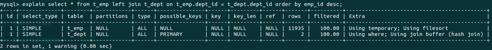

`system`>`const`>`eq_ref`>`ref`>`range`>`index`>`ALL`


## 19.索引题目

```sql
/* 最好索引怎么创建的，就怎么用，按照顺序使用，避免让MySQL再自己去翻译一次 */

/* 1.全值匹配 用到索引c1 c2 c3 c4全字段 */
EXPLAIN SELECT * FROM `test03` WHERE `c1` = 'a1' AND `c2` = 'a2' AND `c3` = 'a3' AND `c4` = 'a4';

/* 2.用到索引c1 c2 c3 c4全字段 MySQL的查询优化器会优化SQL语句的顺序*/
EXPLAIN SELECT * FROM `test03` WHERE `c1` = 'a1' AND `c2` = 'a2' AND `c4` = 'a4' AND `c3` = 'a3';

/* 3.用到索引c1 c2 c3 c4全字段 MySQL的查询优化器会优化SQL语句的顺序*/
EXPLAIN SELECT * FROM `test03` WHERE `c4` = 'a4' AND `c3` = 'a3' AND `c2` = 'a2' AND `c1` = 'a1';

/* 4.用到索引c1 c2 c3字段，c4字段失效，范围之后全失效 */
EXPLAIN SELECT * FROM `test03` WHERE `c1` = 'a1' AND `c2` = 'a2' AND `c3` > 'a3' AND `c4` = 'a4';

/* 5.用到索引c1 c2 c3 c4全字段 MySQL的查询优化器会优化SQL语句的顺序*/
EXPLAIN SELECT * FROM `test03` WHERE `c1` = 'a1' AND `c2` = 'a2' AND `c4` > 'a4' AND `c3` = 'a3';

/* 
   6.用到了索引c1 c2 c3三个字段, c1和c2两个字段用于查找,  c3字段用于排序了但是没有统计到key_len中，c4字段失效
*/
EXPLAIN SELECT * FROM `test03` WHERE `c1` = 'a1' AND `c2` = 'a2' AND `c4` = 'a4' ORDER BY `c3`;

/* 7.用到了索引c1 c2 c3三个字段，c1和c2两个字段用于查找, c3字段用于排序了但是没有统计到key_len中*/
EXPLAIN SELECT * FROM `test03` WHERE `c1` = 'a1' AND `c2` = 'a2' ORDER BY `c3`;

/* 
   8.用到了索引c1 c2两个字段，c4失效，c1和c2两个字段用于查找，c4字段排序产生了Using filesort说明排序没有用到c4字段 
*/
EXPLAIN SELECT * FROM `test03` WHERE `c1` = 'a1' AND `c2` = 'a2' ORDER BY `c4`;

/* 9.用到了索引c1 c2 c3三个字段，c1用于查找，c2和c3用于排序 */
EXPLAIN SELECT * FROM `test03` WHERE `c1` = 'a1' AND `c5` = 'a5' ORDER BY `c2`, `c3`;

/* 10.用到了c1一个字段，c1用于查找，c3和c2两个字段索引失效，产生了Using filesort */
EXPLAIN SELECT * FROM `test03` WHERE `c1` = 'a1' AND `c5` = 'a5' ORDER BY `c3`, `c2`;

/* 11.用到了c1 c2 c3三个字段，c1 c2用于查找，c2 c3用于排序 */
EXPLAIN SELECT * FROM `test03` WHERE `c1` = 'a1' AND  `c2` = 'a2' ORDER BY c2, c3;

/* 12.用到了c1 c2 c3三个字段，c1 c2用于查找，c2 c3用于排序 */
EXPLAIN SELECT * FROM `test03` WHERE `c1` = 'a1' AND  `c2` = 'a2' AND `c5` = 'a5' ORDER BY c2, c3;

/* 
   13.用到了c1 c2 c3三个字段，c1 c2用于查找，c2 c3用于排序 没有产生Using filesort 
      因为之前c2这个字段已经确定了是'a2'了，这是一个常量，再去ORDER BY c3,c2 这时候c2已经不用排序了！
      所以没有产生Using filesort 和(10)进行对比学习！
*/
EXPLAIN SELECT * FROM `test03` WHERE `c1` = 'a1' AND `c2` = 'a2' AND `c5` = 'a5' ORDER BY c3, c2;


/* GROUP BY 表面上是叫做分组，但是分组之前必定排序。 */

/* 14.用到c1 c2 c3三个字段，c1用于查找，c2 c3用于排序，c4失效 */
EXPLAIN SELECT * FROM `test03` WHERE `c1` = 'a1' AND `c4` = 'a4' GROUP BY `c2`,`c3`;

/* 15.用到c1这一个字段，c4失效，c2和c3排序失效产生了Using filesort */
EXPLAIN SELECT * FROM `test03` WHERE `c1` = 'a1' AND `c4` = 'a4' GROUP BY `c3`,`c2`;
```


## 20.外键必须是另一个表的主键吗 ？

不一定是主键，但必须是唯一性索引。
 主键约束和唯一性约束都是唯一性索引。
 外键是表间关系的参照，可以不是主键。只是表明两个表之间的关系是通过那个属性连接起来的。

比如学生表在设计的时候一般可以用学号作为主键，也可设计一个ID字段，字段由数据库自动生成且唯一。

**外键的使用条件:**

① 两个表必须是InnoDB表，MyISAM表暂时不支持外键

② 外键列必须建立了索引，MySQL 4.1.2以后的版本在建立外键时会自动创建索引，但如果在较早的版本则需要显式建立；

③ 外键关系的两个表的列必须是数据类型相似，也就是可以相互转换类型的列，比如int和tinyint可以，而int和char则不可以；


## 21.唯一约束和唯一索引

> 唯一约束 保证在一个字段或者一组字段里的数据都与表中其它行的对应数据不同。和主键约束不同，唯一约束允许为 NULL，只是只能有一行。

创建唯一约束时，会自动的创建唯一索引,在实际使用时，基本没有区别。

> MySQL 中唯一约束是通过唯一索引实现的，为了保证没有重复值，在插入新记录时会再检索一遍，怎样检索快，当然是建索引了，所以，在创建唯一约束的时候就创建了唯一索引。


## 22.[哪些字段应建索引](https://blog.csdn.net/zzhongcy/article/details/98194507)

1) 定义主键的数据列一定要建立索引。

2) 定义有外键的数据列一定要建立索引。

3) 对于经常查询的数据列最好建立索引。

4) 对于需要在指定范围内的快速或频繁查询的数据列;

**5) 经常用在WHERE子句中的数据列。**

**6) 经常出现在关键字order by、group by、distinct后面的字段，建立索引。**

    如果建立的是复合索引，索引的字段顺序要和这些关键字后面的字段顺序一致，否则索引不会被使用。

**7) 对于那些查询中很少涉及的列，重复值比较多的列不要建立索引。**

8) 对于定义为text、image和bit的数据类型的列不要建立索引。

**9) 对于经常存取的列避免建立索引**

10) 限制表上的索引数目。对一个存在大量更新操作的表，所建索引的数目一般不要超过3个，最多不要超过5个。

     索引虽说提高了访问速度，但太多索引会影响数据的更新操作。

11) 对复合索引，按照字段在查询条件中出现的频度建立索引。在复合索引中，记录首先按照第一个字段排序。

      对于在第一个字段上取值相同的记录，系统再按照第二个字段的取值排序，以此类推。
      因此只有复合索引的第一个字段出现在查询条件中，该索引才可能被使用,因此将应用频度高的字段，放置在复合索引的前面，会使系统最大可能地使用此索引，发挥索引的作用.


## 23.索引失效的情况

- like以通配符开头（'%abc'）索引失效，当like前缀没有%，后缀有%时，索引有效。
- 使用or的时候，只有当or左右查询字段均为索引时，才会生效。（用uion代替）
- 最佳左前缀法则（带头大哥不能死，中间兄弟不能死）
- 索引列不能做任何计算，包括类型转换
- 索引列上使用is null,is not null可能会索引失效
- 使用不等于(!= 或者<>)时，有时会无法使用索引会导致全表扫描。
- 当全表扫描速度比索引速度快时，mysql会使用全表扫描，此时索引失效。
- 索引列不能有范围查询，将可能做范围查询的字段的索引顺序放最后


## 24.[Mysql中用来存储日期的数据类型有三种：Date、Datetime、Timestamp](https://blog.csdn.net/chengsw1993/article/details/116597420)
- **Date数据类型：用来存储没有时间的日期。**

> Mysql获取和显示这个类型的格式为“YYYY-MM-DD”。按照标准的SQL，不允许其他格式。在UPDATE表达式以及SELECT语句的WHERE子句中应使用该格式。例如：mysql> SELECT * FROM tbl_nameWHERE date >= ‘2003-05-05’;

> 支持的范围为'1000-01-01'到'9999-12-31'。MySQL以’YYYY-MM-DD’格式显示DATE值，但允许使用字符串或数字为DATE列分配值。

- **Datetime类型：日期和时间的组合。**

> 支持的范围是'1000-01-01 00:00:00'到'9999-12-31 23:59:59'。MySQL以’YYYY-MM-DD HH:MM:SS’格式显示DATETIME值，但允许使用字符串或数字为DATETIME列分配值。

- **Timestamp类型：时间戳。**

> 范围是'1970-01-01 00:00:00'到'2037-12-31 23:59:59。

> TIMESTAMP列用于INSERT或UPDATE操作时记录日期和时间。如果你不分配一个值，表中的第一个TIMESTAMP列自动设置为最近操作的日期和时间。也可以通过分配一个NULL值，将TIMESTAMP列设置为当前的日期和时间。

> TIMESTAMP值返回后显示为’YYYY-MM-DD HH:MM:SS’格式的字符串，显示宽度固定为19个字符。如果想要获得数字值，应在TIMESTAMP 列添加+0。

> 所有不符合上面所述格式的数据都会被转换为相应类型的0值。(0000-00-00或者0000-00-00 00:00:00)

**通常我们都会首选 Timestamp**

> DateTime 类型没有时区信息

> Timestamp 只需要使用 4 个字节的存储空间，但是 DateTime 需要耗费 8 个字节的存储空间。但是，这样同样造成了一个问题，Timestamp 表示的时间范围更小。

    DateTime ：1000-01-01 00:00:00 ~ 9999-12-31 23:59:59
    Timestamp：1970-01-01 00:00:01 ~ 2037-12-31 23:59:59


## 25.varchar(100)和varchar(10)的区别在哪里？

一般初学会认为，二者占用的空间是一样的。比如说我存储5个char，二者都是实际占用了5个char了【不准确的想法：varchar在实际存储的时候会多一个byte用来存放长度】。
但是深入一下，设计数据库的时候，二者一样吗？
答案是否定的【至少varchar类型需要在数据之前利用一个或者两个字节来存储数据的长度】并且二者在内存中的操作方式也是不同的，下面的例子中有体现（例[子链接：看下面的例子。 ）](https://vsalw.com/wp-content/themes/begin/inc/go.php?url=http://tech.it168.com/a2011/0426/1183/000001183173.shtml)
如现在用户需要存储一个地址信息。根据评估，只要使用100个字符就可以了。但是有些数据库管理员会认为，反正Varchar数据类型是根据实际的需要来分配长度的。还不如给其大一点的呢。为此他们可能会为这个字段一次性分配200个字符的存储空间。这VARCHAR(100)与VARCHAR(200)真的相同吗?

结果是否定的。虽然他们用来存储90个字符的数据，其存储空间相同。但是对于内存的消耗是不同的。对于VARCHAR数据类型来说，硬盘上的存储空间虽然都是根据实际字符长度来分配存储空间的，但是对于内存来说，则不是。其时使用固定大小的内存块来保存值。简单的说，就是使用字符类型中定义的长度，即200个字符空间。显然，这对于排序或者临时表(这些内容都需要通过内存来实现)作业会产生比较大的不利影响。解释可以[参见这里](https://vsalw.com/wp-content/themes/begin/inc/go.php?url=http://stackoverflow.com/questions/1151667/what-are-the-optimum-varchar-sizes-for-mysql)。如果不想看解释，我这里大概说下：**假设VARCHAR(100)与VARCHAR(200)类型，实际存90个字符，它不会对存储端产生影响（就是实际占用硬盘是一样的）。但是，它确实会对查询产生影响，因为当MySql创建临时表（SORT，ORDER等）时，VARCHAR会转换为CHAR，转换后的CHAR的长度就是varchar的长度，在内存中的空间就变大了，在排序、统计时候需要扫描的就越多，时间就越久。**


## 26.varchar能存多少汉字、数字？

**具体还是要看版本的，一个字符占用3个字节  ，一个汉字（包括数字）占用3个字节=一个字符**

**4.0版本以下**，varchar(100)，指的是**100字节**，如果存放UTF8汉字时，只能存33个（每个汉字3字节）

**5.0版本以上**，varchar(100)，指的是**100字符**，无论存放的是数字、字母还是UTF8汉字（每个汉字3字节），都可以存放100个。

> **UTF8编码中一个汉字（包括数字）占用3个字节**

> **GBK编码中一个汉字（包括数字）占用2个字节**


## 27.什么时候会键临时表

1、UNION查询；

2、用到TEMPTABLE算法或者是UNION查询中的视图；

3、ORDER BY和GROUP BY的子句不一样时；

4、表连接中，ORDER BY的列不是驱动表中的；(指定了联接条件时，满足查询条件的记录行数少的表为[驱动表]，未指定联接条件时，行数少的表为[驱动表]，多表联合查询时)

5、DISTINCT查询并且加上ORDER BY时；

6、SQL中用到SQL_SMALL_RESULT选项时；

7、FROM中的子查询；

8、子查询或者semi-join时创建的表；


## 28.[mysql如何解决幻读](https://www.cnblogs.com/JMrLi/p/12705188.html)

- 在快照读情况下，MySQL通过mvcc来避免幻读。 
- 在当前读情况下，MySQL通过next-key来避免幻读（加行锁和间隙锁来实现的）。 

**`Serializable`隔离级别也可以避免幻读，会锁住整张表，并发性极低，一般不会使用：**

> 事务在读操作时，先加表级别的共享锁，直到事务结束才释放

> 事务在写操作时，先加表级别的排它锁，直到事务结束才释放

**MVCC:**

MVCC解决了基于快照读下的幻读，事务 读 取的 行， 要么 是在 事务 开始 前 已经 存在 的， 要么 是 事务 自身 插入 或者 修 改过 的。

并不会读到其他事务的写操作 ！！！

**但是MVCC无法解决当前读下的幻读。**

快照读情况下，InnoDB通过mvcc机制避免了幻读现象。而mvcc机制无法避免当前读情况下出现的幻读现象。因为当前读每次读取的都是最新数据，这时如果两次查询中间有其它事务插入数据，就会产生幻读。


## 29.mysql主从同步原理

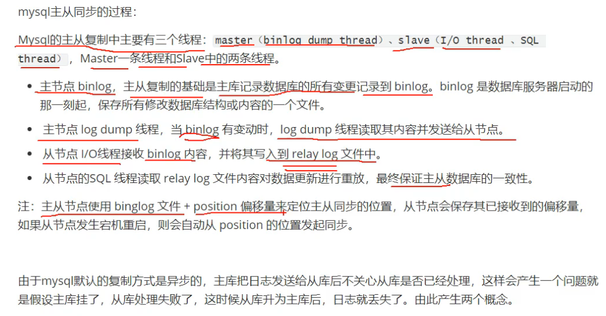


## 30.drop、truncate和delete的区别

**一、delete**

1、delete是DML，执行delete操作时，每次从表中删除一行，并且同时将该行的的删除操作记录在redo和undo表空间中以便进行回滚（rollback）和重做操作，但要注意表空间要足够大，需要手动提交（commit）操作才能生效，可以通过rollback撤消操作。

2、delete可根据条件删除表中满足条件的数据，如果不指定where子句，那么删除表中所有记录。

3、delete语句不影响表所占用的extent，高水线(high watermark)保持原位置不变。

**二、truncate**

1、truncate是DDL，会隐式提交，所以，不能回滚，不会触发触发器。

2、truncate会删除表中所有记录，并且将重新设置高水线和所有的索引，缺省情况下将空间释放到minextents个extent，除非使用reuse storage，。不会记录日志，所以执行速度很快，但不能通过rollback撤消操作（如果一不小心把一个表truncate掉，也是可以恢复的，只是不能通过rollback来恢复）。

3、对于外键（foreignkey ）约束引用的表，不能使用 truncate table，而应使用不带 where 子句的 delete 语句。

4、truncatetable不能用于参与了索引视图的表。

**三、drop**

1、drop是DDL，会隐式提交，所以，不能回滚，不会触发触发器。

2、drop语句删除表结构及所有数据，并将表所占用的空间全部释放。

3、drop语句将删除表的结构所依赖的约束，触发器，索引，依赖于该表的存储过程/函数将保留,但是变为invalid状态。

**总结：**

1、在速度上，一般来说，drop> truncate > delete。

2、在使用drop和truncate时一定要注意，虽然可以恢复，但为了减少麻烦，还是要慎重。

3、如果想删除部分数据用delete，注意带上where子句，回滚段要足够大；

   如果想删除表，当然用drop； 

   如果想保留表而将所有数据删除，如果和事务无关，用truncate即可；

   如果和事务有关，或者想触发trigger，还是用delete；

   如果是整理表内部的碎片，可以用truncate跟上reuse stroage，再重新导入/插入数据。


## 31.[分库分表](https://www.cnblogs.com/butterfly100/p/9034281.html)

**1.垂直切分：**

**垂直分库**就是根据业务耦合性，将关联度低的不同表存储在不同的数据库。做法与大系统拆分为多个小系统类似，按业务分类进行独立划分。与"微服务治理"的做法相似，每个微服务使用单独的一个数据库。如图：


**垂直分表**是基于数据库中的"列"进行，某个表字段较多，可以新建一张扩展表，将不经常用或字段长度较大的字段拆分出去到扩展表中。在字段很多的情况下（例如一个大表有100多个字段），通过"大表拆小表"，更便于开发与维护，也能避免跨页问题，MySQL底层是通过数据页存储的，一条记录占用空间过大会导致跨页，造成额外的性能开销。另外数据库以行为单位将数据加载到内存中，这样表中字段长度较短且访问频率较高，内存能加载更多的数据，命中率更高，减少了磁盘IO，从而提升了数据库性能。


垂直切分的优点：

- 解决业务系统层面的耦合，业务清晰
- 与微服务的治理类似，也能对不同业务的数据进行分级管理、维护、监控、扩展等
- 高并发场景下，垂直切分一定程度的提升IO、数据库连接数、单机硬件资源的瓶颈

缺点：

- 部分表无法join，只能通过接口聚合方式解决，提升了开发的复杂度
- 分布式事务处理复杂
- 依然存在单表数据量过大的问题（需要水平切分）


**2.水平切分:**

当一个应用难以再细粒度的垂直切分，或切分后数据量行数巨大，存在单库读写、存储性能瓶颈，这时候就需要进行水平切分了。

水平切分分为库内分表和分库分表，是根据表内数据内在的逻辑关系，将同一个表按不同的条件分散到多个数据库或多个表中，每个表中只包含一部分数据，从而使得单个表的数据量变小，达到分布式的效果。如图所示： 


库内分表只解决了单一表数据量过大的问题，但没有将表分布到不同机器的库上，因此对于减轻MySQL数据库的压力来说，帮助不是很大，大家还是竞争同一个物理机的CPU、内存、网络IO，最好通过分库分表来解决。

水平切分的优点：

- 不存在单库数据量过大、高并发的性能瓶颈，提升系统稳定性和负载能力
- 应用端改造较小，不需要拆分业务模块

缺点：

- 跨分片的事务一致性难以保证

- 跨库的join关联查询性能较差

- 数据多次扩展难度和维护量极大

  

### 分库分表带来的问题

- 事务一致性问题 

  >分布式事务
  >
  >最终一致性

- 跨节点关联查询 join 问题

- 跨节点分页、排序、函数问题

- 全局主键避重问题

- 数据迁移、扩容问题


## 32. [索引下推](https://zhuanlan.zhihu.com/p/121084592)

- 在不使用ICP的情况下，在使用非主键索引（又叫普通索引或者二级索引）进行查询时，存储引擎通过索引检索到数据，然后返回给MySQL服务器，服务器然后判断数据是否符合条件 。

- 在使用ICP的情况下，如果存在某些被索引的列的判断条件时，MySQL服务器将这一部分判断条件传递给存储引擎，然后由存储引擎通过判断索引是否符合MySQL服务器传递的条件，只有当索引符合条件时才会将数据检索出来返回给MySQL服务器 。

- 索引条件下推优化可以减少存储引擎查询基础表的次数，也可以减少MySQL服务器从存储引擎接收数据的次数。 

根据 "最佳左前缀" 的原则，这里使用了联合索引（name，age）进行了查询，性能要比全表扫描肯定要高。

问题来了，如果有其他的条件呢？假设又有一个需求，要求匹配姓名第一个字为陈，年龄为20岁的用户，此时的sql语句如下：

```sql
SELECT * from user where  name like '陈%' and age=20
```

**Mysql5.6之前的版本**

会忽略age这个字段，直接通过name进行查询，在(name,age)这课树上查找到了两个结果，id分别为2,1，然后拿着取到的id值一次次的回表查询，因此这个过程需要**回表两次**。

**Mysql5.6及之后版本， 索引下推**

InnoDB并没有忽略age这个字段，而是在索引内部就判断了age是否等于20，对于不等于20的记录直接跳过，因此在(name,age)这棵索引树中只匹配到了一个记录，此时拿着这个id去主键索引树中回表查询全部数据，这个过程只需要回表一次。

根据explain解析结果可以看出Extra的值为**Using index condition**，表示已经使用了索引下推。


## 33.[普通索引与唯一索引的选择问题](https://www.cnblogs.com/lamp01/p/10752100.html)             

说到这个问题之前，首先我们需要先了解一下**change buffer**

当需要更新一个数据页时，如果数据页在内存中就直接更新，而如果这个数据页还没有在内存中的话，在不影响数据一致性的前提下，InooDB 会将这些更新操作缓存在 change buffer  中，这样就不需要从磁盘中读入这个数据页了。在下次查询需要访问这个数据页的时候，将数据页读入内存，然后执行 change buffer  中与这个页有关的操作。通过这种方式就能保证这个数据逻辑的正确性。

需要说明的是，虽然名字叫作 change buffer，实际上它是可以持久化的数据。也就是说，change buffer 在内存中有拷贝，也会被写入到磁盘上。

将 change buffer 中的操作应用到原数据页，得到最新结果的过程称为 merge。除了访问这个数据页会触发 merge 外，系统有后台线程会定期 merge。在数据库正常关闭（shutdown）的过程中，也会执行 merge 操作。

显然，如果能够将更新操作先记录在 change buffer，减少读磁盘，语句的执行速度会得到明显的提升。而且，数据读入内存是需要占用 buffer pool 的，所以这种方式还能够避免占用内存，提高内存利用率。

那么，**什么条件下可以使用 change buffer 呢？**

对于唯一索引来说，所有的更新操作都要先判断这个操作是否违反唯一性约束。比如，要插入 (4,400) 这个记录，就要先判断现在表中是否已经存在 k=4  的记录，而这必须要将数据页读入内存才能判断。如果都已经读入到内存了，那直接更新内存会更快，就没必要使用 change buffer 了。

因此，唯一索引的更新就不能使用 change buffer，实际上也只有普通索引可以使用。

change buffer 用的是 buffer pool 里的内存，因此不能无限增大。change buffer 的大小，可以通过参数  innodb_change_buffer_max_size 来动态设置。这个参数设置为 50 的时候，表示 change buffer  的大小最多只能占用 buffer pool 的 50%。

因为 merge 的时候是真正进行数据更新的时刻，而 change buffer 的主要目的就是将记录的变更动作缓存下来，所以在一个数据页做 merge 之前，change buffer 记录的变更越多（也就是这个页面上要更新的次数越多），收益就越大。

因此，对于写多读少的业务来说，页面在写完以后马上被访问到的概率比较小，此时 change buffer 的使用效果最好。这种业务模型常见的就是账单类、日志类的系统。

回到我们开头的问题，普通索引和唯一索引应该怎么选择。其实，这两类索引在查询能力上是没差别的，主要考虑的是对更新性能的影响。所以，我建议你**尽量选择普通索引。**


## 34.区分in和exists

    select * from 表A 
    where id in (select id from 表B)

上面sql语句相当于

    select * from 表A 
    where exists(select * from 表B where 表B.id=表A.id)

区分in和exists主要是造成了驱动顺序的改变（这是性能变化的关键），如果是exists，那么以外层表为驱动表，先被访问，**如果是IN，那么先执行子查询**。**所以IN适合于外表大而内表小的情况；EXISTS适合于外表小而内表大的情况。**


## 35.优化

**大表怎么优化？:**

某个表有近千万数据，查询比较慢，如何优化？当MySQL单表记录数过大时，数据库的性能会明显下降，一些常见的优化措施如下：

- 限定数据的范围。比如：用户在查询历史信息的时候，可以控制在一个月的时间范围内； 
- 读写分离： 经典的数据库拆分方案，主库负责写，从库负责读； 
- 通过分库分表的方式进行优化，主要有垂直拆分和水平拆分。 

**三大范式：**
第一范式（1NF）：列不可再分
第二范式（2NF）：属性完全依赖主键, 2NF依据是非主键列是否完全依赖于主键，还是依赖于主键的一部分。
第三范式（3NF）：**确保每列都和主键列直接相关,而不是间接相关 **3NF依据是非主键列是直接依赖于主键，还是直接依赖于非主键。

1. sql语句优化，可以借助explain关键字、慢查询日志等
2. 索引优化，尽量建立联合索引
3. 数据库结构优化：
   1）范式优化（消除冗余字段）
   2）反范式优化（适当增加冗余，减少join）
   3）拆分表：垂直拆分，不同的表放到不同的服务器上，解决表与表之间的io冲突；水平拆分，解决单表数据量增长出现的压力，比如可以把用户表根据性别拆分，放到不同的server上。
   4）选择合适的数据类型
4. 数据库配置优化（这个还不了解）
5. 硬件优化，这就多花钱咯

**具体说说sql语句优化：**

1. 开启慢查询日志，查看响应时间超过阀值的语句，定位到有问题的sql。
2. 用EXPLAIN关键字分析sql语句或是表结构的性能瓶颈。EXPLAIN关键字可以模拟优化器执行SQL 查询语句，从而知道MySQL是如何处理这条SQL 语句的。

> id | select_type | table | type | possible_keys | key | key_len | ref | rows | Extra

① id：表的读取顺序（id），id越大，越先执行，id相同，执行顺序从上到下

② select_type ：数据读取操作类型，标明是普通查询，联合查询，子查询等

③ **type**：访问类型

system > const > eq_ref > **ref** > ... > **range > index >ALL** ，一般来说，得保证查询至少达到range 级别，最好能达到ref。

1. system：表只有一行记录（等于系统表），这是const 类型的特列，平时不会出现，这个也可以忽略不计
2. const：表示通过索引一次就找到了,const 用于比较primary key 或者unique 索引。因为只匹配一行数据，所以很快。如将主键置于where 列表中，MySQL 就能将该查询转换为一个常量。
3. eq_ref：唯一性索引扫描，对于每个索引键，表中只有一条记录与之匹配。常见于主键或唯一索引扫描。
4. ref：非唯一性索引扫描，返回匹配某个单独值的所有行。属于查找和扫描的混合体。(用到了索引查出多条记录)
5. range：只检索给定范围的行
6. index：full index scan，是sql使用了索引但是没通过索引进行过滤，一般是使用了覆盖索引或者是利用索引进行了排序分组。     (select id from table)
7. all：full table sacn,将遍历全表以找到匹配的行。

④**possible_key、key、key_len：看是否索引失效、多个索引，最后用了哪个**

1. possible_key：理论推测可能应用在这张表中的索引，一个或多个。查询涉及到的字段上若存在索引，则该索引将被列出，但不一定被查询实际使用。
2. key:实际使用的索引。如果为NULL，则没有使用索引。查询中若使用了覆盖索引，则该索引仅出现在key列表中
3. key_len：表示索引中使用的字节数，可通过该列计算查询中使用的索引的长度。查询结果相同的情况，key_len越小越好

⑤**Extra**

1. Using filesort：说明mysql会对数据使用一个外部的索引排序，而不是按照表内的索引顺序进行读取。MySQL中无法利用索引完成的排序操作称为“文件排序”。
2. Using temporary：使了用临时表保存中间结果,MySQL在对查询结果排序时使用临时表。常见于排序order by和分组查询group by。group by 基本上都要进行排序，会有临时表产生。
3. Using index  表示相应的select 操作中使用了覆盖索引(Covering Index)，避免访问了表的数据行，效率不错！如果同时出现using where，表明索引被用来执行索引键值的查找；如果没有同时出现using where，表明索引只是用来读取数据而非利用索引执行查找。

（Show Profile 进行sql分析，是mysq|提供可以用来分析当前会话中语句执行的资源消耗情况。可以用于SQL的调优的测量。）

⑥ rows: 显示此查询一共扫描了多少行. 这个是一个估计值.


## 36.前缀索引
有时需要在很长的字符列上创建索引，这会造成索引特别大且慢。使用前缀索引可以避免这个问题。

前缀索引是指对文本或者字符串的前几个字符建立索引，这样索引的长度更短，查询速度更快。

创建前缀索引的关键在于选择足够长的前缀以保证较高的索引选择性。索引选择性越高查询效率就越高，因为选择性高的索引可以让MySQL在查找时过滤掉更多的数据行。

建立前缀索引的方式：

[复制代码](#)

```sql
// email列创建前缀索引``ALTER` `TABLE` `table_name ``ADD` `KEY``(column_name(prefix_length));
```


# 七、项目


## 1.分布式session

SpringSession将原始的请求对象进行包装，重写了getSession方法， 使得以后每次使用的session都是redis中的。

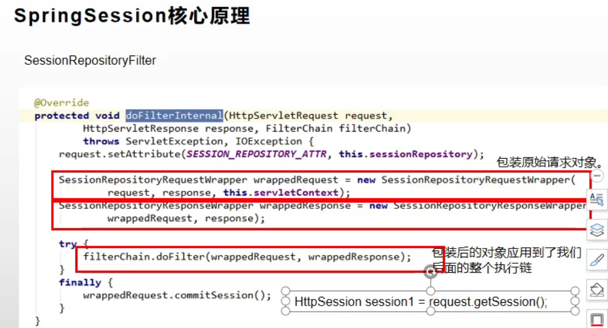


## 2.消息队列能为我们的系统带来下面三点好处：

1. **通过异步处理提高系统性能（减少响应所需时间）。**
2. **削峰/限流**
3. **降低系统耦合性。**


## 3.[一致性哈希算法 consistent hashing](https://www.zsythink.net/archives/1182)

而一致性哈希算法是对2^32取模, 我们把这个由2的32次方个点组成的圆环称为hash环。

**hash（服务器A的IP地址） %  2^32**

**hash（图片名称） %  2^32**

从图片1的位置开始，沿顺时针方向遇到的第一个服务器就是A服务器， 图片1将会被缓存到服务器A上.


一致性哈希算法的优点：

> 服务器的数量如果发生改变，并不是所有缓存都会失效，而是只有部分缓存会失效


## 4.[正向代理与反向代理 (nginx)](https://www.cnblogs.com/xudong-bupt/p/8661523.html)

1.**正向代理**

正向代理，是在用户端的。比如需要访问某些国外网站，我们可能需要购买vpn。

并且**vpn是在我们的用户浏览器端设置的**(并不是在远端的服务器设置)。

浏览器**先访问vpn地址，vpn地址转发请求**，并最后将请求结果原路返回来。


 

**2. 反向代理**

**反向代理是作用在服务器端的，是一个虚拟ip(VIP)**。对于用户的一个请求，**会转发到多个后端处理器**中的一台来理该具体请求。

大型网站都有DNS(域名解析服务器)，load balance(负载均衡器)等。


 

## 5.分布式事务方案

> **2PC**

 **二阶段提交是一种强一致性设计**。


> **3PC** 

包含了三个阶段,分别是**准备阶段、预提交阶段和提交阶段**，对应的英文就是：`CanCommit、PreCommit 和 DoCommit`。看起来是**把 2PC 的提交阶段变了预提交阶段和提交阶段**，但是 3PC 的准备阶段协调者只是询问参与者的自身状况，比如你现在还好吗？负载重不重？


3PC 相对于 2PC 做了一定的改进：引入了参与者超时机制，并且增加了预提交阶段使得故障恢复之后协调者的决策复杂度降低，但整体的交互过程更长了，性能有所下降，并且还是会存在数据不一致问题。

所以 2PC 和 3PC 都不能保证数据100%一致，因此一般都需要有定时扫描补偿机制。

我再说下 3PC 我没有找到具体的实现，所以我认为 3PC 只是纯的理论上的东西，而且可以看到相比于 2PC 它是做了一些努力但是效果甚微，所以只做了解即可。

**优点：**相比二阶段提交，三阶段提交降低了阻塞范围，在等待超时后协调者或参与者会中断事务。避免了协调者单点问题，阶段 3 中协调者出现问题时，参与者会继续提交事务。

**缺点：**数据不一致问题依然存在，当在参与者收到 preCommit 请求后等待 do commite 指令时，此时如果协调者请求中断事务，而协调者无法与参与者正常通信，会导致参与者继续提交事务，造成数据不一致。

> **TCC**

**2PC 和 3PC 都是数据库层面的，而 TCC 是业务层面的分布式事务**

TCC 指的是`Try - Confirm - Cancel`。

- Try 指的是预留，即资源的预留和锁定，**注意是预留**。

- Confirm 指的是确认操作，这一步其实就是真正的执行了。

- Cancel 指的是撤销操作，可以理解为把预留阶段的动作撤销了。


**优点：**

- 性能提升：具体业务来实现控制资源锁的粒度变小，不会锁定整个资源。

- 数据最终一致性：基于 Confirm 和 Cancel 的幂等性，保证事务最终完成确认或者取消，保证数据的一致性。

- 可靠性：解决了 XA 协议的协调者单点故障问题，由主业务方发起并控制整个业务活动，业务活动管理器也变成多点，引入集群。


## 6.装饰器和代理模式的区别

对装饰器模式来说，装饰者（Decorator）和被装饰者（Decoratee）都实现一个接口。对代理模式来说，代理类（Proxy  Class）和真实处理的类（Real  Class）都实现同一个接口。此外，不论我们使用哪一个模式，都可以很容易地在真实对象的方法前面或者后面加上自定义的方法。

在上面的例子中，装饰器模式是使用的调用者从外部传入的被装饰对象（coffee），**调用者只想要你把他给你的对象装饰（加强）一下。而代理模式使用的是代理对象在自己的构造方法里面new的一个被代理的对象，不是调用者传入的**。调用者不知道你找了其他人，他也不关心这些事，只要你把事情做对了即可。

**装饰器模式关注于在一个对象上动态地添加方法，而代理模式关注于控制对对象的访问**。换句话说，用代理模式，代理类可以对它的客户隐藏一个对象的具体信息。因此当使用代理模式的时候，我们常常在一个代理类中创建一个对象的实例；当使用装饰器模式的时候，我们通常的做法是将原始对象作为一个参数传给装饰器的构造器。

装饰器模式和代理模式的使用场景不一样，比如IO流使用的是装饰者模式，可以层层增加功能。而代理模式则一般是用于增加特殊的功能，有些动态代理不支持多层嵌套。

代理和装饰其实从另一个角度更容易去理解两个模式的区别：代理更多的是强调对对象的访问控制，比如说，访问A对象的查询功能时，访问B对象的更新功能时，访问C对象的删除功能时，都需要判断对象是否登陆，那么我需要将判断用户是否登陆的功能抽提出来，并对A对象、B对象和C对象进行代理，使访问它们时都需要去判断用户是否登陆，简单地说就是将某个控制访问权限应用到多个对象上；而装饰器更多的强调给对象加强功能，比如说要给只会唱歌的A对象添加跳舞功能，添加说唱功能等，简单地说就是将多个功能附加在一个对象上。

所以，代理模式注重的是对对象的某一功能的流程把控和辅助，它可以控制对象做某些事，**重心是为了借用对象的功能完成某一流程，而非对象功能如何**。而装饰模式注重的是对**对象功能的扩展**，不关心外界如何调用，只注重对对象功能加强，装饰后还是对象本身。

**总结**

对于代理类，如何调用对象的某一功能是思考重点，而不需要兼顾对象的所有功能；对于装饰类，如何扩展对象的某一功能是思考重点，同时也需要兼顾对象的其他功能，因为再怎么装饰，本质也是对象本身，要担负起对象应有的职责，被装饰者的职责一旦增加，作为装饰类也需要有相应的扩展，必然会造成编码的负担。

设计模式本身是为了提升代码的可扩展性，灵活应用即可，不必生搬硬套，非要分出个所以然来，装饰器模式和代理模式的区别也是如此。

> 1、应用场景上，代理模式是为了帮助目标类增强一些自己不关心的事，比如日志代理，在目标类前后加一些日志。而装饰模式则是用来增强自身的功能，比如Java的InputStream那些的子类装饰类，提供了一些更方便的接口给我们调用。

> 2、使用方式上，代理模式一般在代理类中确定了要被代理的目标对象，客户端根本不知道被代理类的存在。而装饰模式中被装饰者对象需要客户端创建提供，并且可以层层嵌套，层层装饰。


## 7.[OpenFeign原理](https://www.cnblogs.com/crazymakercircle/p/11965726.html)


> **第1步：通过Spring IOC 容器实例，装配代理实例，然后进行远程调用。**

前文讲到，Feign在启动时，会为加上了@FeignClient注解的所有远程接口（包括 DemoClient 接口），创建一个本地**JDK Proxy代理实例**，并注册到Spring IOC容器。在这里，暂且将这个Proxy代理实例，叫做  DemoClientProxy，稍后，会详细介绍这个Proxy代理实例的具体创建过程。

在需要代进行hello（）远程调用时，直接通过 demoClient 成员变量，调用JDK Proxy动态代理实例的hello（）方法。

> **第2步：执行 InvokeHandler 调用处理器的invoke(…)方法**

前面讲到，JDK Proxy动态代理实例的真正的方法调用过程，具体是通过 InvokeHandler  调用处理器完成的。故，这里的DemoClientProxy代理实例，会调用到默认的FeignInvocationHandler  调用处理器实例的invoke(…)方法。

通过前面 **FeignInvocationHandler** 调用处理器的详细介绍，大家已经知道，默认的调用处理器  FeignInvocationHandle，内部保持了一个远程调用方法实例和方法**处理器的一个Key-Value键值对Map映射**。FeignInvocationHandle 在其invoke(…)方法中，会根据Java反射的方法实例，在dispatch 映射对象中，找到对应的 MethodHandler  方法处理器，然后由后者完成实际的HTTP请求和结果的处理。

所以在第2步中，FeignInvocationHandle 会从自己的 dispatch映射中，**找到hello()方法所对应的MethodHandler 方法处理器**，然后调用其 invoke(…)方法。

> **第3步：执行 MethodHandler 方法处理器的invoke(…)方法**

通过前面关于 MethodHandler 方法处理器的非常详细的组件介绍，大家都知道，feign默认的方法处理器为  SynchronousMethodHandler，其invoke(…)方法主要是通过内部成员feign客户端成员 client，完成远程 URL 请求执行和获取远程结果。

feign.Client 客户端有多种类型，不同的类型，完成URL请求处理的具体方式不同。

> **第4步：通过 feign.Client 客户端成员，完成远程 URL 请求执行和获取远程结果**

如果MethodHandler方法处理器实例中的client客户端，是默认的 feign.Client.Default 实现类性，则使用JDK自带的HttpURLConnnection类，完成远程 URL 请求执行和获取远程结果。

如果MethodHandler方法处理器实例中的client客户端，是 ApacheHttpClient 客户端实现类性，则使用 Apache httpclient 开源组件，完成远程 URL 请求执行和获取远程结果。


## 8.[分布式ID生成方案](https://zhuanlan.zhihu.com/p/107939861)

**要求：**

- 全局唯一：必须保证ID是全局性唯一的，基本要求
- 高性能：高可用低延时，ID生成响应要块，否则反倒会成为业务瓶颈
- 高可用：100%的可用性是骗人的，但是也要无限接近于100%的可用性
- 好接入：要秉着拿来即用的设计原则，在系统设计和实现上要尽可能的简单
- 趋势递增：最好趋势递增，这个要求就得看具体业务场景了，一般不严格要求


**1、基于UUID**

**优点：**

- 生成足够简单，本地生成无网络消耗，具有唯一性

**缺点：**

- 无序的字符串，不具备趋势自增特性

- 没有具体的业务含义

- 长度过长16 字节128位，36位长度的字符串，存储以及查询对MySQL的性能消耗较大，MySQL官方明确建议主键要尽量越短越好，作为数据库主键 `UUID` 的无序性会导致数据位置频繁变动，严重影响性能。

  

**2、基于数据库自增ID**

**优点：**

- 实现简单，ID单调自增，数值类型查询速度快

**缺点：**

- DB单点存在宕机风险，无法扛住高并发场景


**3、基于数据库集群模式**

前边说了单点数据库方式不可取，那对上边的方式做一些高可用优化，换成主从模式集群。害怕一个主节点挂掉没法用，那就做双主模式集群，也就是两个Mysql实例都能单独的生产自增ID。

**解决方案**：设置`起始值`和`自增步长`

**优点：**

- 解决DB单点问题

**缺点：**

- 不利于后续扩容，而且实际上单个数据库自身压力还是大，依旧无法满足高并发场景。


**4、基于数据库的号段模式**

号段模式是当下分布式ID生成器的主流实现方式之一，号段模式可以理解为从数据库批量的获取自增ID，每次从数据库取出一个号段范围


**5、基于Redis模式**

`Redis`也同样可以实现，原理就是利用`redis`的 `incr`命令实现ID的原子性自增。

- `RDB`会定时打一个快照进行持久化，假如连续自增但`redis`没及时持久化，而这会Redis挂掉了，重启Redis后会出现ID重复的情况。
- `AOF`会对每条写命令进行持久化，即使`Redis`挂掉了也不会出现ID重复的情况，但由于incr命令的特殊性，会导致`Redis`重启恢复的数据时间过长。


**6、基于雪花算法（Snowflake）模式**


- 强依赖与机器时钟，如果时钟回拨， 会导致重复ID生成。


**7、美团（Leaf）**

`Leaf`同时支持号段模式和`snowflake`算法模式，可以切换使用。

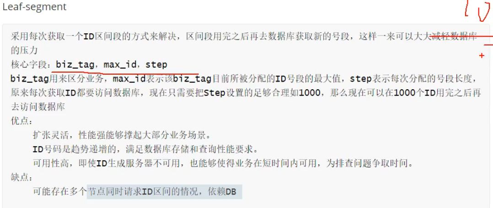

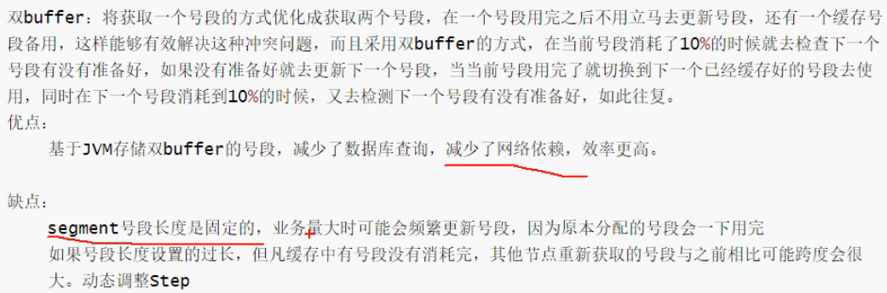

**snowflake模式**

`Leaf`的snowflake模式依赖于`ZooKeeper`，不同于`原始snowflake`算法也主要是在`workId`的生成上，`Leaf`中`workId`是基于`ZooKeeper`的顺序Id来生成的，每个应用在使用`Leaf-snowflake`时，启动时都会都在`Zookeeper`中生成一个顺序Id，相当于一台机器对应一个顺序节点，也就是一个`workId`。


## 9.秒杀限流

**限流算法**

[ 2.2 漏桶算法](https://links.jianshu.com/go?to=http%3A%2F%2Fwww.tianxiaobo.com%2F2019%2F05%2F18%2F%E7%AE%80%E6%9E%90%E9%99%90%E6%B5%81%E7%AE%97%E6%B3%95%2F%2322-%E6%BC%8F%E6%A1%B6%E7%AE%97%E6%B3%95)

漏桶算法由流量容器、流量入口和出口组成。其中流量出口流速即为我们期望的限速值，比如 100 QPS。漏桶算法除了具备限流能力，还具备流量整型功能。下面我们通过一张图来了解漏桶算法。


如上图，流入漏桶流量的流速是不恒定的，经过漏桶限速后，流出流量的速度是恒定的。需要说明的是，漏桶的容量是有限的，一旦流入流量超出漏桶容量，这部分流量只能被丢弃了。

漏桶是一个比较好的限流整型工具，不过漏桶不能处理突发流量，一些观点认为这是它的一个缺点。不过如果较起真来，我觉得这个缺点是不成立的。毕竟漏桶本就是用来平滑流量的，如果支持突发，那么输出流量反而不平滑了。如果要找一种能够支持突发流量的限流算法，那么令牌桶算法可以满足需求。

[ 2.3 令牌桶算法](https://links.jianshu.com/go?to=http%3A%2F%2Fwww.tianxiaobo.com%2F2019%2F05%2F18%2F%E7%AE%80%E6%9E%90%E9%99%90%E6%B5%81%E7%AE%97%E6%B3%95%2F%2323-%E4%BB%A4%E7%89%8C%E6%A1%B6%E7%AE%97%E6%B3%95)

令牌桶和漏桶颇有几分相似，只不过令牌通里存放的是令牌。它的运行过程是这样的，一个令牌工厂按照设定值定期向令牌桶发放令牌。当令牌桶满了后，多出的令牌会被丢弃掉。每当一个请求到来时，该请求对应的线程会从令牌桶中取令牌。初期由于令牌桶中存放了很多个令牌，因此允许多个请求同时取令牌。当桶中没有令牌后，无法获取到令牌的请求可以丢弃，或者重试。下面我们来看一下的令牌桶示意图：


尽管令牌桶允许突发流量，但突发流量速率 R1 + 限流速率 R2 不能超过系统最大的处理能力 Rt，即 R1 + R2 ≤ Rt,否则会冲垮系统。

1.应用限流

- Tomcat

- API限流

2.分布式限流

- Nginx

- OpenResty


## 10.热点key

[有赞透明多级缓存解决方案(TMC)](https://mp.weixin.qq.com/s/BnWtbetNq076iRRZfnGRrw)


# 八、Spring框架

## 1.[Spring之Aware接口介绍](https://blog.csdn.net/qq_38526573/article/details/88095674)

Aware接口从字面上翻译过来是感知捕获的含义。实现了Aware系列接口的bean可以访问Spring容器。

让对象取获取到容器， 自己在容器中的名字， 工厂，类加载器。

```java
/**
 * 实现了
 * 	ApplicationContextAware
 *  BeanClassLoaderAware
 *  BeanFactoryAware
 *  BeanNameAware
 *  接口
 * @author dengp
 *
 */
public class User implements ApplicationContextAware,BeanClassLoaderAware,BeanFactoryAware,BeanNameAware{
	private int id;
	private String name;
	// 保存感知的信息
	private String beanName;
	// 保存感知的信息
	private BeanFactory beanFactory;
	// 保存感知的信息
	private ApplicationContext ac;
	// 保存感知的信息
	private ClassLoader classLoader;
    
	@Override
	public void setBeanClassLoader(ClassLoader classLoader) {
		this.classLoader = classLoader;
	}
	@Override
	public void setApplicationContext(ApplicationContext applicationContext) throws BeansException {
		this.ac = applicationContext;
	}
	@Override
	public void setBeanName(String name) {
		this.beanName = name;
	}
	@Override
	public void setBeanFactory(BeanFactory beanFactory) throws BeansException {
		this.beanFactory = beanFactory;
	}
}
```


## 2.AOP通知顺序


## 3.三级缓存，循环依赖

- A创建过程中需要B，于是A将自己放到三级缓存里面，去实例化B

- B实例化的时候发现需要A，于是B先查一级缓存，没有，再查二级缓存，还是没有，再查三级缓存，找到了A，然后把三级缓存里面的这个A放到二级缓存里面，并删除三级缓存里面的A

- B顺利初始化完毕，将自己放到一级缓存里面（此时B里面的A依然是创建中状态），然后回来接着创建A，此时B已经创建结束，直接从一级缓存里面拿到B，然后完成创建，并将A自己放到一级缓存里面。

因为涉及到AOP增强是在BeanPostProcessor做的，所以需要第三季缓存。


## 4.bean作用域

单实例和多实例， 单实例对象在容器创建的时候就创建（饿汉）， 多实例对象默认不创建， 等到get对象的时候创建（懒汉）

```xml
<!--
 实验9：测试bean的作用域，分别创建单实例和多实例的bean★
	bean的作用域:指定bean是否单实例，xxx；默认：单实例的
	
	prototype:多实例的；
		1）、容器启动默认不会去创建多实例bean
		2）、获取的时候创建这个bean
		3）、每次获取都会创建一个新的对象
	singleton:单实例的；默认的；
		1）、在容器启动完成之前就已经创建好对象，保存在容器中了。
		2）、任何获取都是获取之前创建好的那个对象；
	
	request:在web环境下，同一次请求创建一个Bean实例（没用）
	session:在web环境下，同一次会话创建一个Bean实例（没用）
-->
<bean id="book" class="com.atguigu.bean.Book" scope="prototype"/>
```


## 5.静态工厂与实例工厂

**方法1：**自己定义工厂类

```xml
<!--实验5：配置通过静态工厂方法创建的bean、实例工厂方法创建的bean、FactoryBean★  -->
<!-- bean的创建默认就是框架利用反射new出来的bean实例 -->
<!--
 工厂模式；工厂帮我们创建对象；有一个专门帮我们创建对象的类，这个类就是工厂
		AirPlane ap = AirPlaneFactory.getAirPlane(String jzName);
		
		静态工厂：工厂本身不用创建对象；通过静态方法调用，对象 = 工厂类.工厂方法名()；
		实例工厂：工厂本身需要创建对象；
				工厂类 工厂对象 = new 工厂类();
				工厂对象.getAirPlane("张三");
-->
<!--
 1、静态工厂(不需要创建工厂本身)factory-method="getAirPlane"：
		指定哪个方法是工厂方法
		class：指定静态工厂全类名
		factory-method:指定工厂方法
		constructor-arg：可以为方法传参
-->
<bean id="airPlane01" class="com.atguigu.factory.AirPlaneStaticFactory" factory-method="getAirPlane">
<!-- 可以为方法指定参数 -->
<constructor-arg value="李四"/>
</bean>


<!--2、实例工厂使用 
		factory-method;指定这个实例工厂中哪个方法是工厂方法；	
	 -->
<bean id="airPlaneInstanceFactory" class="com.atguigu.factory.AirPlaneInstanceFactory"/>
<!--
 factory-bean：指定当前对象创建使用哪个工厂
		1、先配置出实例工厂对象
		2、配置我们要创建的AirPlane使用哪个工厂创建
			1）、factory-bean：指定使用哪个工厂实例
			2）、factory-method：使用哪个工厂方法
-->
<bean id="airPlane02" class="com.atguigu.bean.AirPlane" factory-bean="airPlaneInstanceFactory" factory-method="getAirPlane">
<constructor-arg value="王五"/>
</bean>
```

**方法2：**实现Spring的FactoryBean接口,  懒加载

```java
/**
 * 实现了FactoryBean接口的类是Spring可以认识的工厂类；
 * Spring会自动的调用工厂方法创建实例
 * @author lfy
 *
 *1、编写一个FactoryBean的实现类
 *2、在spring配置文件中进行注册
 */
public class MyFactoryBeanImple implements FactoryBean<Book>{

	/**
	 * getObject：工厂方法；
	 * 		返回创建的对象
	 */
	@Override
	public Book getObject() throws Exception {
		// TODO Auto-generated method stub
		System.out.println("MyFactoryBeanImple。。帮你创建对象...");
		Book book = new Book();
		book.setBookName(UUID.randomUUID().toString());
		return book;
	}

	/**
	 * 返回创建的对象的类型；
	 * Spring会自动调用这个方法来确认创建的对象是什么类型
	 */
	@Override
	public Class<?> getObjectType() {
		// TODO Auto-generated method stub
		return Book.class;
	}

	/**
	 * isSingleton：是单例？
	 * false：不是单例
	 * true：是单例
	 */
	@Override
	public boolean isSingleton() {
		// TODO Auto-generated method stub
		return true;
	}

}
```

```xml
<!--
 FactoryBean★(是Spring规定的一个接口);
			只要是这个接口的实现类，Spring都认为是一个工厂；
		1、ioc容器启动的时候不会创建实例 
		2、FactoryBean；获取的时候的才创建对象
-->
<bean id="myFactoryBeanImple" class="com.atguigu.factory.MyFactoryBeanImple"/>
</beans>
```


## 6. 创建带有生命周期方法的bean

**我们可以为bean自定义一些生命周期方法；spring在创建或者销毁的时候就会调用指定的方法**

```xml
<!--
 实验10：创建带有生命周期方法的bean 
	生命周期：bean的创建到销毁；
		ioc容器中注册的bean；
			1）、单例bean，容器启动的时候就会创建好，容器关闭也会销毁创建的bean
			2）、多实例bean，获取的时候才创建；
		我们可以为bean自定义一些生命周期方法；spring在创建或者销毁的时候就会调用指定的方法；
		自定义初始化方法和销毁方法； The method must have no arguments,but may throw any exception
-->
<bean id="book01" class="com.atguigu.bean.Book" destroy-method="myDestory" init-method="myInit"/>
```


## 7. bean的后置处理器

	 *单例： Bean的生命周期
	 * 		（容器启动）构造器---->初始化方法---->(容器关闭)销毁方法
	 *多实例：
	 *		获取bean（构造器--->初始化方法）--->容器关闭不会调用bean的销毁方法
	 *
	 *后置处理器：
	 *		（容器启动）构造器------后置处理器before..-----初始化方法-----后置处理器after...-----bean初始化完成
	 *
	 *无论bean是否有初始化方法；后置处理器都会默认其有，还会继续工作；

```java
/**
 * 1）、编写后置处理器的实现类
 * 2）、将后置处理器注册在配置文件中
 * @author lfy
 */
public class MyBeanPostProcessor implements BeanPostProcessor{
	/**
	 * postProcessBeforeInitialization：
	 * 		初始化之前调用
	 * Object bean：将要初始化的bean
	 */
	@Override
	public Object postProcessBeforeInitialization(Object bean, String beanName)throws BeansException {
		System.out.println("postProcessBeforeInitialization...【"+beanName+"】bean将要调用初始化方法了....这个bean是这样【"+bean+"】");
		//返回传入的bean
		return bean;
	}
	/**
	 * postProcessAfterInitialization：
	 * 		初始化方法之后调用
	 * Object bean, 
	 * String beanName：bean在xml中配置的id
	 */
	@Override
	public Object postProcessAfterInitialization(Object bean, String beanName)throws BeansException {
		System.out.println("postProcessAfterInitialization...【"+beanName+"】bean初始化方法调用完了...AfterInitialization..");
		//初始化之后返回的bean；返回的是什么，容器中保存的就是什么
		return bean;
	}
}
```

配置了后置处理器后会在每个bean的初始化方法前后处理

```xml
<bean id="beanPostProcessor" class="com.atguigu.bean.MyBeanPostProcessor"/>
```


## 8.bean的生命周期

- Bean 容器找到配置文件中 Spring Bean 的定义。
- Bean 容器利用 Java Reflection API 创建一个Bean的实例。
- 如果涉及到一些属性值 利用 `set()`方法设置一些属性值。
- 如果 Bean 实现了 `BeanNameAware` 接口，调用 `setBeanName()`方法，传入Bean的名字。
- 如果 Bean 实现了 `BeanClassLoaderAware` 接口，调用 `setBeanClassLoader()`方法，传入 `ClassLoader`对象的实例。
- 与上面的类似，如果实现了其他 `*.Aware`接口，就调用相应的方法。
- 如果有和加载这个 Bean 的 Spring 容器相关的 `BeanPostProcessor` 对象，执行`postProcessBeforeInitialization()` 方法
- 如果Bean实现了`InitializingBean`接口，执行`afterPropertiesSet()`方法。
- 如果 Bean 在配置文件中的定义包含  init-method 属性，执行指定的方法。
- 如果有和加载这个 Bean的 Spring 容器相关的 `BeanPostProcessor` 对象，执行`postProcessAfterInitialization()` 方法
- 当要销毁 Bean 的时候，如果 Bean 实现了 `DisposableBean` 接口，执行 `destroy()` 方法。
- 当要销毁 Bean 的时候，如果 Bean 在配置文件中的定义包含 destroy-method 属性，执行指定的方法。


## 9. AOP

```java
/**
 * 告诉Spring每个方法都什么时候运行；
 * try{
 * 		@Before
 * 		method.invoke(obj,args);
 * 		@AfterReturning
 * }catch(e){
 * 		@AfterThrowing
 * }finally{
 * 		@After
 * }
 * 	
 * 5个通知注解
 * @Before：在目标方法之前运行；  					 前置通知
 * @After：在目标方法结束之后						后置通知
 * @AfterReturning：在目标方法正常返回之后			返回通知
 * @AfterThrowing：在目标方法抛出异常之后运行			异常通知
 * @Around：环绕								环绕通知
 */
//想在执行目标方法之前运行；写切入点表达式
//execution(访问权限符  返回值类型  方法签名)
@Before("execution(public int com.atguigu.impl.MyMathCalculator.*(..))")
public static void logStart(JoinPoint joinPoint){
	//获取到目标方法运行是使用的参数
	Object[] args = joinPoint.getArgs();
	//获取到方法签名
	Signature signature = joinPoint.getSignature();
	String name = signature.getName();
	System.out.println("【"+name+"】方法开始执行，用的参数列表【"+Arrays.asList(args)+"】");
}
/**
 * 切入点表达式的写法；
 * 固定格式： execution(访问权限符  返回值类型  方法全类名(参数表))
 *   
 * 通配符：
 * 		*：
 * 			1）匹配一个或者多个字符:execution(public int com.atguigu.impl.MyMath*r.*(int, int))
 * 			2）匹配任意一个参数：第一个是int类型，第二个参数任意类型；（匹配两个参数）
 * 				execution(public int com.atguigu.impl.MyMath*.*(int, *))
 * 			3）只能匹配一层路径
 * 			4）权限位置*不能；权限位置不写就行；public【可选的】
 * 		..：
 * 			1）匹配任意多个参数，任意类型参数
 * 			2）匹配任意多层路径:
 * 				execution(public int com.atguigu..MyMath*.*(..));
 * 
 * 记住两种；
 * 最精确的：execution(public int com.atguigu.impl.MyMathCalculator.add(int,int))
 * 最模糊的：execution(* *.*(..))：千万别写；
 * 
 * &&”、“||”、“!
 * 
 * &&：我们要切入的位置满足这两个表达式
 * 	MyMathCalculator.add(int,double)
 * execution(public int com.atguigu..MyMath*.*(..))&&execution(* *.*(int,int))
 * 
 * 
 * ||:满足任意一个表达式即可
 * execution(public int com.atguigu..MyMath*.*(..))&&execution(* *.*(int,int))
 * 
 * !：只要不是这个位置都切入
 * !execution(public int com.atguigu..MyMath*.*(..))
 * 
 * 告诉Spring这个result用来接收返回值：
 * 	returning="result"；
 */
//想在目标方法正常执行完成之后执行
@AfterReturning(value="execution(public int com.atguigu..MyMath*.*(..))",returning="result")
public static void logReturn(JoinPoint joinPoint,Object result){
	Signature signature = joinPoint.getSignature();
	String name = signature.getName();
	System.out.println("【"+name+"】方法正常执行完成，计算结果是："+result);
}

/**
	 * 细节四：我们可以在通知方法运行的时候，拿到目标方法的详细信息；
	 * 1）只需要为通知方法的参数列表上写一个参数：
	 * 		JoinPoint joinPoint：封装了当前目标方法的详细信息
	 * 2）、告诉Spring哪个参数是用来接收异常
	 * 		throwing="exception"：告诉Spring哪个参数是用来接收异常
	 * 3）、Exception exception:指定通知方法可以接收哪些异常
	 * 
	 * ajax接受服务器数据
	 * 	$.post(url,function(abc){
	 * 		alert(abc)
	 * 	})
	 */
//想在目标方法出现异常的时候执行
@AfterThrowing(value="execution(public int com.atguigu.impl.MyMathCalculator.*(..))",throwing="exception")
public static void logException(JoinPoint joinPoint,Exception exception) {
    System.out.println("【"+joinPoint.getSignature().getName()+"】方法执行出现异常了，异常信息是【"+exception+"】：；这个异常已经通知测试小组进行排查");
}

//想在目标方法结束的时候执行
/**
	 * Spring对通知方法的要求不严格；
	 * 唯一要求的就是方法的参数列表一定不能乱写？
	 * 	通知方法是Spring利用反射调用的，每次方法调用得确定这个方法的参数表的值；
	 * 	参数表上的每一个参数，Spring都得知道是什么？
	 * 	JoinPoint:认识
	 * 	不知道的参数一定告诉Spring这是什么？
	 * 
	 * @param joinPoint
	 */
@After("execution(public int com.atguigu.impl.MyMathCalculator.*(..))")
private int logEnd(JoinPoint joinPoint) {
    System.out.println("【"+joinPoint.getSignature().getName()+"】方法最终结束了");
    return 0;
}
```

```xml
<!--  开启基于注解的AOP功能；aop名称空间-->
<aop:aspectj-autoproxy/>
```


## 10. cglib和jdk动态代理

1. Jdk动态代理：利用拦截器（必须实现InvocationHandler）加上反射机制生成一个代理接口的匿名类，在调用具体方法前调用InvokeHandler来处理

2.  Cglib动态代理：利用ASM框架，对代理对象类生成的class文件加载进来，通过修改其字节码生成子类来处理

**什么时候用cglib什么时候用jdk动态代理？**

> 1、目标对象生成了接口 默认用JDK动态代理

> 2、如果目标对象使用了接口，可以强制使用cglib

> 3、如果目标对象没有实现接口，必须采用cglib库，Spring会自动在JDK动态代理和cglib之间转换

**JDK动态代理和cglib字节码生成的区别？**

> 1、JDK动态代理只能对实现了接口的类生成代理，而不能针对类

> 2、Cglib是针对类实现代理，主要是对指定的类生成一个子类，覆盖其中的方法，并覆盖其中方法的增强，但是因为采用的是继承，所以该类或方法最好不要生成final，对于final类或方法，是无法继承的


## 11.Spring AOP和AspectJ

### Spring AOP

- 基于动态代理来实现，默认如果使用接口的，用JDK提供的动态代理实现，如果是方法则使用CGLIB实现

- Spring AOP需要依赖IOC容器来管理，并且只能作用于Spring容器，使用纯Java代码实现

- 在性能上，由于Spring AOP是基于动态代理来实现的，在容器启动时需要生成代理实例，在方法调用上也会增加栈的深度，使得Spring AOP的性能不如AspectJ的那么好
- 我们不能在 "final" 类中应用交叉问题 (或方面), 因为它们不能被重写, 因此会导致运行时异常。同样适用于静态和最终方法。不能将 Spring 方面应用于它们, 因为它们不能被覆盖。因此, 由于这些限制, Spring AOP 只支持方法执行连接点。

### AspectJ

-  AspectJ属于静态织入，通过修改代码来实现，有如下几个织入的时机：

> 1、编译期织入（Compile-time weaving）： 如类 A 使用 AspectJ 添加了一个属性，类 B 引用了它，这个场景就需要编译期的时候就进行织入，否则没法编译类 B。 

> 2、编译后织入（Post-compile weaving）： 也就是已经生成了 .class 文件，或已经打成 jar 包了，这种情况我们需要增强处理的话，就要用到编译后织入。 

> 3、类加载后织入（Load-time weaving）：  指的是在加载类的时候进行织入，要实现这个时期的织入，有几种常见的方法。1、自定义类加载器来干这个，这个应该是最容易想到的办法，在被织入类加载到  JVM 前去对它进行加载，这样就可以在加载的时候定义行为了。2、在 JVM 启动的时候指定 AspectJ 提供的 agent：`-javaagent:xxx/xxx/aspectjweaver.jar`。 

-  AspectJ可以做Spring AOP干不了的事情，它是AOP编程的完全解决方案，Spring AOP则致力于解决企业级开发中最普遍的AOP（方法织入）。而不是成为像AspectJ一样的AOP方案
   
-  因为AspectJ在实际运行之前就完成了织入，所以说它生成的类是没有额外运行时开销的

  

| Spring AOP                                       | AspectJ                                                      |
| :----------------------------------------------- | :----------------------------------------------------------- |
| **在纯 Java 中实现**                             | 使用 Java 编程语言的扩展实现                                 |
| 不需要单独的编译过程                             | 除非设置 LTW，否则需要 AspectJ 编译器 (ajc)                  |
| **只能使用运行时织入**                           | 运行时织入不可用。支持编译时、编译后和加载时织入             |
| 功能不强-仅支持方法级编织                        | 更强大 - 可以编织字段、方法、构造函数、静态初始值设定项、最终类/方法等......。 |
| **只能在由 Spring 容器管理的 bean 上实现**       | 可以在所有域对象上实现                                       |
| **仅支持方法执行切入点**                         | 支持所有切入点                                               |
| 代理是由目标对象创建的, 并且切面应用在这些代理上 | 在执行应用程序之前 (在运行时) 前, 各方面直接在代码中进行织入 |
| 比 AspectJ 慢多了                                | 更好的性能                                                   |
| 易于学习和应用                                   | 相对于 Spring AOP 来说更复杂                                 |


## 12.SpringBoot自动配置

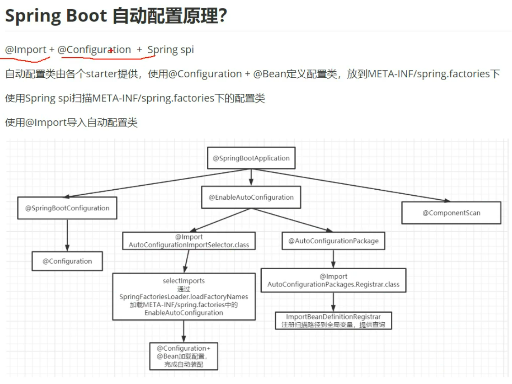


## 12.[Spring中的观察者模式（事件监听）](https://www.cnblogs.com/jmcui/p/11054756.html)

**1. 事件（ApplicationEvent）**

ApplicationEvent 是所有事件对象的父类。ApplicationEvent 继承自 jdk 的 EventObject, 所有的事件都需要继承 ApplicationEvent, 并且通过 source 得到事件源。

下列描述了Spring提供的内置事件：

- ContextRefreshedEvent：事件发布在 ApplicationContext 初始化或刷新时（例如：通过在  ConfigurableApplicationContext 接口使用refresh()方法）。这里,“初始化”意味着所有 bean  加载，post-processor bean 被检测到并且激活,单例预先实例化，ApplicationContext  对象可以使用了。只要上下文没有关闭,可以触发多次刷新, ApplicationContext  提供了一种可选择的支持这种“热”刷新。例如：XmlWebApplicationContext 支持热刷新,但  GenericApplicationContext 并非如此。具体是在 AbstractApplicationContext 的  finishRefresh() 方法中。
- ContextStartedEvent：事件发布在 ApplicationContext 开始使用  ConfigurableApplicationContext 接口 start() 方法。这里,“开始”意味着所有生命周期 bean  接收到一个明确的起始信号。通常,这个信号用于明确停止后重新启动,但它也可以用于启动组件没有被配置为自动运行（例如：组件还没有开始初始化）。
- ContextStoppedEvent：事件发布在 ApplicationContext 停止时通过使用  ConfigurableApplicationContext 接口上的 stop()  方法。在这里,“停止”意味着所有生命周期bean接收一个显式的停止信号。停止上下文可以通过重新调用start()方法。
- ContextClosedEvent：事件发布在 ApplicationContext 关闭时通过关闭  ConfigurableApplicationContext 接口()方法。这里,“封闭”意味着所有单例 bean  被摧毁。一个封闭的环境达到生命的终结。它不能刷新或重启。
- RequestHandledEvent：一个特定的web事件告诉所有能处理HTTP请求的bean 。这个事件是在请求完成后发布的。这个事件只适用于使用 Spring 的 DispatcherServlet 的web应用程序。

**2. 事件监听（ApplicationListener）**

ApplicationListener 事件监听器，也就是观察者。继承自 jdk 的 EventListener，该类中只有一个方法 onApplicationEvent。当监听的事件发生后该方法会被执行。

**3. 事件发布（ApplicationContext）**

ApplicationContext 是 Spring 中的核心容器，在事件监听中 ApplicationContext  可以作为事件的发布者，也就是事件源。因为 ApplicationContext 继承自 ApplicationEventPublisher。在  ApplicationEventPublisher 中定义了事件发布的方法 — publishEvent(Object event)

**4. 事件管理（ApplicationEventMulticaster）**

ApplicationEventMulticaster 用于事件监听器的注册和事件的广播。监听器的注册就是通过它来实现的，它的作用是把 Applicationcontext 发布的 Event 广播给它的监听器列表。


```java
@Component
public class MyListenerA implements ApplicationListener<MyEvent> {
    @Override
    public void onApplicationEvent(MyEvent myEvent) {
        System.out.println("MyListenerA");
        myEvent.echo();
    }
}
```


#  九、Mybatis


## 1.[延迟加载lazyLoadingEnabled](https://blog.csdn.net/weixin_42476601/article/details/84194210)

**延迟加载：**先从单表查询、需要时再从关联表去关联查询，大大提高数据库性能，因为查询单表要比关联查询多张表速度要快

**使用association中的select指定延迟加载去执行的statement的id。**

```xml
 <!-- 查询订单关联查询用户，用户信息按需延迟加载 的 resultMap定义 -->
    <resultMap type="com.mybatis.entity.Orders" id="ordersUserLazyLoading">
                <!--对订单信息进行映射配置  -->
            <id column="id" property="id"/>
            <result column="user_id" property="userid"/>
            <result column="number" property="number"/>
            <result column="createtime" property="createTime"/>
            <result column="note" property="note"/>
             <!-- 实现对用户信息进行延迟加载
                select：指定延迟加载需要执行的statement的id（是根据user_id查询用户信息的statement） 
                column：订单信息中关联用户信息查询的列，是user_id
                关联查询的sql理解为：
                 SELECT orders.*,
                    (SELECT username FROM USER WHERE orders.user_id = user.id)username,
                    (SELECT sex FROM USER WHERE orders.user_id = user.id)sex
                 FROM orders
            -->
            <association property="user"  javaType="com.mybatis.entity.User" select="findUserById" column="user_id"/>
    </resultMap>
        
    <!-- 根据Id查询用户，用于测试延迟加载 -->
    <select id="findUserById" parameterType="int" resultType="com.mybatis.entity.User" >
                select * from t_user where id=#{id}
    </select>

    <!-- 查询订单关联用户，用户信息延迟加载 -->
    <select id="findOrdersUserLazyLoading" resultMap="ordersUserLazyLoading">
            select * from orders
    </select>   
```

当我们调用Orders中的**getUser**方法时，开始进行延迟加载

在mybatis核心配置文件中配置：

| 设置项                | 描述                                                         | 允许值        | 默认值 |
| --------------------- | ------------------------------------------------------------ | ------------- | ------ |
| lazyLoadingEnabled    | 全局性设置懒加载。如果设为‘false’，则所有相关联的都会被初始化加载。 | true \| false | false  |
| aggressiveLazyLoading | 当设置为‘true’的时候，懒加载的对象可能被任何懒属性全部加载。否则，每个属性都按需加载. | true \| false | true   |

【注意】association或者collection标签的fetchType=eager/lazy可以覆盖全局的延迟加载策略，指定立即加载（eager）或者延迟加载（lazy）


## 2.[自定义类型处理器 TypeHandler](https://blog.csdn.net/lmb55/article/details/90380309)

MyBatis 中的 TypeHandler 类型处理器用于 JavaType 与 JdbcType 之间的转换，用于 PreparedStatement 设置参数值和从 ResultSet 或 CallableStatement 中取出一个值。

映射方式为自定义一个 `TypeHandler`，实现 `TypeHandler` 的 `setParameter()`和 `getResult()`接口方法。`TypeHandler` 有两个作用，一是完成从 javaType 至 jdbcType 的转换，二是完成 jdbcType 至 javaType 的转换，体现为 `setParameter()`和 `getResult()`两个方法，分别代表设置 sql 问号占位符参数和获取列查询结果。

**可以继承org.apache.ibatis.type.BaseTypeHandler 类型来实现自定义类型处理器**


**把TypeHandler配置到程序中有三种方法：**

1.在Mapper.xml中声明

```xml
1<result column="enum1" jdbcType="INTEGER" property="enum1" typeHandler="com.xxx.handler.EnumTypeHandler"/>
```

2.在mybatis配置文件中设置

```xml
<typeHandlers>
        <typeHandler handler="com.xxx.handler.EnumTypeHandler"/>
</typeHandlers>
```

3.在springboot的yml配置文件中设置类型处理器所在的包名

```yaml
mybatis:
  type-handlers-package: com.xxx.handler
```


## 3.一级二级缓存

**一级缓存**

一级缓存只是相对于同一个SqlSession而言，默认开启。

　**一级缓存的生命周期有多长？**

　　a、MyBatis在开启一个数据库会话时，会创建一个新的SqlSession对象，SqlSession对象中会有一个新的Executor对象。Executor对象中持有一个新的PerpetualCache对象；当会话结束时，SqlSession对象及其内部的Executor对象还有PerpetualCache对象也一并释放掉。

　　b、如果SqlSession调用了**close**()方法，会释放掉一级缓存PerpetualCache对象，一级缓存将不可用。

　　c、如果SqlSession调用了**clearCache**()，会清空PerpetualCache对象中的数据，但是该对象仍可使用。

　　d、SqlSession中执行了任何一个**update**操作(update()、delete()、insert()) ，都会清空PerpetualCache对象的数据，但是该对象可以继续使用

**二级缓存，全局作用域缓存**

- 二级缓存默认不开启，需要手动配置
- MyBatis提供二级缓存的接口以及实现，缓存实现要求POJO实现Serializable接口
- 二级缓存在 SqlSession 关闭或提交之后才会生效

使用步骤
1、全局配置文件中开启二级缓存

```xml
<setting name="cacheEnabled" value="true"/>
```

2、需要使用二级缓存的映射文件处使用cache配置缓存

```xml
<cache />
```

3、注意：POJO需要实现Serializable接口


## 4.**Dao接口的工作原理是什么？Dao接口里的方法能重载吗？**

　　答：Dao接口，就是人们常说的Mapper接口，接口的全限名，就是映射文件中的namespace的值，接口的方法名，就是映射文件中MappedStatement的id值，接口方法内的参数，就是传递给sql的参数。Mapper接口是没有实现类的，当调用接口方法时，接口全限名+方法名拼接字符串作为key值，可唯一定位一个MappedStatement，举例：com.mybatis3.mappers.StudentDao.findStudentById，可以唯一找到namespace为com.mybatis3.mappers.StudentDao下面id  = findStudentById的MappedStatement。在Mybatis中，每一个<select>、<insert>、<update>、<delete>标签，都会被解析为一个MappedStatement对象。

　　**Dao接口里的方法，是不能重载的，因为是全限名+方法名的保存和寻找策略。**

> **Dao接口的工作原理是JDK动态代理**，Mybatis运行时会使用JDK动态代理为Dao接口生成代理proxy对象，代理对象proxy会拦截接口方法，转而执行MappedStatement所代表的sql，然后将sql执行结果返回。

> Mapper接口是没有实现类的，当调用接口方法时，采用了JDK的动态代理，先从Configuration配置类MapperRegistry对象中获取mapper接口和对应的代理对象工厂信息（MapperProxyFactory），然后利用代理对象工厂MapperProxyFactory创建实际代理类（MapperProxy），最后在MapperProxy类中通过MapperMethod类对象内保存的中对应方法的信息，以及对应的sql语句的信息进行分析，最终确定对应的增强方法进行调用。


## 5.Mybatis执行批量插入，能返回数据库主键列表吗？

能，JDBC都能，Mybatis当然也能。

1、对于支持生成自增主键的数据库：增加 useGenerateKeys和keyProperty ，<insert>标签属性。

2、不支持生成自增主键的数据库：使用<selectKey>。


## 6.Mybatis是否支持延迟加载？如果支持，它的实现原理是什么？

Mybatis仅支持association关联对象和collection关联集合对象的延迟加载，association指的就是一对一，collection指的就是一对多查询。在Mybatis配置文件中，可以配置是否启用延迟加载lazyLoadingEnabled=true|false。

它的原理是，使用CGLIB创建目标对象的代理对象，当调用目标方法时，进入拦截器方法，比如调用a.getB().getName()，拦截器invoke()方法发现a.getB()是null值，那么就会单独发送事先保存好的查询关联B对象的sql，把B查询上来，然后调用a.setB(b)，于是a的对象b属性就有值了，接着完成a.getB().getName()方法的调用。这就是延迟加载的基本原理

> CGLIB(Code Generation Library)， JDK的动态代理用起来非常简单，但它有一个限制，就是使用动态代理的对象必须实现一个或多个接口。如果想代理没有实现接口的继承的类，该怎么办？现在我们可以使用CGLIB包


## 7.**Mybatis的插件运行原理?**

> ```java
> Executor          //执行增删改查操作
> StatementHandler //处理sql语句预编译，设置参数等相关工作；
> ParameterHandler //设置预编译参数用的
> ResultSetHandler //处理结果集
> ```

**编写插件的步骤：**

 （1）实现Interceptor接口方法
 （2）确定拦截的签名
 （3）在配置文件中配置插件

**插件原理:在四大对象创建的时候**
 1、每个创建出来的对象不是直接返回的，而是
      interceptorChain.pluginAll(parameterHandler);
 2、获取到所有的Interceptor（拦截器）（插件需要实现的接口）；
      调用interceptor.plugin(target);返回target包装后的对象
 3、插件机制，我们可以使用插件为目标对象创建一个代理对象；AOP（面向切面）
       我们的插件可以为四大对象创建出代理对象；
       代理对象就可以拦截到四大对象的每一个执行；

如果多个插件对一个对象的方法进行拦截 就会产生层层拦截效果 第一个对象的动态代理对象传给第二个插件包装 当执行目标方法的时候先调用第二个插件的intercept 然后调用第一个插件的intercept方法 最后执行真正的目标方法 

  


## 8. [一个DAO接口对应多个mapper？](https://blog.csdn.net/weixin_39823527/article/details/89087156?utm_term=%E4%B8%80%E4%B8%AAxml%E6%96%87%E4%BB%B6%E5%AF%B9%E5%BA%94%E5%A4%9A%E4%B8%AAdao%E7%B1%BB&utm_medium=distribute.pc_aggpage_search_result.none-task-blog-2~all~sobaiduweb~default-6-89087156&spm=3001.4430)

会报错， 可以将mapper文件放在不同的路径下， 根据需求扫描不同的包

> **Result Maps collection already contains value for com.atsjh.dao.EmployeeMapper.BaseResultMap**

### **原因&原理：**

**SqlSource**

Mybatis会把每个SQL标签封装成SqlSource对象。然后根据SQL语句的不同，又分为动态SQL和静态SQL。其中，静态SQL包含一段String类型的sql语句；而动态SQL则是由一个个SqlNode组成。


**MappedStatement**

XML文件中的每一个SQL标签就对应一个MappedStatement对象，这里面有两个属性很重要。

- id :   全限定类名+方法名组成的ID。
- sqlSource :   当前SQL标签对应的SqlSource对象。

创建完MappedStatement对象，将它缓存到Configuration的mappedStatements中。

Configuration对象，我们知道它就是Mybatis中的大管家，基本所有的配置信息都维护在这里。把所有的XML都解析完成之后，Configuration就包含了所有的SQL信息。**通过statement全限定类型+方法名拿到MappedStatement 对象，然后通过执行器Executor去执行具体SQL并返回。**


## 9.[Mybatis工作流程](https://blog.csdn.net/u014297148/article/details/78696096)


# 十、ElasticSearch

## 1.**详细描述一下 Elasticsearch 搜索的过程？**

搜索拆解为“query then fetch” 两个阶段。

**query 阶段的目的**：定位到位置，但不取。

步骤拆解如下：

1、假设一个索引数据有 5 主+1 副本 共 10 分片，一次请求会命中（主或者副本

分片中）的一个。

2、每个分片在本地进行查询，结果返回到本地有序的优先队列中。

3、第 （2）步骤的结果发送到协调节点，协调节点产生一个全局的排序列表。

**fetch 阶段的目的**：取数据。

路由节点获取所有文档，返回给客户端。

***写请求是写入 primary shard，然后同步给所有的 replica shard；读请求可以从 primary shard 或 replica shard 读取，采用的是随机轮询算法。***


## 2.**elasticsearch 的倒排索引是什么**

传统的我们的检索是通过文章，逐个遍历找到对应关键词的位置。

而倒排索引，是通过分词策略，形成了词和文章的映射关系表，这种词典+映射表即为倒排索引。

有了倒排索引，就能实现 o（1）时间复杂度的效率检索文章了，极大的提高了检索效率。


学术的解答方式：

倒排索引，相反于一篇文章包含了哪些词，它从词出发，记载了这个词在哪些文档中出现过，由两部分组成——词典和倒排表。


